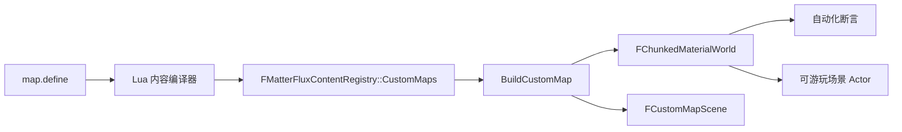

# MatterFlux 自定义地图：UE 与 Lua 初学者指南

自定义地图用于写出小型、可复现的材料世界和对应三维验收场景。它特别适合液体、
化学反应、切割等测试：自动化断言和截图命令加载同一个 Lua 地图 ID，避免“测试的
是一套、截图展示的是另一套”。

当前实现是有界测试地图，不是替代无限随机世界的关卡编辑器。随机世界仍由世界种子和
分块生成器负责；自定义地图负责需要精确复现的场景。

## 1. 最小示例

地图脚本放在 `Content/Lua/Maps`。下面定义一张水平草地、水池和圆形酸液区：

```lua
map.define({
    id = "test.acid_drop",
    name = "酸滴测试",
    min_x = -16,
    min_y = -12,
    max_x_exclusive = 17,
	max_y_exclusive = 13,
	cell_size_cm = 28,
	material_depth_cells = 0.25,
}, function(m)
	 m.fill_circle("water", -6, 0, 5)
	 m.fill_circle("acid", 6, 0, 5)
	 m.marker("player_start", 0, -9)
	-- X/Y 是游戏地表，Z 只表示高度；最后一个 true 开启角色碰撞。
	m.scene_box("arena.floor", "grassland", 0, 0, -0.5, 33, 25, 1, true)
	m.camera("camera.oblique", 24, -34, 26, 0, 0, 0, 48)
end)
```

- `fill_rectangle` 的最大坐标是包含在填充内的。
- `fill_circle` 是 X/Y 地表上的圆形占用区；它不是竖直截面，也不是三维 SPH 球体。
- 填充按脚本顺序执行，后面的 Stamp 会覆盖前面的 Stamp。
- `marker` 不生成物质，只记录出生、镜头或断言可复用的命名格子。
- `scene_box` 生成水平游戏场景中的静态布景；位置与尺寸使用地图格，构建时统一换算成厘米，最后一个可选布尔值控制碰撞。
- `camera` 声明透视观察位置和目标。斜视截图不再在 C++ 里写死相机坐标。
- `tilting_container` 声明装满指定液体的三维开口容器，以及开始步、倾斜时长、目标角度和每步出流量。Lua 只保存参数，固定步运动和液体状态由 C++ 内核计算。
- `material_depth_cells` 控制地表材料薄层的可见厚度；X/Y 始终对应游戏地面，Z 由地表承托高度决定。

Lua Language Server 会从 `Content/Lua/Annotations/MatterFluxApi.lua` 获得中文字段提示。

## 2. 数据如何进入 UE



Lua 不能直接生成 Actor 或改 UE 世界。内容加载器先校验 ID、边界、材质引用、Stamp 数量
和 Marker，然后提交不可变注册表。C++ 的 `BuildCustomMap` 是唯一运行时入口：调用者
只给地图 ID 与种子，模块同时返回水平 SurfaceTopology 材料世界和厘米制三维场景；分块预算、边界、填充
顺序、场景换算和相机参数都由模块内部处理。

这样做的价值是把易变的地图布局和稳定的模拟器分开。以后可增加多边形、预制 Stamp 或
出生规则，而液体求解器和测试调用点无需知道 Lua 表结构。

## 3. 当前安全限制

- 地图宽、高各为 1～512 格。
- 每张地图最多 256 个 Stamp、64 个 Marker。
- 每张地图最多 64 个三维场景盒、8 个验收相机。
- 圆形半径为 1～128 格。
- 坐标绝对值不超过 1,000,000，避免整数边界运算溢出。
- 所有材质 ID 必须已在同一内容包中注册。
- 地图 ID、Marker ID 必须稳定且唯一。

内容发生兼容性变化时要递增 `Content/Lua/MatterFluxContent.lua` 的 manifest revision。

## 4. 项目中的密度测试地图

`Content/Lua/Maps/LiquidDensityDrops.lua` 布置一张带碰撞地板和围栏的水平测试场：

- 左右分别布置水和酸的大液面与小液块，观察地表铺展和接触边界。
- `player_start` 把真实 `AMatterFluxCharacter` 放到地板上，角色继续使用项目的 2.5D 透视斜镜头。
- 场景隐藏原随机世界的 Source/碎片，避免测试地图被旧实体污染。

自动化测试 `MatterFlux.Lua.CustomMapBuildsPlayableSurfaceFixture` 从该地图构建真实
`FChunkedMaterialWorld`，运行 120 个固定步并检查所有活动格仍使用同一水平
`SupportHeight`；同一测试还检查 X/Y 地板尺寸、碰撞配置、玩家出生点和斜视透视相机。

编辑器中可用控制台命令生成同一地图的三阶段截图：

```text
mf.Visual.CustomMap3D test.liquid_density_drops 1
```

截图保存到 `Saved/Screenshots/WindowsEditor/MatterFluxCustomMap3D`。最后一个参数 `1`
表示完成后退出；在交互式编辑器里观察时可以使用
`mf.Visual.CustomMap3D test.liquid_density_drops 0`。此时截图结束后不会销毁地图，
角色可以继续在场内移动，材质模拟也会持续推进。旧的 `mf.Visual.LiquidDrops` 命令
仍作为这张默认测试地图的快捷别名保留。

## 5. 增加新地图的步骤

1. 在 `Content/Lua/Maps` 新建一个 Lua 文件，并使用唯一的命名空间 ID。
2. 只用 `map.define` 的受限 Builder 描述布局，不调用底层 `content.register_custom_map`。
3. 给需要被测试或镜头查询的位置加 Marker，避免在 C++ 再写一份魔法坐标。
4. 为新行为添加自动化断言，并让可视验收命令加载相同地图 ID。
5. 运行 `Automation RunTests MatterFlux.Lua` 和对应模拟模块测试。

测试地图应尽量小，只保留能证明行为的物质。性能压力图可以扩大布局或重复 Stamp，但
仍应使用固定种子，确保失败可以复现。

## 6. 悬空容器同步倾倒测试

`Content/Lua/Maps/StackedContainerPour.lua` 在同一 X/Y 上放置两个悬空容器：下层装水，
上层装酸。两者引用同一组开始步、倾斜时长、目标角和出流速率，因此可以直接观察
“不同高度、同一时刻倾倒”的行为。地图仍有水平地板、角色出生点、碰撞接液池和斜向
透视相机，不是只为截图搭建的竖直切面。

`FCustomMapPourSimulation` 是表现无关的固定步内核。每个快照分别暴露容器内、下落中和
已落地的液体格；落地格会在接液池范围内向附近最低列径向铺展，外圈使用 seed 哈希形成
稳定的不规则边缘。同一列包含多种液体时按 Lua 材质密度排序，所以酸位于水下。

自动化测试
`MatterFlux.Lua.StackedContainerPourIsSynchronizedAndDeterministic` 会检查：

- 两个容器初始都装满且酸容器更高；
- 实时倾角一致，两种液体都开始向下流；
- 水和酸各 175 格守恒，最终没有残留的下落格；
- 同 seed、同步数得到逐格一致的结果；
- 液体形成低矮水滩而不是竖直高塔，且共享列中酸在水下。

游戏内可视验收使用：

```text
mf.Visual.ContainerPour 1
```

命令依次保存“装满”“同步倾倒”“落地分层”三张图。把参数改为 `0` 时，截图后会切回
角色的 2.5D 斜视镜头并继续运行，便于走进场景检查碰撞。

如果只想直接游玩测试场，不需要截图、自动退出或帧率上限，使用：

```text
mf.Visual.ContainerPour 2
```

`play` 和 `uncapped` 也是 `2` 的可读别名。该模式会关闭 `t.MaxFPS`、垂直同步和固定时间步，
但材质逻辑仍按自己的确定性固定步推进，避免显示帧率改变物理结果。
