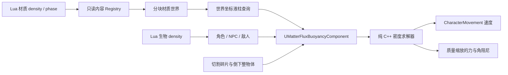

# MatterFlux 液体浮力与密度：UE 初学者指南

这份文档对应当前仓库中的真实实现，说明主角、NPC、敌人以及切割后物体如何在液体中
按材质密度漂浮或下沉。这里实现的是适合当前 2.5D 分块材质世界的确定性浮力层，
不是 UE Water 插件，也不是昂贵的三维流体力学求解器。

## 1. 先理解“密度决定浮沉”

水的密度在 Lua 中定义为 `1.00`。物体密度小于 1 时，完全浸没后浮力大于重力；
大于 1 时，浮力不足以抵消重力，因此继续下沉。

```text
浮力加速度 = -重力 × 液体密度 / 物体密度 × 浸没比例
阻力加速度 = -(物体速度 - 液体流速) × 阻力系数 × 浸没比例
```

例如密度为 `0.65` 的角色在水中倾向上浮，密度为 `1.15` 的重甲敌人倾向下沉。
重力仍由 `CharacterMovementComponent` 或 Chaos 负责；浮力组件只添加浮力和阻力，
所以不会重复施加重力。

## 2. 数据如何流动



关键点是查询接口只返回一根 `FLiquidColumn`，调用者不需要知道活动块、RLE 休眠块、
Lua registry 或视觉实例如何存储。这让浮力成为一个可复用的深模块，而不是分别给
玩家、NPC、敌人和树木复制四套逻辑。

## 3. 从哪里开始读代码

1. `Source/MatterFlux/Public/Material/MatterFluxLiquidBuoyancy.h`：纯数据和求解器接口。
2. `Source/MatterFlux/Private/Material/MatterFluxLiquidBuoyancy.cpp`：浮力、浸没比例和阻力。
3. `Source/MatterFlux/Public/Material/MatterFluxBuoyancyComponent.h`：可挂到 Actor 的适配组件。
4. `Source/MatterFlux/Private/Material/MatterFluxBuoyancyComponent.cpp`：五点采样、角色与 Chaos 两条执行路径。
5. `Source/MatterFlux/Private/Game/MatterFluxPlayableWorldActor.cpp`：世界坐标到材质格、液柱高度和密度缓存。
6. `Source/MatterFlux/Private/Material/MatterFluxMaterialWorld.cpp`：活动块与已归档块的单格快照查询。
7. `Source/MatterFlux/Private/Fragment/Fragment2DActor.cpp`：碎片和组合整物体的有效密度。

## 4. 为什么使用五个采样点

只检查物体中心会产生明显跳变：中心刚跨过岸边时，整棵树会突然从“完全无水”变成
“完全浸水”。组件现在检查中心、左右、前后共五点，并把每点贡献除以固定的五。

这样只有半个物体进入水面时，只得到一部分浮力；也能让横跨多个材质格的大碎片更平稳。
五点是质量和成本的折中，每个物体每帧最多进行五次 O(1) 分块格查询，没有射线检测、
Overlap 或逐三角形流体碰撞。

## 5. 生物如何接入

`AMatterFluxCharacter` 和 `AMatterFluxCreatureActor` 都拥有同一种
`UMatterFluxBuoyancyComponent`。NPC 和敌人不是特殊分支，它们从各自的 Lua creature
定义读取 `density`。

```lua
creature.define({
    id = "std.slime",
    -- 省略名字、阵营和行为树等字段
    density = 0.35, -- 明显比水轻
})
```

默认内容中的示例：

| 生物 | 密度 | 在水中的趋势 |
|---|---:|---|
| Slime | 0.35 | 明显上浮 |
| HouseResident | 0.65 | 上浮 |
| CampMerchant | 0.70 | 上浮，但比普通居民略重 |
| Elite | 0.90 | 接近中性浮力 |
| Patrol | 1.15 | 下沉 |
| Boss | 1.40 | 更稳定地下沉 |

解析器会拒绝非有限数以及不在 `0.05..20.0` 范围内的密度。Lua 注解位于
`Content/Lua/Annotations/MatterFluxApi.lua`，支持 Lua Language Server 的字段提示。

## 6. 物体和切割碎片如何接入

动态碎片的根组件是 `UProceduralMeshComponent`，浮力组件对它施加：

- `加速度 × Chaos 质量` 的力；
- 与浸没比例成正比的角速度阻尼。

因此同一种材料的大块和小块具有相同的浮沉趋势，质量变大不会错误地使浮力比例消失。
倒下的整棵树也是 `AFragment2DActor` 的 aggregate carrier，所以不需要树木专用浮力代码。

组合物体按体积计算有效密度：

```text
有效密度 = Σ(每层材质密度 × 该层体积) / Σ(该层体积)
```

体素层体积是 `solid cell 数 × CellSize³`；普通挤出碎片使用三角形正面面积乘
`Thickness`。因此木头与树叶组合后的密度来自实际组成，后续加入金属、玻璃或其他
可切割材料时无需修改浮力算法。

## 7. 服务器与客户端各做什么

- NPC、敌人和 Chaos 动态物体只在服务器计算浮力，位置继续由现有复制系统同步。
- 玩家角色在服务器计算权威结果；拥有该角色的客户端也做本地计算，以保留输入手感，
  最终仍接受 CharacterMovement 的网络校正。
- simulated proxy 不重复计算浮力，只显示服务器复制的位置。
- Dedicated Server 不创建液体视觉组件，但仍保留材质格查询和权威浮力。

这与项目现有 Host + Client 架构一致，不新增另一套“单机专用物理”。单人游戏的 Host
只是同时拥有服务器和本地玩家，两者不会在同一个角色上重复 Tick。

## 8. 液体列与可视表面为什么是两个高度

当前材质模拟是 2.5D：每个 XY 格保存一种材料和一个地表支撑高度。动态液体格的
`MaterialLiquidColumnHeight` 默认代表 120 cm 的有效浸没深度；确定性大湖则缓存真实
湖底和统一湖面，能返回每格不同的水深。视觉上只绘制连续的薄顶面。

两者必须解耦。若把 120 cm 直接作为每个实例方块的可视厚度，流动后稀疏的液体格
会成为一排排蓝色竖柱。现在逻辑仍按细格查询，溪流和湖泊的表现却各自合并为一个
无碰撞顶面 section，从而避免透明方块侧面、重叠混合与排序闪烁。

角色、生物和普通刚体提交的是“该格最多还能容纳多少液体”的体积约束，而不是简单的
占用/未占用布尔值。排开量由实际 XY 覆盖率和 Z 方向浸没高度换算成 `Amount`；角色与
生物使用胶囊体采样，所以胶囊包围盒的四角不会被误排空。同一个物体连续多帧提交相同
约束是幂等的，不会每帧继续抽干水柱。被排出的量优先填高相邻同种液体，再寻找空格，
全过程保持精确总量守恒。

可视自由液面仍是材质状态的投影。身体暂时占据液柱时，投影保留原有自由液面，让不透明
身体通过深度遮挡水面；它不会把一个 64 cm 格整块删除成方孔。地图初始化中的调试材质
样本也只能放入空地，不能覆盖湖水或溪水事实。

这也是当前实现的明确边界：它能正确给出浮沉和阻力，但没有保存多层三维水体，也没有
压力、波浪或真实水面高度均衡。以后扩展瀑布/深湖时，应增加稀疏竖直液体层或独立水面
高度，而不是重新把视觉格拉成长柱。

## 9. 如何给新内容配置密度

新液体在 `Content/Lua/Materials/` 中注册。使用命名字段同时配置密度和光学属性，
`phase` 必须为 `"liquid"`：

```lua
material.define({
    id = "oil", density = 0.82, hardness = 0.03,
    color_r = 0.12, color_g = 0.08, color_b = 0.03, color_a = 0.90,
    phase = "liquid", mobility = 245, dispersion = 210,
    shallow_opacity = 0.22, deep_opacity = 0.94,
    opacity_depth = 110.0, refraction_index = 1.47,
})
```

新生物在对应的 `Content/Lua/Creatures/` 文件中填写 `density`。新可切割物体只要保留
正确的 `MaterialId` 和 mask/面几何，就会自动参与组合密度计算，不需要注册新的 C++ 类。

## 10. 性能注意事项

- 世界 Actor 在 Lua registry 生效时建立液体密度缓存；每个采样点不会重新遍历 Lua 内容。
- `TryGetCellSnapshot` 能直接查询活动分块，也能从 RLE 归档块读取，不强制唤醒远处区块。
- 找不到可玩世界时组件只每秒重试一次，不会每帧遍历 Actor。
- 浮力 Tick 在 `TG_PrePhysics`，CharacterMovement 依赖它先完成，Chaos 在同一物理帧消费力。
- 液体表现按层合并成连续 ProceduralMesh，绝不是每格一个 Actor 或透明立方体。

本轮 512×384 压力场结果：120 次移动、材质与燃烧联合 Tick 约 584.45 ms；不同移动速度
下 streaming 平均帧耗时约 1.18～2.67 ms，p95 为 4.79～7.03 ms。具体结果记录在
`Saved/Logs/MatterFlux-Liquid-LargeWorld-Performance.log`。

## 11. 如何测试

纯公式和非法密度：

```text
MatterFlux.Material.LiquidDensityDeterminesFloatOrSink
```

真实场景会找到生成溪流和深湖，验证水的 Lua 密度、动态液柱、湖泊真实水深与复制
预算，并让真实玩家角色执行一次浮力 Tick：

```text
MatterFlux.Playable.Liquid.CreatureSamplesRenderedColumnAndReceivesBuoyancy
```

其他相关门禁：

```text
MatterFlux.Creatures
MatterFlux.Fragment.Aggregate.VoxelRootAndLeavesShareOneOccupancy
MatterFlux.Network.ListenHostClient
MatterFlux.Performance.LargeWorld
```

运行全部相关自动化：

```powershell
& 'C:\Program Files\Epic Games\UE_5.8\Engine\Binaries\Win64\UnrealEditor-Cmd.exe' `
  "$PWD\MatterFlux.uproject" -unattended -nop4 -nullrhi -nosplash -NoSound `
  '-ExecCmds=Automation RunTests MatterFlux; Quit' `
  '-TestExit=Automation Test Queue Empty' -log
```

液体专用视觉验收使用固定 seed 的外部截图命令。它不需要窗口焦点：

```powershell
& 'C:\Program Files\Epic Games\UE_5.8\Engine\Binaries\Win64\UnrealEditor.exe' `
  "$PWD\MatterFlux.uproject" -game -windowed -ResX=1280 -ResY=720 `
  '-ExecCmds=mf.Visual.LiquidPool 1337 1' -log
```

截图保存在 `Saved/Screenshots/WindowsEditor/MatterFluxLiquidPool`。命令会自动拍摄两个
斜向和一个高角度视图，用于检查连续液面、浅岸透视、深水不透明度与折射。

## 12. 后续扩展建议

1. 给液体格记录或推导局部流速，把当前已经预留的 `FlowVelocity` 用于带动物体。
2. 为游泳生物增加 CharacterMovement 自定义模式和 Lua 行为树游泳节点；浮力组件继续复用。
3. 深湖/瀑布升级为稀疏多层水体和独立水面高度，避免致密三维网格。
4. 对大船或长树增加按体积分布的更多采样点，并把力施加到各采样位置以自然产生扭矩。
5. 把温度、溶解和液体反应继续留在通用材质反应引擎，不在浮力组件里增加材料特例。
