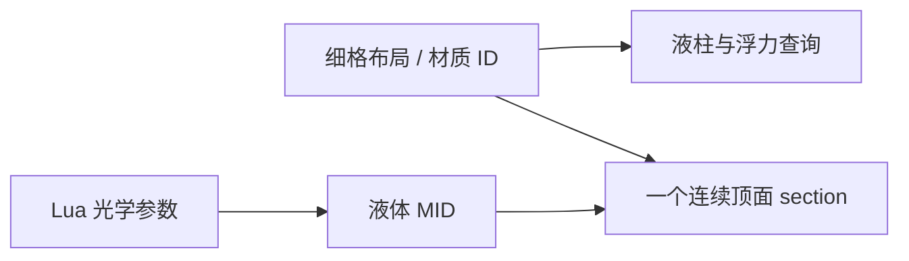

# MatterFlux 液体光学与大湖实现：UE 初学者指南

本文对应当前仓库中的真实实现，解释确定性大湖、Lua 液体参数、按水深变化的透明度、
连续液面渲染，以及它们如何与浮力和网络复制配合。

## 1. 一份液体配置服务多个系统

液体不应在 C++ 中按“水、岩浆、油”分别写特殊分支。每种物质在
`Content/Lua/Materials/` 中用 `material.define` 注册：

```lua
material.define({
    id = "water", density = 1.00, hardness = 0.05,
    color_r = 0.12, color_g = 0.46, color_b = 0.78, color_a = 0.82,
    phase = "liquid", mobility = 255, dispersion = 220,
    shallow_opacity = 0.82, deep_opacity = 0.96,
    opacity_depth = 120.0, refraction_index = 1.33,
})
```

- `density`：模拟密度，也决定生物和物体倾向漂浮还是下沉。
- `shallow_opacity`：岸边或后方几何很近时的不透明度。
- `deep_opacity`：达到吸收距离后的不透明度，不能小于浅水值。
- `opacity_depth`：浅水到深水过渡所需的厘米距离。
- `refraction_index`：保留的液体光学元数据；水默认为 `1.33`，当前体素液面不把它连接到屏幕空间折射。

Lua 加载器先校验所有字段，再原子替换只读 Registry。非法透明度、负吸收距离或异常
折射率元数据会让本次内容加载失败，不会留下半更新状态。类型注解位于
`Content/Lua/Annotations/MatterFluxApi.lua`。

## 2. 水越深越不透明是怎样实现的

透明材质能读取水面像素与后方不透明几何之间的距离。项目材质 `M_VoxelLiquid` 用
`DepthFade` 将距离除以 `OpacityDepth`，再在浅水和深水不透明度间插值：

```text
深度权重 = saturate((后方场景深度 - 水面像素深度) / OpacityDepth)
最终不透明度 = lerp(ShallowOpacity, DeepOpacity, 深度权重)
```

湖岸的湖床离水面近，仍能透过水看见体素阶梯；湖心的湖床更深，颜色逐渐被液体吸收。
生成脚本 `Scripts/Editor/BuildVoxelLiquidMaterial.py` 创建半透明、受光材质并连接
`Base Color`、`Opacity` 和 `Roughness`。体素液面不再连接屏幕空间 `Refraction`：它会在
分格顶面和运动物体上产生明显重影。运行时把兼容参数固定为中性 IOR=1.0，只创建 MID 并写参数，
不会每帧重建材质图。

## 3. 为什么不再画上千个透明小立方体

每个逻辑格画一个薄透明立方体会暴露相邻方块侧面，重叠区域会重复混合，独立实例的
透明排序还会随视角闪烁。当前 `BuildLiquidLayerMesh` 为每格只生成顶面四边形，并把
整条溪流或整座湖放进一个 `UProceduralMeshComponent` section。



逻辑仍按细格保存，表现层单独合批。液面不产生碰撞、不参与导航；入水判断由液柱查询
负责。Dedicated Server 不创建液面网格，但仍保留权威浮力数据。

这里的“单独合批”不代表第二份液体状态。每个顶面四边形是否存在仍由材质格决定；角色、
生物或刚体造成的瞬时体积约束会保留自由液面，并由身体深度正确遮挡，而不是删掉整块
顶面。地图中的反应演示样本只允许写入空地，避免初始化时把湖心的水替换成酸、木头或
草地，从事实层制造规则方孔。

## 4. 大湖如何由 seed 确定

`MatterFluxPlayableLevel.cpp` 根据世界 seed 生成湖心和椭圆半径，再在高度场上雕刻平滑
碗状湖床。湖面统一，湖岸至少有 64 个浅水格，中心至少有 64 个超过 100 cm 的深水格。
固定 seed 会逐字段生成相同的湖范围和湖床。

seed `1337` 的验收湖面约为 `560 × 352 cm`。树木、花草、房屋会避开湖区；远景代理
也会在雕刻湖床后重新下压，避免从水下穿出。

## 5. 为什么静态湖不进入逐格网络快照

湖泊是世界 seed 的确定性静态结果，服务器和客户端可独立生成相同湖床与湖面。把上千
个静态水格塞进材质模拟会超过项目的 `3072` 字节 Actor 通道安全预算。

世界 Actor 为湖建立 `StaticLiquidColumns` 只读缓存：键是 XY 材质格，值是材质 ID、
湖底和湖面高度。浮力查询先查看会流动/反应的动态模拟，再回退到静态湖缓存。湖泊因此
参与完整浮力，网络只复制真正变化的活动物质。

## 6. 建议的代码阅读顺序

1. `Content/Lua/Materials/Default.lua`：水和岩浆配置。
2. `MatterFluxContentTypes.h`：材质定义字段。
3. `MatterFluxLuaModule.cpp`：命名字段解析与事务校验。
4. `MatterFluxPlayableLevel.cpp`：湖形、湖床和液面格。
5. `MatterFluxPlayableWorldActor.cpp`：MID、连续液面、静态液柱与查询。
6. `BuildVoxelLiquidMaterial.py`：可重复生成材质资源的编辑器脚本。
7. `PlayableSceneTests.cpp`：尺寸、深浅水、网格、复制预算与浮力规格。

## 7. 自动化与视觉验收

```text
MatterFlux.Lua.LiquidOpticsUseNamedConfiguration
MatterFlux.Playable.RandomLevelIsDeterministicAndTraversable
MatterFlux.Playable.Liquid.CreatureSamplesRenderedColumnAndReceivesBuoyancy
MatterFlux.Playable.VoxelDecorationsSpawnAsDamageableSources
MatterFlux.Playable.WorldActorHasLightingAndCollisionGeometry
```

真实 GPU 多角度截图：

```powershell
& 'C:\Program Files\Epic Games\UE_5.8\Engine\Binaries\Win64\UnrealEditor.exe' `
  "$PWD\MatterFlux.uproject" -game -windowed -ResX=1280 -ResY=720 `
  -nosplash -nop4 '-ExecCmds=mf.Visual.LiquidPool 1337 1'
```

截图写入 `Saved/Screenshots/WindowsEditor/MatterFluxLiquidPool/<时间戳>/`。应检查三个角度
确实不同、液面无实例格缝、浅岸可见湖床、深水更不透明，并确认日志没有材质 usage
回退、模拟种子拒绝或复制预算溢出。

玩家与生物的深水动态排液验收使用：

```text
mf.Visual.DeepLiquidWalk 1337 1
```

它会在至少 90 cm 深的实际生成湖中驱动玩家和一个 Lua 生物行走，拍摄站立、移动中、
移动结束和旧路径回填四个阶段，并检查当前位置液面按物体体积下降、旧路径重新进水、下一帧仍有环境
液柱压力以及液体总量误差只来自同时运行的世界化学反应。

## 8. 当前边界

当前仍是 2.5D 高度场液体，不是完整三维流体：没有波浪法线、泡沫、焦散和连续水量。
后续可继续加入油、酸等 Lua 配置，并给连续液面增加低成本像素法线扰动；不要把光学
特例写进浮力组件，也不要让静态湖重新进入动态网络快照。
