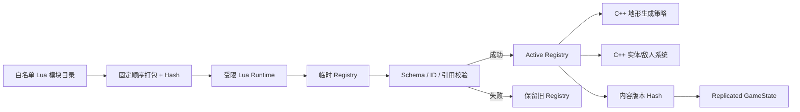

# MatterFlux Lua 内容系统：UE 初学者指南

这份文档对应当前仓库中的真实实现。目标不是“把游戏全改成 Lua”，而是让材质、地形装饰和实体定义能快速迭代，同时继续保留 UE C++ 的性能、确定性和服务器权威。

Lua 法杖/法术定义、确定性法术编译、GAS 施法和工作台 UI 见
[MatterFlux 法杖、法术编程与 GAS：UE 初学者指南](MatterFlux_Magic_System_Beginner_Guide.md)。

## 1. 为什么是 Lua + C++，而不是二选一

Lua 官方将自己定义为轻量、可嵌入的扩展语言；宿主程序可以只注册少量 C 函数，形成一个项目专用的小语言。[Lua 5.4 官方手册](https://www.lua.org/manual/5.4/manual.html)

在 MatterFlux 中：

| 层 | 负责 | 不负责 |
|---|---|---|
| C++ 核心 | mask/轮廓/三角剖分、物理、复制、存档、生成算法、输入校验 | 频繁变化的数值清单 |
| Lua 内容 | 材质、装饰物、实体的声明和组合 | 直接访问 UObject、磁盘、网络、系统命令 |
| Primary Data Asset | 内容包元数据和 UE 资源软引用 | 实时执行行为 |
| GameState | 复制服务器选中的内容包 ID、revision、hash | 复制整个 Lua 注册表 |

关键原则是：Lua 可以选择 C++ 已注册的 `generator_id`，但不能自己绕开核心规则。



## 2. 为什么没有直接使用 UnLua

项目实际用 UE 5.8 编译了 Tencent UnLua 的 `master` 和最新 `develop`。当前版本在 UE 5.8 的反射/属性 API 上存在核心编译冲突，验证日志位于：

- `Saved/Logs/UnLua-UE58-probe.log`
- `Saved/Logs/UnLua-UE58-probe-runtime.log`
- `Saved/Logs/UnLua-UE58-core-probe.log`

因此本项目没有复制整套 UObject 反射绑定，而是在 `Plugins/MatterFluxLua` 内嵌 Lua 5.4.4，只暴露少量内容注册函数。这既避开版本耦合，也缩小了脚本权限面。UnLua 仍是有价值的完整方案参考：[Tencent/UnLua](https://github.com/Tencent/UnLua)。

## 3. 代码从哪里开始读

1. `Content/Lua/MatterFluxContent.lua`
   只保存 manifest；不再混放所有定义。
2. `Content/Lua/MatterFluxEngine.lua`
   引擎设置，以及法术作者使用的能力 API。
3. `Content/Lua/Materials`、`World`、`Spells`、`Wands`、`Items`、`Quests`、
   `Creatures`、`Dialogues`、`Shops`
   默认内容模块；法术按内容库继续分成 `MatterFlux` 与 `PaperMagic`。
4. `Plugins/MatterFluxLua/Source/MatterFluxLua/Public/IMatterFluxScriptRuntime.h`
   游戏模块唯一依赖的深模块接口。
5. `Plugins/MatterFluxLua/Source/MatterFluxLua/Public/MatterFluxContentTypes.h`
   manifest、材质、装饰物、实体和 registry 的 C++ 数据结构。
6. `Plugins/MatterFluxLua/Source/MatterFluxLua/Private/MatterFluxLuaModule.cpp`
   沙箱、校验、内存/指令预算、事务提交和文件热重载。
7. `Source/MatterFlux/Private/Game/MatterFluxPlayableLevel.cpp`
   C++ 生成策略如何读取材质颜色和装饰物数量。
8. `Source/MatterFlux/Private/Game/MatterFluxGameState.cpp`
   服务器内容版本如何复制给客户端。
9. `Source/MatterFluxTests/Private/MatterFluxLuaContentTests.cpp`
   最短、最可信的行为规格。

需要编写可重复的材质测试场景时，继续阅读
`docs/MatterFlux_Custom_Maps_Beginner_Guide.md`。自定义地图由 Lua 声明，自动化测试和
截图命令从同一个地图 ID 构建世界。

## 4. Lua API

### 4.1 Manifest

```lua
content.set_manifest("matterflux.default", 12, 2)
```

- `pack_id`：稳定 ID。
- `revision`：内容作者递增的版本号。
- `schema_version`：当前只能是 `2`。
- 每次加载必须且只能调用一次。

### 4.2 材质

```lua
content.register_material(
    "grass",
    0.35, 0.20,
    0.16, 0.55, 0.18, 1.00,
    "static", 0, 0)
```

参数依次是 ID、密度、硬度、RGBA、相态、移动率、扩散率。

- 相态只能是 `static`、`powder`、`liquid` 或 `gas`。
- 移动率和扩散率都是 `0..255` 的确定性整数参数。
- 为兼容旧内容，省略最后三个参数的 7 参数写法仍会注册为静态固体。
- 密度参与液体/气体的上下置换；颜色同时用于场景体素层。

### 4.3 化学反应

```lua
reaction.define {
    id = "water_lava_quench",
    trigger = "contact",
    inputs = { "water", "lava" },
    outputs = { "steam", "stone" },
    chance = 1.0,
}

reaction.define {
    id = "wood_burn",
    trigger = "propagating",
    inputs = { "wood", "fire" },
    outputs = { "charcoal", "fire" },
    chance = 1.0,
    duration_steps = 18,
    propagation = { chance = 0.72 },
    emission = { material = "smoke", chance = 0.68 },
}
```

`contact` 在两个相邻格接触时立即变换；`propagating` 被第二种输入激活后，持续若干
固定步并向第一种输入的邻格传播。概率在 Lua 中写 `0..1`，加载时编译成整数千分比。
输入必须引用已注册材质；输出可以写 `empty` 表示该格被消耗。传播规则的 `emission`
可省略，因此酸蚀、结晶等规则不必伪装成会冒烟的燃烧。

旧 `content.register_combustion` 已删除，避免规则分散到两个 registry。旧的六参数
`content.register_reaction` 仅作为接触反应兼容入口保留；新内容应统一使用
`reaction.define`。Lua 只声明数据，实际 mask 传播、表现、服务器权威和网络复制均由
C++ 执行。

### 4.4 为什么不是在 Lua 每格执行回调

热更新时 Lua 把易读 DSL 编译成不可变 C++ 数据；游戏 fixed step 不再调用 Lua。
因此联机端能按相同 seed、tick、坐标和规则 ID 得到相同结果，也避免数万个格子跨
Lua/C++ 边界。具体架构见
[`MatterFlux_Material_Reaction_Engine_Beginner_Guide.md`](MatterFlux_Material_Reaction_Engine_Beginner_Guide.md)。

### 4.5 装饰物

```lua
content.register_decorator(
    "forest.grass",
    "surface_scatter",
    "grass",
    1.0, 100, 140,
    false)
```

- `generator_id` 选择 C++ 生成策略。
- `material_id` 必须引用已注册材质。
- `spawn_weight` 为未来的群落/生物群系选择保留。
- `min_count`、`max_count` 控制确定性数量范围；单个 decorator 的 `max_count` 上限是 4096。
- 每类定义（material、reaction、decorator、entity）最多注册 1024 个，超过上限时整包会事务性拒绝。
- 最后一个可选布尔值控制生成出来的完整装饰是否启用碰撞；省略时默认为
  `false`，而且必须使用 Lua 的 `true`/`false`，不能写字符串。

当前场景消费 `tree` 和 `surface_scatter` 两类策略。`tree` 生成分开的树干/树冠
mask source；它把碰撞配置映射到树干，三层树冠始终是无碰撞的视觉部件。
`surface_scatter` 把草和花按小簇写入 mask source，避免每根草都产生一个 Actor。
默认森林只有树干开启碰撞，岩石、树叶、草和花都不会阻挡角色。以后新增复杂生成
方法时，应增加一个 C++ 策略并注册 ID，并明确该策略的哪个部件消费碰撞配置，而
不是让 Lua 获得任意 UE 反射权限。

### 4.6 实体

```lua
content.register_entity(
    "enemy.slime",
    "slime_wander",
    35.0, 180.0)
```

它声明实体 ID、行为 ID、最大生命值和移动速度。当前只完成内容注册；敌人 Actor/StateTree/GAS 消费端仍是后续工作。

### 4.7 生物、对话与商店

可交互 NPC 和敌人使用更完整的 `creature.define`，而不是上面的早期通用 entity：

```lua
creature.define({
    id = "std.test_boss", name = "营地首领",
    faction = "hostile", level = "boss",
    health = 50, width = 95, height = 210,
}, function(ai)
    ai.tree({
        sight = { range = 1500, memory_seconds = 15 },
        locomotion = { speed = 380 },
        root = ai.selector({
            ai.sequence({
                ai.condition("target_too_close", { distance = 320 }),
                ai.action("retreat"),
            }),
            ai.sequence({
                ai.condition("target_in_attack_range", { distance = 950 }),
                ai.condition("skill_ready"),
                ai.action("skill", {
                    cooldown = 10, spell = "std.default",
                    projectiles = 12, radial = true,
                    projectile_interval = 0.2,
                }),
            }),
            ai.sequence({
                ai.condition("target_in_attack_range", { distance = 950 }),
                ai.condition("attack_ready"),
                ai.action("attack", {
                    cooldown = 2, spell = "std.default", projectiles = 2,
                }),
            }),
            ai.sequence({
                ai.condition("has_target"),
                ai.action("chase"),
            }),
            ai.action("patrol", { turn_seconds = 3, pause_seconds = 1 }),
        }),
    })
end)
```

这里使用的是受限的行为树 DSL：

- `selector` 从上到下尝试分支，因此越靠前优先级越高。
- `sequence` 依次检查条件，最后选择一个动作；任一条件不成立就尝试下个分支。
- `condition` 只能读取 C++ 提供的只读事实，例如是否看见目标、距离和冷却。
- `action` 只能选择巡逻、追击、后撤、攻击、技能等服务器权威能力。

旧的 `ai.configure({...})` 已从公开 DSL 删除。感知和移动能力位于树根，距离紧跟
对应条件，冷却、法术和弹幕参数紧跟对应动作。生命值、阵营、外观、对话和商店仍
属于生物定义，因为这些是身份/表现数据，不是决策逻辑。

示例中“近身后撤”优先于技能，“技能”优先于普通攻击；没有可用攻击时追击，失去
目标后巡逻。树限制为最多 64 个节点、8 层、每个组合节点 16 个子节点；循环、未知
名称、错误的节点顺序和超预算内容都会使整次热重载失败，旧 registry 保持不变。

Lua 在加载时把 builder 编译成不可变的 AI/施法数据，之后不保留 Lua 函数或表。
服务器上的 `AMatterFluxCreatureAIController` 以固定 10 Hz 构造感知快照并执行纯 C++
解释器，客户端只接收 Actor 状态与移动复制。Actor `TimerManager` 执行分时弹幕，
对话图与商店报价也只保存数据；购买仍由服务器检查 revision、货币、限购和背包容量。

目前白名单条件是 `has_visible_target`、`has_target`、`target_too_close`、
`target_in_attack_range`、`attack_ready`、`skill_ready`；动作是 `passive`、
`patrol`、`chase`、`retreat`、`attack`、`skill`。完整中文字段提示位于
`Content/Lua/Annotations/MatterFluxApi.lua`，VS Code 的 Lua Language Server 会读取它。

## 5. 热重载到底发生了什么

默认目录结构是：

```text
Content/Lua/
├─ MatterFluxEngine.lua
├─ MatterFluxContent.lua
├─ Materials/
├─ World/
├─ Spells/
│  ├─ MatterFlux/
│  └─ PaperMagic/
├─ Wands/
├─ Items/
├─ Quests/
├─ Creatures/
├─ Dialogues/
└─ Shops/
```

C++ 只递归扫描上面九个白名单模块目录。执行顺序固定为引擎脚本、manifest，再按
`Materials`、`World`、`Spells`、`Wands`、`Items`、`Quests`、`Creatures`、
`Dialogues`、`Shops` 加载；每组内部按规范化相对路径排序。文件名和顺序也进入
hash，因此不同机器不会因为文件系统枚举顺序不同而获得不同内容身份。
`require`、`package`、`io` 和 `os` 均未开放。

开发构建每 0.5 秒重新计算默认 Lua bundle 的 hash：

1. 创建全新的、最多 8 MiB 的 Lua state。
2. 只打开 base/table/string/math/utf8。
3. 移除文件访问、模块加载、调试、动态代码加载和随机 API。
4. 在临时 builder 中执行注册，最多一百万条指令。
5. 校验 schema、数字、重复 ID 和材质引用。
6. 全部成功才替换 `ActiveRegistry` 并广播 reload delegate。
7. 场景 Actor 收到通知后，使用同一个 `MapSeed` 重建。

因此语法错误、重复 ID、无限循环或坏引用都不会污染已经提交的内容。

法术没有继续扩张 `content.register_spell({...几十个字段...})`。默认法术使用：

```lua
spell.define({
    id = "std.default",
    name = "圆形子弹",
    mana_cost = 10
}, function(api)
    api.projectile({
        damage = 10,
        speed = 1500,
        lifetime = 3,
        radius = 14
    })
end)
```

引擎只提供 `projectile`、`modify_projectile`、`draw`、`trigger`、`cut`、`flame`、`impulse` 等少量能力。Lua 可以组合它们；C++ 把结果编译成受预算约束的内部格式。这样新增普通法术无需接触 GAS 或 Actor，而新增底层能力仍必须经过 C++ 权限、数值、复制和性能校验。

## 6. 联机中为什么只复制 Hash

`AMatterFluxGameState` 复制：

- `ContentPackId`
- `ContentRevision`
- `ContentVersionHash`

客户端本地加载相同内容，再与服务器身份比较。服务器仍决定伤害、生成和物理结果；客户端 Lua 不能直接改变权威状态。UE 的 `ReplicatedUsing` 会在客户端收到属性后调用 RepNotify，官方流程见 [Replicate Actor Properties](https://dev.epicgames.com/documentation/unreal-engine/replicate-actor-properties-in-unreal-engine)。

当前 hash 用于一致性身份，不是安全签名。正式线上热更新还需要：

- 内容包签名
- 白名单/兼容版本
- Pak/IoStore chunk
- 下载失败回滚
- 服务器登录前握手拒绝不匹配客户端

UE 的 Asset Manager 和 chunk 机制是后续发布层基础：[Asset Management](https://dev.epicgames.com/documentation/en-us/unreal-engine/asset-management-in-unreal-engine)、[Cooking and Chunks](https://dev.epicgames.com/documentation/en-us/unreal-engine/cooking-content-and-creating-chunks-in-unreal-engine)。

## 7. Primary Data Asset 的作用

`UMatterFluxContentPackAsset` 保存 pack ID、schema、revision、Lua 相对路径和 `TSoftObjectPtr` 资源引用。

继承 `UPrimaryDataAsset` 后，资源具有 Primary Asset ID 和 Asset Bundle 支持，可由 Asset Manager 管理加载/卸载。[UE 5.8 Data Assets](https://dev.epicgames.com/documentation/en-us/unreal-engine/data-assets-in-unreal-engine)

为什么不把网格路径直接写进 Lua？因为 UE 资源引用还要参与 Asset Registry、Cook、异步加载和 chunk 分包；Data Asset/软引用更适合这部分。

## 8. 初学者练习：新增一种花

先复用已有 `surface_scatter` 策略：

```lua
content.register_material(
    "flower_white",
    0.12, 0.05,
    0.95, 0.95, 0.90, 1.0)

content.register_decorator(
    "forest.flower.white",
    "surface_scatter",
    "flower_white",
    0.15, 10, 24,
    false)
```

注意：当前 C++ 场景只把已经映射的森林装饰定义实例化。要让任意新 ID 自动出现，
下一步应把 `surface_scatter` 的 mask 模板、CellSize、每簇数量和 stream margin
做成版本化参数，然后遍历 registry，而不是继续增加 `if`。

这也说明“内容数据驱动”和“完整通用生成器”是两个阶段，不能混为一谈。

## 9. 构建与测试

Editor 构建：

```powershell
$env:UE_SDKS_ROOT='C:\Users\hepta\Documents\unreal-angelscript-forge\.unreal-angelscript-forge\matterflux\cache\toolchains\auto-sdk'
$env:UBA_ROOT="$PWD\Saved\UnrealBuildAccelerator"
& 'C:\Program Files\dotnet\dotnet.exe' `
  'C:\Program Files\Epic Games\UE_5.8\Engine\Binaries\DotNET\UnrealBuildTool\UnrealBuildTool.dll' `
  MatterFluxEditor Win64 Development "$PWD\MatterFlux.uproject" `
  -WaitMutex -NoHotReloadFromIDE -NoUBA -MaxParallelActions=1
```

Lua 测试：

```powershell
& 'C:\Program Files\Epic Games\UE_5.8\Engine\Binaries\Win64\UnrealEditor-Cmd.exe' `
  "$PWD\MatterFlux.uproject" -Unattended -Multiprocess -NoCompile `
  -NullRHI -NoSound -NoSplash `
  '-ExecCmds=Automation RunTests MatterFlux.Lua' `
  '-TestExit=Automation Test Queue Empty'
```

当前测试覆盖：

- 合法内容注册
- 相同源码得到相同 hash/字段
- 无效 reload 保留旧 registry
- 危险标准库不可用
- 无限循环被指令预算终止
- GameMode 使用复制内容身份的 GameState
- 可玩场景实际消费 Lua 数量和颜色
- 液体、气体、粉末相态和化学反应定义逐字段解析
- 水与熔岩按 Lua 规则变成蒸汽与石头
- 燃烧规则逐字段解析，并验证材质引用、概率和持续时间
- 活动分块跨边界移动、休眠分块冻结、RLE 归档与恢复
- 花草树木输出确定性 mask source，而不是旧 HISM 基础形状
- 程序化 source 实际接受 damage，并把颜色传给动态碎片
- Lua 行为树会确定性编译，非法树不会替换当前 registry
- 行为树按作者顺序选择后撤、技能、攻击、追击和巡逻状态

## 10. 当前限制与下一步

必须明确当前没有完成的部分：

- 花草树木已经进入 MatterFlux mask/碎片管线，并保留 `MaterialId`；木头、树叶、
  草、花和草地已经能按 Lua 规则燃烧。液体分块世界与装饰燃烧目前仍是两个共享
  material-id 的模拟模块，尚未实现水格直接浇灭任意装饰 mask。
- `register_entity` 还没有敌人运行时消费者。
- 新 decorator ID 还不能自动获得完整的可配置几何参数。
- Shipping 热更新只有文件 staging，没有签名/CDN/回滚服务。
- 内容 hash 只做一致性校验，不提供防篡改安全。

材质模拟实现和扩展路线请继续阅读
[MatterFlux Noita 风格材质模拟：UE 初学者指南](MatterFlux_Material_Simulation_Beginner_Guide.md)。

生物定义还支持 `density` 字段。它与材质的 `density` 一起决定主角、NPC、敌人和
切割物体在液体中漂浮或下沉；配置示例和物理含义见
[MatterFlux 液体浮力与密度：UE 初学者指南](MatterFlux_Liquid_Buoyancy_Beginner_Guide.md)。
