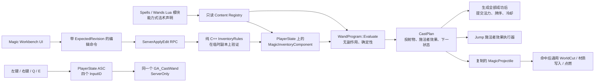

# MatterFlux 法杖、法术编程与 GAS：UE 初学者指南

> 本文对应仓库中的当前实现。读完后，你应当能在游戏中编辑法杖、理解一次施法如何从 Lua 配置走到服务器 GAS，并能自己增加一种法术或法杖。

## 1. 先运行起来

1. 打开 `/Game/Default` 并 Play；Standalone 和 Listen Server 都可用。
2. 按 `I` 或 `Tab` 打开中文“魔法工坊”。
3. 顶部的“法杖背包”和“法术编程”互斥切换，不会把两种库存塞在同一个滚动栏。
4. “法杖背包”页左侧是四个竖向键位槽，右侧只显示法杖；把法杖拖到键位槽完成装备。
5. “法术编程”页左侧选择当前键位，中央编辑该键位法杖的程序，右侧只显示法术背包。
6. 把法术拖到中央槽位；法杖内的法术可以互相拖动换位。
7. 右键装备槽会卸下法杖；右键法术槽会把法术退回背包。不方便拖放时，可以先单击背包法术，再单击目标槽。
8. 关闭工作台后，左键、右键、`Q`、`E` 分别施放装备槽 1～4 的法杖。

切割和喷火不再是角色硬编码的特殊能力。它们和普通飞弹一样先生成投射物，只有投射物
命中后才把切割、点燃或材质写入交给世界系统。默认配置只是把“伐木法杖”装到左键槽，
把“火舌法杖”装到右键槽；交换法杖或法术后，同一个键就会施放新的程序。

## 2. MatterFlux 参考了 PaperMagic 的哪些部分

参考项目 `PaperMagic` 最有价值的是交互布局：背包分类、装备槽、中央法术连接、拖放替换、右键移除和悬浮详情都很直观。MatterFlux 保留了这些交互语言，但没有复制它的运行结构。

PaperMagic 的 UI 会直接修改全局可变数据，Lua 回调也能直接执行战斗。单机原型很快，但在 UE 联机项目中会产生三个问题：

- UI、规则和战斗互相依赖，自动化测试很难隔离。
- 客户端可能绕过服务器直接改装备或施法。
- 可变法术树不容易确定性序列化，也难做 revision 冲突和事务回滚。

MatterFlux 因而采用“声明、编译、提交”三段式结构：Lua 通过少量能力接口构造受限程序；纯 C++ 编译器生成施法计划；服务器确认计划成功生成后才消耗法力并推进牌序。

当前不只参考了外观，也完整迁移了目标项目 `GameData/Scripts/Spells` 下的 9 个法术。ID、中文名称、法力消耗、伤害和子节点数尽量保持一致；任意 Lua 回调则被改写成受校验的颜色、轨迹、触发时机和自身冲量字段。也就是说，玩法结果对应，但权限模型适合 UE 联机。

## 3. 全链路概览



最重要的边界是：UI 不生成投射物，Lua 不调用 UObject，GAS 不解释 Lua 表，法术编译器也不修改 Actor。
常规法术只能生成或修改投射物；跳跃这类只作用于施法者的能力是显式例外，不能作为触发器载荷。

## 4. 关键文件从哪里读

建议按下面顺序阅读：

| 文件 | 初学者应关注什么 |
|---|---|
| `Content/Lua/MatterFluxEngine.lua` | `spell.define` 与受限能力 API |
| `Content/Lua/Spells/` | 每个法术一个模块，按内容库分目录 |
| `Content/Lua/Wands/` | 每根法杖一个底盘配置模块 |
| `MatterFluxContentTypes.h` | Lua 数据进入 C++ 后的不可变定义 |
| `MatterFluxLuaModule.cpp` | 受限 API、字段读取、范围和引用校验 |
| `MatterFluxWandProgram.h/.cpp` | 如何把法术槽编译为一次 CastPlan |
| `MatterFluxSpellProgramLayout.h/.cpp` | 如何把复制用的平铺槽位稳定解释为法术树列和父子关系 |
| `MatterFluxMagicInventoryComponent.h/.cpp` | 背包、装备、revision、Fast Array 和服务器 RPC |
| `GA_CastWand.cpp` | GAS 如何从玩家输入进入服务器施法 |
| `MatterFluxMagicProjectile.cpp` | 投射物复制、碰撞、切割和点燃 |
| `MatterFluxMagicWorkbenchSlate.cpp` | 纯 C++ Slate 工作台、拖放和右键交互 |
| `MatterFluxMagicWorkbenchWidget.cpp` | UMG 生命周期、状态绑定和领域命令 adapter |
| `MatterFluxMagicProgrammingTests.cpp` | 规则层和施法层的可执行示例 |
| `MatterFluxMagicNetworkPIETests.cpp` | dedicated server + 两客户端的完整链路 |

## 5. Lua 只负责“是什么”

### 5.1 一个普通投射物

```lua
spell.define({
    id = "spell.spark_bolt",
    name = "闪光弹",
    description = "快速而稳定的凝光飞弹。",
    icon = "spark_bolt",
    mana_cost = 8,
    starter_count = 8
}, function(api)
    api.projectile({
        damage = 12,
        speed = 1250,
        lifetime = 2.0,
        radius = 13,
        cast_delay = 0.04
    })
end)
```

`starter_count` 表示新玩家背包里最初有多少张散装法术。初始法杖内置的程序改由
法杖自己的 `starter_deck` 声明，不会消耗这些散装数量。

### 5.2 少量能力，而不是巨型注册表

| Lua 能力 | 作用 |
|---|---|
| `api.projectile` | 声明投射物的伤害、速度、寿命、半径、本体材质与命中材质 |
| `api.modify_projectile` | 修改后续投射物的伤害、速度、寿命、轨迹或颜色 |
| `api.draw` | 抽取子法术；一次抽多张自然形成多重施法 |
| `api.trigger` | 把子法术绑定到命中或消逝事件 |
| `api.impulse` | 请求对施法者施加受限冲量 |

`content.register_spell` 仍存在于 C++ 和引擎脚本之间，但它只是私有编译格式；默认内容模块看不到也不调用它。内容作者面对的是 `spell.define(meta, function(api) ... end)`。回调在内容加载时执行并构造确定性程序，不会在客户端任意操作 Actor。

这些能力不是完整 UObject 反射。这样才能限制一次施法最多执行 128 条指令、产生 32 个投射物、嵌套 4 层触发器，防止错误配置造成死循环或无限生成。增加普通法术只需组合现有能力；只有新增一种真正的底层引擎能力时才修改 C++ 校验器和服务器执行器。

### 5.3 一个法杖底盘

```lua
content.register_wand({
    id = "wand.apprentice",
    name = "学徒法杖",
    capacity = 8,
    shuffle = false,
    draw_count = 1,
    cast_delay = 0.16,
    recharge_time = 0.48,
    mana_max = 110,
    mana_recharge = 28,
    spread = 2.5,
    starter_slot = 2,
    starter_deck = {
        "spell.double_cast",
		"spell.add_damage",
		"spell.spark_trigger",
		"spell.spark_bolt",
		"spell.flame_jet"
    }
})
```

- `capacity` 是法术槽数量，上限 32。
- `shuffle = false` 时按槽位顺序抽牌，并保存 `DeckCursor`。
- `shuffle = true` 时根据事件 seed、法杖 ID 和施法序号确定性洗牌。
- `starter_slot = 0..3` 表示新玩家出生时把这根法杖绑定到哪个输入槽。
- `starter_count` 表示新玩家初始拥有但不自动绑定的数量；适合鞋型施法器或备用法杖。
- `starter_deck` 是初始法术程序，长度不能超过 `capacity`，每个 ID 必须存在。
- 每个初始槽只能被一根法杖占用；当前默认四槽是左键、右键、`Q`、`E`。

工作台会常驻显示四个最重要的底盘属性：`mana_max`（法力上限）、`mana_recharge`（每秒法力恢复）、`cast_delay`（基础释放间隔）和 `capacity`（法术容量）。`recharge_time`、抽取数、乱序和散布仍在法杖详情中显示。

### 5.4 已迁移的 PaperMagic 法术

| 原 ID | 中文名 | MatterFlux 中的受限语义 |
|---|---|---|
| `std.default` | 圆形子弹 | 10 伤害的普通复制投射物 |
| `std.add_damage` | 增加伤害 | 子节点伤害 `+7` |
| `std.circle_trail` | 圆形轨迹 | 半径 300 cm 的圆轨迹，寿命乘 2 |
| `std.set_color_red` | 红色 | 红色覆盖进入 InitialOnly presentation |
| `std.double_cast` | 双重释放 | 两个子节点，增加 10 度散布 |
| `std.triple_cast` | 三重释放 | 三个子节点，增加 10 度散布 |
| `std.trigger_on_collision` | 碰撞触发 | 命中通道载荷，确定性随机方向 |
| `std.trigger_on_expired` | 消逝触发 | 寿命结束通道载荷，沿当前方向 |
| `std.jump` | 跳跃 | 服务器设置 600 cm/s 向上速度并进入 Falling |

项目内嵌的 Lua 运行时没有开放文件、网络、系统命令和 UObject 反射。脚本先在新的临时 registry 中完整执行；所有 ID、数值、材质引用和唯一性通过后才一次替换活动 registry。因此错误热更不会留下“半份配置”。

敌人的法术同样复用这些只读定义。`creature.define` 把弹数、散射、径向排列、
发射间隔、收招、起跳冲量和颜色覆盖直接写在行为树的 `attack`/`skill` 动作旁；C++ 先用
`FMatterFluxCreatureCastPlanner` 生成确定性射击计划，再由 Creature Actor 的服务器
TimerManager 执行。Boss 因而能表达 PaperMagic 的双发攻击和分时环形技能，而不用
在 Actor 中写一个只服务于 Boss 的硬编码分支。

## 6. 确定性法术编译器

`FMatterFluxWandProgram::Evaluate` 的输入只有：

- 只读 registry；
- 法杖定义 ID；
- 法术槽数组；
- 当前法力、牌序和施法序号；
- 事件 seed。

输出是 `FMatterFluxWandCastPlan`，包括根投射物、命中/消逝载荷、跳跃等施法者效果、
消耗的法力、施法延迟、充能时间和下一份法杖状态。它不访问 World、不
SpawnActor，也不改变传入状态。

这就是“纯函数”在游戏代码中的实际价值：相同输入可以逐字段比较，失败时输出保持为空，服务器也能先试算后提交。

法杖 ID 不能直接使用 `GetTypeHash(FName)` 参与跨进程 seed，因为 FName 的内部索引是进程局部的。当前实现对受约束的字符串 ID 做 CRC，再与事件 seed 和 CastSerial 组合，保证不同进程得到同一洗牌和散布结果。

## 7. 背包与装备为什么放在 PlayerState

角色 Pawn 可能死亡或重生，PlayerController 只存在于拥有者与服务器。`APlayerState` 会随玩家身份存在并复制给网络，因此 ASC 和法术背包都放在 `AMatterFluxPlayerState`：

- ASC 使用 Mixed replication mode；Owner 是 PlayerState，Avatar 是当前 Character。
- `UMatterFluxMagicInventoryComponent` 保存拥有的法术、法杖、四个装备槽和当前槽。
- 法术/法杖列表用 `FFastArraySerializer`，只发送变化的条目。
- 整套背包使用 `COND_OwnerOnly`；其他玩家不需要接收你的牌库内容。
- 投射物是世界表现，正常复制给相关客户端。

### 7.1 revision 防止什么

UI 发出的每个编辑命令都带 `ExpectedRevision`。服务器只接受与当前 `InventoryRevision` 相同的命令。

例如客户端连续拖动两次，但第二个包先到服务器；没有 revision 时，两次操作可能覆盖或复制法术。有 revision 时，过期操作会被拒绝，客户端等待最新复制状态后重新操作。

### 7.2 为什么编辑临时副本

`ApplyEditAuthority` 先复制 spells、wands、equipment 和 active slot，在副本上运行 `FMatterFluxMagicInventoryRules::ApplyEdit`。只有整个命令成功才移动回正式状态并增加 revision。

因此“取出旧法术成功、放入新法术失败”不会让玩家丢物品。替换会归还旧法术并消耗新法术；移除会归还；换位不改变背包数量。

## 8. GAS 施法与事务提交

四个输入键分别寻找 `InputID = 0..3` 的 Ability Spec。四份 Spec 都使用同一个
`UGA_CastWand` 类，因此输入层只选择装备槽，不知道里面是哪一种投射物或施法者效果。
`UGA_CastWand` 使用 `ServerOnly`：真正的牌序计算和世界修改发生在权威服务器。

一次成功施法的顺序是：

1. 检查输入绑定的装备槽、Lua 定义、法力和服务器时间。
2. 用当前状态运行纯编译器，得到候选计划。
3. 先校验所有投射物和施法者效果参数，再对所有根投射物调用 deferred spawn。
4. 只要任何一个 Actor 分配失败，就销毁尚未完成的 Actor，候选计划不提交。
5. 全部初始化成功后 `FinishSpawningActor`，再执行已验证的施法者效果。
6. 最后提交 Mana、DeckCursor、CastSerial 和 NextCastServerTime。

这与数据库事务的思路相同：副作用准备失败时，玩家不会白白消耗法力或跳过牌。

## 9. 投射物如何进入 MatterFlux 世界

`AMatterFluxMagicProjectile` 由服务器生成，开启 movement replication。法术 ID、速度、寿命、半径、本体材质和携带量使用 `COND_InitialOnly`，因为它们生成后不再变化。投射物的重力比例由法术定义；速度和寿命共同限定射程。

普通投射物仍使用紧凑体素外观；声明 `body_material` 的投射物则根据材质颜色建立确定性的
多体素球。火焰喷流因此是一团向玩家前方移动、无重力的火焰材质球，而不是施法瞬间
向锥形区域直接写世界。颜色回退使用法术字符串 ID 的稳定 CRC，而不是进程局部的 FName 索引。

碰撞只在服务器处理：

- 普通伤害投射物只伤害角色，不直接改写可切割世界；只有明确的平面切割工具会提交 `FFragmentWorldCutRequest`。
- `body_material` 是投射物实际携带的物质。碰撞或寿命结束时，它按 `material_amount` 进入统一物质模拟；火、水、沙、酸的后续变化都由反应与移动规则推进。
- trigger 投射物按声明在命中点生成 `OnImpactProjectiles`，或在寿命结束位置生成 `OnExpireProjectiles`。
- 圆形轨迹只在服务器推进，客户端接收 movement replication；红色覆盖随 InitialOnly presentation 一次复制。

法术定义因此只负责制造、组合和修改世界中的投射物，不携带“命中后点燃/腐蚀/改地形”一类结果命令。敌人技能、机关和可动物体也能复用同一套 CastPlan 与物质反应，而不必复制专用命中逻辑。

## 10. 工作台 UI 的实现方式

工作台是一个 `UUserWidget` adapter 加私有 `MatterFluxMagicWorkbenchSlate` deep module，不依赖手工创建的 Widget Blueprint，所以 C++ 编译后立即可用。UMG 文件只处理生命周期、状态绑定和领域命令，完整 Slate 树不会再和 adapter 混在同一个 2000 行编译单元里。

布局直接遵循 PaperMagic 的工作区层级：顶部页签互斥切换，法术页由“左侧竖向装备槽—中央程序—右侧法术包”组成，法杖页只显示键位槽和法杖库存。选中哪个键位，中央就编辑该键位的法杖，不会偷偷编辑未装备法杖。

中央不再把所有法术横向塞成一条线。`FMatterFluxSpellProgramLayoutBuilder` 根据修饰器、多重释放和触发器的子节点数，从左到右消费平铺槽位，为每个节点记录父槽位、分支序号和所属施法段。一根法杖可以包含多个互不相连的根；Slate 只显示同尺寸法术槽与它们之间的连线，不再常驻显示槽号、来源和施法段说明。连线层先从父法术槽中心画到子法术槽中心，节点再在更高图层绘制，所以线会自然被槽体遮挡，不会压住图标或边框。

必需子节点即使为空，也会留在树内并标记“待填”；只有没被任何树消费的空槽才进入“空闲容量槽”。这个区分很重要：前者会导致当前组合不完整，后者只是法杖还有可用容量。同一份布局模块同时供测试和 Slate 使用，避免“画面看起来是一棵树，实际执行另一套规则”。

物品槽约 50 px，只显示图标和必要的数量角标；名称、说明和数值统一放进悬停 tooltip。中央只保留当前法杖名称、法力条、程序连线和槽位，顶部页签也使用短名称。界面使用统一的白底、黑色描边；当前编辑项用浅灰底标出，保证黑色图标始终可见。键位槽只显示 `L`、`R`、`Q`、`E` 角标。不方便拖放时仍可“先点法术，再点目标槽”。

UI 始终只构造 `FMatterFluxMagicEdit` 并调用 `RequestEdit`。客户端画面会在 Fast Array、装备 RepNotify 或 Lua 内容热重载后重建。打开时 PlayerController 使用 `FInputModeUIOnly` 并显示鼠标，避免编辑时误移动或施法；关闭时恢复 `FInputModeGameOnly`。

Lua 的 `icon` 字段是相对 `Content/Lua/Icons` 的稳定资源键，可以省略 `.png`。例如 `icon = "paper/default"` 会读取 `Content/Lua/Icons/paper/default.png`；找不到图片时槽位才回退到类型符号。法术、法杖和道具共用这套解析器，空法杖/法术槽则统一读取 `paper/add_sign`。`paper/` 保存从 PaperMagic 移植的原图，MatterFlux 自有法术图标放在图标根目录。解析器拒绝绝对路径、目录穿越和非 PNG 扩展，整个 `Lua` 目录会作为 NonUFS 内容随包分发，因此同一份 Lua 配置在编辑器与打包版本中行为一致。

## 11. 热重载行为

Development/Editor 下修改默认 Lua 后，运行时会事务式替换 registry：

- 工作台收到 `OnContentReloaded` 并立即刷新名称、说明和数值。
- 服务器把已有法杖槽数适配到新 `capacity`。
- 缩容时被裁掉且仍有效的法术会回到背包。
- 已被新包删除的槽内法术会清空；牌序重置。
- 法力会限制到新的 `mana_max`。
- 结构发生变化才增加 InventoryRevision 并复制。

建议热更保留已发布 ID，只修改数值；删除或改名应当在未来的存档迁移表中显式处理。

## 12. 怎样增加内容

### 12.1 只用现有能力

在 `Content/Lua/Spells/<内容库>/` 新建一个法术文件，用 `spell.define` 组合 `api` 能力；法杖则放在 `Content/Lua/Wands/`。保存后模块加载器会重新计算整个白名单目录包的 hash 并事务热重载。先给法术 `starter_count`，否则当前没有拾取系统把它发给测试玩家。

### 12.2 增加新的法术语义

如果想增加“传送”“召唤”“锯片”等新语义，不要在 Lua 中写直接操作 Actor 的函数。
优先把新语义表达为投射物字段、投射物修饰器或命中策略；只有确实作用于施法者自身的能力
才进入施法者效果通道。推荐步骤：

1. 在引擎脚本的 `api` 上增加一个窄能力函数。
2. 在私有编译格式与 registry builder 中校验所有字段和引用。
3. 在 `WandProgram` 中把它编译成纯计划数据。
4. 在服务器执行层消费计划；需要属性或冷却时通过 GAS。
5. 先写能力编译事务测试，再写 Actor/多人测试。

这样 Lua 仍是可热更的数据语言，C++ 仍掌握权限、预算、复制和性能。

## 13. 自动化和构建

法杖专项测试：

```text
Automation RunTests MatterFlux.Magic
```

当前覆盖：

- Lua 法术/法杖注册和确定性计划；
- 切割/火焰编译为投射物，直接注册 `cut`/`flame` 世界法术会被拒绝；
- 火焰本体材质复制、确定性体素球表现与无重力前向运动；
- modifier、multicast、trigger 的组合与失败回滚；
- PaperMagic 9 个法术的清单、关键原始数值、逐项编译结果，以及法术/法杖/道具/空槽图标的安全路径解析；
- 全空法杖、并列投射物、修饰链、嵌套多重施法/触发器、缺失子节点和多个独立施法段；
- 父槽位、分支序号、根序号、完整容量记账，以及未知法术失败时不暴露半棵树；
- 红色/圆轨迹 presentation、碰撞/消逝载荷和 GAS 跳跃的运行时执行；
- 背包所有权守恒、替换/移除/换位、无效和过期编辑；
- CastPlan 原子生成复制投射物；
- dedicated server + 两客户端的 owner-only 背包、服务器编辑和投射物一致性；
- GAS 默认能力和 `ServerOnly` 策略；
- 左键、右键、`Q`、`E` 分别映射到四个法杖 Ability InputID。

命令行示例：

```powershell
& 'C:\Program Files\Epic Games\UE_5.8\Engine\Binaries\Win64\UnrealEditor-Cmd.exe' `
  "$PWD\MatterFlux.uproject" -Unattended -Multiprocess -NoCompile `
  -NullRHI -NoSound -NoSplash `
  '-ExecCmds=Automation RunTests MatterFlux.Magic' `
  '-TestExit=Automation Test Queue Empty' `
  "-AbsLog=$PWD\Saved\Logs\MatterFlux-Magic.log"
```

需要做 UI 视觉回归时，可以不聚焦窗口、不模拟键鼠，直接让游戏打开工作台并截图：

```powershell
& 'C:\Program Files\Epic Games\UE_5.8\Engine\Binaries\Win64\UnrealEditor.exe' `
  "$PWD\MatterFlux.uproject" -game -windowed -ResX=1280 -ResY=720 `
  '-ExecCmds=mf.Visual.Capture 8 1 1 1337 1 0 2 forest spell' -log
```

`mf.Visual.Capture` 的第六个参数保留旧的页面布尔值；第七个参数是要选中的装备槽 `0..3`；第八个参数是法术树视觉预设：`nested`、`forest`、`incomplete` 或 `empty`；可选第九个参数显式选择 `spell`、`wand`、`item`、`quest` 或 `settings` 页面。预设只服务于开发截图，不修改 Lua 初始配置。

截图命令会等待 Lua registry、玩家背包和目标装备槽都真正就绪后才开始延时，不会因为 PlayerState 较晚复制而偶尔截到错误法杖。图片保存到 `Saved/Screenshots/WindowsEditor`。

修改运行时头文件后至少构建 `MatterFluxEditor` 和 `MatterFlux`。多人行为必须用 PIE 网络测试验证，单纯在 Standalone 成功不能证明 RPC、OwnerOnly 或移动复制正确。

## 14. 初学者常见误区

- “Lua 热更”不等于把所有游戏权限交给 Lua；越靠近网络和世界状态，越应由 C++ 限制。
- `HasAuthority()` 表示这个 Actor 的网络权威，不等于“这是本地玩家”。
- `IsLocallyControlled()` 适合决定谁读取输入，不适合决定谁能修改背包。
- `Replicated` 不代表每帧复制所有内容；Fast Array、OwnerOnly、InitialOnly 分别解决不同带宽问题。
- UMG/Slate 的按钮回调不是可信边界；服务器必须重新验证 ID、索引、数量和 revision。
- 先扣法力再 SpawnActor 会造成半提交；先生成候选计划、成功执行、最后提交才安全。
- `FName` 相等比较很快，但内部索引不应直接用作跨进程确定性随机种子。

## 15. 当前边界与下一步

当前版本已经有可玩的中文法术、法杖、道具与任务页面、四键装备、列式法杖编辑、能力式 Lua 法术 API、PaperMagic 9 法术兼容库、GAS 施法、命中/消逝载荷、MatterFlux 切割/点燃、模块热重载、存档和多人复制。

还没有实现地面拾取、掉落、商店交互、GameplayEffect 属性化伤害、施法音效/Niagara，以及客户端施法预测。这些功能可以继续建立在当前接口上，不需要让 UI 或 Lua 绕过服务器权威。普通道具和任务系统见 [MatterFlux 任务与道具系统：UE 初学者指南](MatterFlux_Quest_Item_System_Beginner_Guide.md)。
