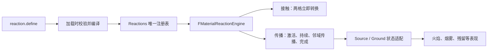

# MatterFlux 通用物质反应引擎：UE 初学者指南

这份文档说明当前项目怎样用一套引擎处理水与熔岩、燃烧、酸蚀等反应。重点不是把
Noita 的所有物理一次做完，而是先建立一个能扩展、能存档、能联机且运行成本可控的
反应内核。

## 1. 最重要的设计结论

火焰不是引擎中的特殊物质类型。它只是一个普通 material ID；木头燃烧是
`wood + fire` 的传播反应，和 `metal + acid` 使用相同状态机。



只有最后一层知道某条规则要显示成火焰。反应内核只认识输入、输出、概率、步数和
可选排放物。

## 2. 两类规则

### 接触反应

两个相邻格满足输入时立即转换，适合水/熔岩、酸/碱等：

```lua
reaction.define {
    id = "water_lava_quench",
    trigger = "contact",
    inputs = { "water", "lava" },
    outputs = { "steam", "stone" },
    chance = 1.0,
}
```

接触顺序可以反转；输出会跟着对应输入反转，不会把石头和蒸汽放错格。

### 传播反应

第二种输入激活第一种输入。活跃格保持 `duration_steps` 个 fixed step，期间尝试向
四邻域传播，完成后把第一种输入改成第一种输出：

```lua
reaction.define {
    id = "metal_acid_corrosion",
    trigger = "propagating",
    inputs = { "metal", "acid" },
    outputs = { "empty", "acid" },
    chance = 1.0,
    duration_steps = 10,
    propagation = { chance = 0.35 },
}
```

`emission` 完全可选。燃烧可以排放 smoke，酸蚀可以不排放任何东西：

```lua
emission = { material = "smoke", chance = 0.68 }
```

## 3. 一步传播内部发生什么

每个传播网格保存三张紧凑数组：

- `InputMask`：尚未完成反应的输入物；
- `ActiveState`：活跃格剩余步数，0 表示未激活；
- `OutputMask`：已经变成输出物的格子。

一次 `Step()` 按稳定索引处理当前活跃格：

1. 根据规则决定是否产生排放事件；
2. 按固定的四邻域顺序寻找可传播格；
3. 受到 `MaxNewActivations` 预算限制，只加入有限的新格；
4. 当前格倒计时；归零时从输入 mask 移到输出 mask；
5. 新活跃索引排序后成为下一步状态。

引擎返回变化格和排放坐标，但不创建 Actor、Component 或粒子。世界层可以把许多
变化批量合并成网格/ISM，也可以在 Dedicated Server 上完全跳过表现。

## 4. 确定性为什么重要

服务器、晚加入客户端和存档恢复必须认同同一结果。概率不是调用全局随机数，而是由
以下稳定输入混合得到：

- 世界/事件 seed；
- logical tick；
- 格子坐标；
- 规则字符串 ID 的稳定 hash；
- 当前操作的固定 salt。

规则查找也先把 ID 按字典序排序，不使用 `TMap` 的遍历顺序。Lua 不参与运行时逐格
计算，避免脚本状态、平台浮点和执行顺序造成分歧。

## 5. 为什么代码里还有 FMaskCombustion

这是兼容适配器，不是第二套引擎。现有存档、复制包、控制台命令和 VFX 使用
`FuelMask/BurningMask/ResidueMask` 等名称；一次全部改名会制造没有玩法价值的格式
迁移风险。适配器把这些字段映射到通用引擎的
`InputMask/ActiveState/OutputMask`，所有状态转移仍只有一个实现。

判断是否出现“双轨逻辑”的方法很简单：如果适配器自己计算概率、遍历邻居或递减
计时，就是错误；当前它只转发调用与转换快照字段。

## 6. Lua 热更新与安全边界

Lua 内容包加载到临时 registry 后会验证：

- ID 格式和全局唯一性；
- 输入、输出、排放物是否引用存在的材质；
- 概率是否在 0～1（编译后为 0～1000）；
- 持续步数是否在 1～255；
- 同类规则是否占用冲突的输入对；
- schema 是否为当前版本 2。

全部成功才替换活动 registry。任何一项失败都会保留旧 registry，所以热更不会留下
“一半新规则、一半旧规则”的世界。

## 7. 怎样新增一种反应

1. 在 `Content/Lua/Materials` 注册所有输入和输出材质。
2. 在 `Content/Lua/World` 用 `reaction.define` 添加规则。
3. 若只是接触或传播转换，不需要写 C++。
4. 若需要新的视觉形态，只扩展表现消费者，不修改反应状态机。
5. 为新行为增加自动化测试，至少覆盖输入反转/激活、最终输出、快照恢复和确定性。
6. 修改默认内容后增加 manifest revision；改变 C++/Lua 数据契约时才增加 schema。

温度阈值、催化剂、压力等尚未进入规则结构。加入这些能力时应扩展通用条件/效果
数据，而不是新建 `FreezingEngine`、`CorrosionEngine` 等并行系统。

## 8. 代码入口和测试

- `Plugins/MatterFluxLua/Source/MatterFluxLua/Public/MatterFluxContentTypes.h`：统一规则。
- `Content/Lua/World/00_ReactionDsl.lua`：面向内容作者的 DSL。
- `Source/MatterFlux/Public/Material/MatterFluxMaterialReactionEngine.h`：深模块接口。
- `Source/MatterFlux/Private/Material/MatterFluxMaterialReactionEngine.cpp`：唯一状态机。
- `Source/MatterFlux/Private/Material/MatterFluxCombustion.cpp`：旧命名适配器。
- `Source/MatterFluxTests/Private/MatterFluxMaterialReactionEngineTests.cpp`：接触、火焰、
  无排放酸蚀和稳定规则选择测试。

常用验收命令：

```text
Automation RunTests MatterFlux.Material
Automation RunTests MatterFlux.Lua
Automation RunTests MatterFlux.Combustion
```

第一组验证通用核心，第二组验证 Lua 编译与事务，第三组保证树木、地表、存档和复制的
火焰兼容层没有退化。

## 9. 当前边界

反应算法已经统一，但世界存储仍分为动态材质分块、静态 source mask 和地表反应
运行时。这是数据所有权与流式加载的边界，不是三套化学规则。下一阶段若要更接近
Noita，应优先增加统一的温度/湿度/压力通道，以及分块间物质交换，而不是把 Lua 放进
每格 Tick 或为每种反应创建 Actor。
