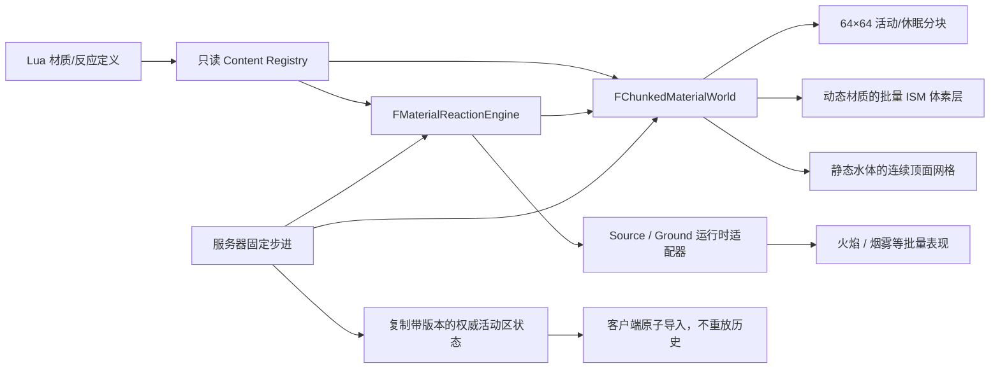

# MatterFlux Noita 风格材质模拟：UE 初学者指南

这份文档对应当前仓库中的真实实现，介绍 Lua 可配置通用物质反应、燃烧、液体、气体、
粉末、限高和分块加载。它是一个可运行的第一阶段，不等于已经复制了 Noita 的全部
引擎。

## 1. 系统分成哪几层



- Lua 只描述材质和反应，不直接操作 UE 世界。
- `FMaterialReactionEngine` 是不依赖 Actor 的纯 C++ 深模块，统一执行接触反应与持续
  传播反应；火焰、酸蚀、冻结不需要各写一套状态转移算法。
- `FChunkedMaterialWorld` 负责分块、相态移动，并调用同一个引擎处理接触反应。
- `AMatterFluxPlayableWorldActor` 是 UE 适配层，负责生命周期、复制和可视化。
- 动态材质目前按材质使用 ISM；确定性溪流和湖泊已经使用连续合并顶面。两者都是可替换
  的表现适配器，不改变模拟接口。

## 2. 从哪里开始读代码

1. `Content/Lua/MatterFluxContent.lua`：默认材质和水/熔岩反应。
2. `Plugins/MatterFluxLua/Source/MatterFluxLua/Public/MatterFluxContentTypes.h`：
   相态和反应数据结构。
3. `Plugins/MatterFluxLua/Source/MatterFluxLua/Private/MatterFluxLuaModule.cpp`：
   Lua 参数解析、引用校验和事务提交。
4. `Source/MatterFlux/Public/Material/MatterFluxMaterialWorld.h`：
   模拟模块的窄接口。
5. `Source/MatterFlux/Private/Material/MatterFluxMaterialWorld.cpp`：
   分块、反应和移动规则。
6. `Source/MatterFlux/Public/Material/MatterFluxMaterialReactionEngine.h`：
   接触与传播反应共用的窄接口。
7. `Source/MatterFlux/Private/Game/MatterFluxPlayableWorldActor.cpp`：
   固定步进、复制焦点、动态 ISM 和静态连续液面显示。
8. `Source/MatterFluxTests/Private/MatterFluxMaterialReactionEngineTests.cpp`：
   水/熔岩、火焰传播和非火焰酸蚀的统一行为规格。
9. `Source/MatterFluxTests/Private/MatterFluxMaterialWorldTests.cpp`：
   最短、最可信的行为规格。

可复现的液体与化学场景放在 `Content/Lua/Maps`，由
`BuildCustomMap` 同时构建材料世界与三维验收场景。具体写法见
`docs/MatterFlux_Custom_Maps_Beginner_Guide.md`。

## 3. 一格里保存什么

每格只保存四个整数：

- `MaterialIndex`：0 是空，其余索引指向初始化时稳定排序的材质表。
- `LastUpdatedTick`：防止同一格在一次 fixed step 中移动两次。
- `SupportHeight`：地表模式下该 XY 格的地形顶面世界高度。
- `Amount`：格内物质量。液体使用 `1..255` 表示局部液量，空格为 0；其他相态通常为
  255。它让液体可以“分一部分给邻格”，而不是把整个方块随机搬走。

材质密度在加载时乘 1000 并转为整数。随机选择也来自
`seed + cell coordinate + tick` 的整数 hash，因此相同输入能得到相同结果，避免把
浮点随机和平台相关遍历顺序带进权威模拟。

## 4. 两种空间拓扑

同一套格子规则支持两种观察世界的方式：

- **竖直剖面模式**：格子坐标表示水平 X 和竖直 Y。重力沿负 Y，液体下落、气体
  上升，适合 Noita 式洞穴或侧视关卡。
- **地表高度场模式**：格子坐标表示世界 X/Y，每格另存 `SupportHeight`。液体比较
  八邻域地表高度，优先流向最低的空格；如果低处已是较轻液体，较重液体会与它
  交换，让轻液体回到较高格；粉末只向更低地表滚落；气体在地面上按八邻域扩散，
  并在可视化时抬到地表上方。当前森林演示使用此模式。

`bUseSurfaceTopology` 只切换邻居与重力策略，Lua 材质、反应、分块归档和确定性顺序
完全复用。这样不会为了“能在地上流”复制一套模拟器。

当前地表液体是“单层高度场 + 每格液量”的简化浅水模型。它有守恒体积和局部液面
均衡，但没有 Navier–Stokes 速度场、惯性波浪或同一 XY 柱内的多层材质。它适合
像素/体素风格溪流、漫流、沿坡分层和化学反应。真正的同柱多层液体仍需把格子扩展为
稀疏 Z 层，不能靠反复交换同高度整格来伪造，否则会产生抖动。

### “沿垂直面流”和“在地上流”分别是什么意思

竖直剖面模式中，液体格先受重力向下移动；墙体占据的格子不可进入，所以液体会贴着
墙的空侧向下落，遇到地面后再沿水平格摊开。这是 Noita 式侧视世界最直接、成本最低
的表现。

森林是 3D 地表，但没有为每个 X/Y/Z 都分配体素。它使用一层 X/Y 高度场：
`SupportHeight` 代表脚下地面高度，水选择八邻域中较低的支撑面。这样水能绕过高地、
沿坡下流并在平地横向扩散，同时内存和步进成本仍接近二维网格。

这个取舍意味着当前不能表现“有厚度的瀑布从任意 3D 悬崖表面流下，再在地面形成
连续水深”。要加入这种效果，推荐只在悬崖附近临时创建稀疏的竖直表面块，并在落地点
把流量交给地表高度场；不要把整张地图升级成致密 3D 流体网格。

## 5. 四种相态如何移动

### 静态固体

`static` 不主动移动，用作石墙和反应生成的石头。

### 粉末

`powder` 先尝试正下方，再按确定性方向尝试两个下对角。下面被挡住时自然形成斜坡，
这就是沙堆的基本效果。

### 液体

竖直剖面中的 `liquid` 依次尝试下方、下对角和横向。目标是另一种可移动材质时会
比较密度，较重液体可以向下置换较轻材质。

### 气体

`gas` 是液体规则的竖直反转：先上升，再尝试上对角，最后按 `dispersion` 横向扩散。
较轻气体可向上置换较重的动态材质。

更新坐标在执行前已稳定排序：从低到高扫描，奇偶 tick 反转 X 方向，减少液体总向
一侧偏移。当前核心是单线程确定性版本；未来并行时只能把纯格子数据交给 worker，
UObject 和 HISM 更新仍必须回到 Game Thread。

在地表模式中，“下方”改为八邻域里支撑高度最低的位置，并始终优先处理低地；平地
上的液体比较源格与目标格的 `Amount`，每步只转移有上限的一部分液量。空白边缘必须
跨过由 `world seed + 目标坐标 + 材质` 派生的表面张力阈值，所以同一 seed 完全
确定，不同位置的边缘又会有轻微不规则。每步只对活动液体做一次连通域扫描；若液滩
长轴明显大于短轴，长轴方向提高表面张力、短轴方向降低，接近等宽后偏置自动归零。
低液量、低邻接的孤立毛刺会把液量守恒地并回主体。这样长方形初态会逐步松弛成近圆
的像素水洼，而不是整格随机游走或棋盘空洞。

## 6. 化学反应怎样配置

```lua
reaction.define {
    id = "water_lava_quench",
    trigger = "contact",
    inputs = { "water", "lava" },
    outputs = { "steam", "stone" },
    chance = 1.0,
}
```

每步先检测右邻和上邻，避免一对格子重复检测。命中反应后，两个输出格在本步被标记
为已经更新，所以新生成的蒸汽不会在同一帧立刻再移动。概率是 `0..1000` 的整数，
也使用确定性 hash。

Lua 热重载仍是事务式：新脚本的所有材质、输入/输出引用和概率全部合法后，才替换
活动 registry；失败时保留旧版本。

默认酸液在 `Content/Lua/Materials/Default.lua` 中定义，密度为 `1.22`，高于水的
`1.00`。`Content/Lua/World/Chemistry.lua` 使用同一个接触反应 DSL 声明腐蚀：

```lua
reaction.define {
    id = "acid_wood_corrosion",
    trigger = "contact",
    inputs = { "acid", "wood" },
    outputs = { "acid", "acid_gas" },
    chance = 1.0,
}
```

输出中的酸仍留在原格，被腐蚀的木格变成会按气体规则扩散的 `acid_gas`。木、叶、草、
`grassland` 和三种花都从同一个 Lua 辅助函数展开规则。脚本故意没有声明
`acid + water`：两者会按密度发生物理置换，但 `ReactedPairs` 保持为零，不产生化学
产物。这两个概念必须分开测试。

### 动态材料怎样腐蚀树和其他可切割物体

树、房屋等整体物体使用 Source mask，而流体使用材料格，二者不能靠相邻数组元素
自动相遇。`AMatterFluxPlayableWorldActor::ApplyMaterialSourceContactReactions` 是它们
之间唯一的适配层：它只挑出“液体 + 静态固体”的 Lua contact 规则，查询液柱包围盒
内的 Source，按稳定规则 ID 和 Source GUID 顺序执行一次小圆形 mask 损伤，再把气体
输出写回相邻材料格。C++ 不检查 `acid` 名称，因此以后新增碱液、溶剂或冻结液时只需
配置相同接口。

这个桥接默认每帧最多提交 8 次 Source 反应，避免大面积泄漏同时物理化大量树木。
法术、容器和测试通过 `SetSimulatedMaterialAtWorldLocation` 共用世界坐标到材料格的
换算入口；客户端不能用它改权威状态。

## 7. 通用传播反应怎样工作

燃烧已经不再拥有一套独立的反应算法。Lua 的 `reaction.define` 同时描述接触反应和
传播反应；C++ 将它们编译成同一种 `FMatterFluxReactionDefinition`，再交给
`FMaterialReactionEngine`。例如酸蚀可以不产生任何副产物：

```lua
reaction.define {
    id = "metal_acid_corrosion",
    trigger = "propagating",
    inputs = { "metal", "acid" },
    outputs = { "empty", "acid" },
    chance = 1.0,
    duration_steps = 10,
    propagation = { chance = 0.35 },
}
```

传播规则中的第一种输入是被转换的物质，第二种输入是激活物。活跃格经过固定步数后
转为第一种输出，同时按四邻域传播。`emission` 是可选的表现/副产物事件；不填写就
不会为了凑接口而生成假烟雾。完整字段说明见
[`MatterFlux_Material_Reaction_Engine_Beginner_Guide.md`](MatterFlux_Material_Reaction_Engine_Beginner_Guide.md)。

### 为什么代码里还看得到 Combustion

`FMaskCombustion` 现在只是向旧存档、网络字段和火焰 VFX 提供兼容名称的薄适配器，
内部没有蔓延算法；所有 `Initialize/Activate/Step/Capture/Restore` 都委托给通用反应
引擎。它对外仍映射三张与 source 同尺寸的紧凑数组：

- `FuelMask`：仍存在的可燃像素；
- `BurningMask`：每格剩余燃烧步数；
- `ResidueMask`：木炭或灰等固体残留。

Lua 的传播规则为一种输入物声明激活物、排放物、输出物、触发概率、蔓延概率、持续
步数和排放概率。C++ 以确定性整数 hash 执行规则。树干使用 `wood`，
树冠使用 `leaf`，草、花和 `grassland` 分别有自己的规则；树干燃尽形成
`charcoal`，叶片与小型植物形成 `ash`。

可玩世界每 0.2 秒检查一次实际燃烧像素的世界包围盒，把火从树干传播到相交的树冠
source，再传播到地表。地表使用独立的低蔓延 `grassland` 规则，避免一次点火立刻
吞掉整张地图。火焰和烟雾是批量 ISM 体素，固体残留重新走 mask 挤出网格。

燃烧步只遍历 `ActiveBurningIndices`。用于防止同一邻格在一帧被重复点燃的标记采用
常驻 generation-stamp 数组：每步递增 epoch，只写火焰邻域，不再为 512×384
整张地表反复分配和清零临时数组。因此没有火时近似零成本，局部火势的 CPU 成本
主要随活跃燃烧格数量增长，而不是随地图总面积增长。

地面模拟 mask 与可复制碎片 mask 使用不同的校验边界。碎片 source 仍受
256×256 网络/几何预算限制；服务器本地燃烧允许最多 1,048,576 格，并单独验证
尺寸乘积、二值内容和至少一个燃料格。不能把网络 payload 的预算误当作核心模拟
尺寸限制，否则地图扩到 512×384 后会在进入燃烧器之前被静默拒绝。

燃烧仍遵守碎片事务：若燃烧中的 source 同时被 damage 删除像素，
`ConstrainFuelMask` 会把模拟燃料与已提交的 `RuntimeMask` 求交，因此下一步不会把
已经破坏的像素“复活”。

地表燃烧在 `FMaskCombustion` 外还有一层 `FGroundCombustionRuntime`。初学者可以把
两者理解为“规则机器”和“运行时管家”：前者只回答一格怎样点燃、蔓延和烧尽；后者
负责每 0.1 秒推进、每帧最多补 3 步、记录不足一步的时间、把变化格归入 64×64
dirty chunk，并管理服务器 revision 与客户端已应用 revision。世界 Actor 不再同时
保存另一份 mask、累加器和 revision，所以显示、存档与网络不会各自读到不同状态。

发布 dirty chunks 时，运行时先按稳定坐标顺序把整批 payload 全部编码成功，然后才
递增一次 revision 并清除 dirty。任意编码失败都会保留原 revision 和全部 dirty，
下一次仍可重试。客户端也先完成长度、解压和 CRC 校验，校验失败不会写入任何 mask；
重复或更旧的 payload 返回 `NoChange`。这就是网络代码里常说的 prepare→commit：
“准备成功”与“状态已经提交”不能混成同一步的半成品。

地图重生成也采用相同思想。新地形的 surface positions、燃料 mask 和燃烧运行时先在
局部候选对象中构建；成功后才一次替换旧状态并发布初始 chunks。因此加载跨过一帧或
候选构建失败时，旧的火焰、烟雾和焦痕不会先被整层清空再突然出现。

联机时只有服务器推进燃烧。装饰 source 复制燃料、燃烧和残留 mask，并会在
两种编码中自动选择较小者：完整 bit mask，或连续燃烧区间的 run-length 编码。
刚点燃的局部火势通常只需几个区间；如果火势碎片化到区间编码更大，则自动退回
bit mask，因此最坏包体不会随火点数量失控。客户端严格检查区间顺序和边界后再
重建显示，不自行决定传播结果。地表则使用独立的 64×64 payload：残留按 bit
打包、燃烧剩余步数按 byte 保存，并在 Zlib 确实更小时压缩。

可燃装饰离开所有玩家的流式窗口时，即使仍在燃烧或只剩残渣，也不再为了保存状态而
常驻 Actor。服务器把燃料、残渣、每格剩余燃烧步数、随机种子、模拟 Tick 和不足一
个 fixed step 的累计时间保存为普通 C++ 状态，然后销毁 Actor。该区块再次进入窗口
时，以同一 `SourceId` 恢复；卸载期间火势休眠，回来后从完全相同的确定性状态继续。
这比长期保留成百上千个远处 Actor 便宜得多，同时不会把残渣变回燃料。

## 8. 分块加载和边界

默认 `ChunkSize` 是 64，接近 Noita 技术访谈公开的 64×64 模拟块。活动窗口由
`ActiveChunkRadius` 控制：

- 活动块之间可以直接交换格子，所以接缝不会成为隐形墙。
- 目标块不活动时，本步移动失败，边界格保持原材质，不会凭空丢失。
- 玩家跨过分块边界后，旧块被 RLE 编码并移出实时 `Chunks`。
- 回到旧区域时解码恢复，并把整块标为 dirty 继续模拟。
- 空块不写入归档，避免世界探索后留下大量空数据。
- 负坐标使用 floor division 和 positive modulo，`(-1, y)` 会正确进入 `-1` 号块。

多人时不是只取第一个 Controller。世界 Actor 把每个权威 Pawn 的位置转换成材质
chunk 原点，去重并按坐标排序，再一次传入 `SetSimulationFocuses`。材质世界先加入每个
焦点的中心块，然后逐个距离环遍历；同一个环坐标会轮流服务每个焦点，避免第一个玩家
把预算全部吃完。`MaxActiveChunks` 仍是硬上限；默认半径 1、预算 9 时，四名分离玩家
都会至少得到中心块，其余预算公平分配给邻环。输入焦点顺序不会改变结果。

大地图初始化使用 `SeedSurface` 批量提交。函数先校验所有坐标、重复格和材质引用，
再按块写入，最后让每个非活动块只进行一次 RLE 归档。不能用循环反复调用
`SetSupportHeight` 来播种几十万个远端格：那会让同一块在每个格上反复解码和编码。

Noita 公开资料还描述了 dirty rectangle 和避免相邻块并发写冲突的多轮调度。本实现
已经使用每块 dirty rectangle，并把跨活动块边界作为公开行为测试；当前尚未启用
多线程四轮调度，避免在规则仍快速迭代时引入数据竞争。

参考资料：

- [GDC Vault：Exploring the Tech and Design of Noita](https://www.gdcvault.com/play/1025695/Exploring-the-Tech-and-Design)
- [80 Level：Noita 的 falling-sand 技术访谈](https://80.lv/articles/noita-a-game-based-on-falling-sand-simulation)
- [Game Developer：Noita / Falling Everything Engine](https://www.gamedeveloper.com/game-platforms/road-to-the-igf-nolla-games-i-noita-i-)

## 9. 限高和越界消除

竖直剖面模式使用 `MinWorldHeightCells` / `MaxWorldHeightCells`；地表模式使用
`MinSurfaceCell` / `MaxSurfaceCellExclusive` 的 XY 矩形边界。上界都是开区间。

移动目标越过边界时，源格会被清空并增加 `CulledCells`。因此蒸汽飘过天花板会被
删除，液体落出下界也能被删除。`SetCell` 同样拒绝直接写入边界外，避免出现永远
无法更新的幽灵格。

## 10. 联机模型

服务器是唯一推进权威 fixed step 的一端。世界 Actor 复制：

- `MapSeed`
- 一个包含 map seed、revision 和活动区二进制状态的复制结构
- 状态内部的 logical step、核心 simulation tick 和规范化 focus 列表

客户端用同一 Lua registry 和 seed 构造静态地表，但不再调用材质世界的 `Step()`。
服务器把活动块中的非空格按稳定的“块坐标、格索引”顺序编码；包内使用固定小端
字节序，并带 magic、版本、块大小、活动半径、focus 列表、step 和 tick。v3 快照
额外复制精确液量，并用区块内格索引增量 varint、承托高度 ZigZag 增量 varint，
满液量 255 则不额外写字节；导入器仍接受旧 v1 单焦点与 v2 多焦点格式。客户端先完整
检查尺寸、排序、材质索引、重复块、截断和尾随数据，全部合法后才一次替换活动区。

因此晚加入客户端不需要从第 0 步重放；漏掉旧 focus 或旧 step 也只会暂时显示上一
个有效 revision，收到下一份权威快照便恢复。复制属性保留当前值，所以 UE 会把当前
快照自动发送给新连接。当前活动物质较稀疏，使用整份稀疏快照；如果以后让整个活动
窗口充满动态物质，应升级为分块 Fast Array、每块 revision 和 delta 压缩。

## 11. 当前可见演示

可玩森林把生成好的土地顶面写成地表高度场，并在上面生成：

- 沿河床分布、向低处流动的水
- 高地上的沙
- 河边的熔岩和水/熔岩反应产物
- 比水更重的紫红色酸液、酸水惰性接触，以及酸对木/草地小样的腐蚀产气
- 地表上方扩散的蒸汽
- 少量静态石头

每种材质使用一个动态 ISM 体素层和 Lua 颜色。服务器以 0.05 秒 fixed step 推进，
每帧最多补 4 步，避免卡顿后无限追帧；可视实例最多每 0.10 秒批量重建一次。
Dedicated Server 不创建可视组件。当前演示规模下，模拟只访问活动分块和 dirty
区域，可视化只维护五个左右的 ISM 组件，避免“每格一个 Actor/Component”。

燃烧同样按需付费：未点燃 source 不 Tick、不创建火焰/烟雾组件；点燃后以 10 Hz
固定步进，单帧最多追 3 步。每个 source 最多保留 128 个烟雾实例，地表火焰最多
显示 256 个、烟雾最多 96 个，并且只以 5 Hz 重建地表视觉。只有 `wood` 树干创建
无阴影点光源，因此分层树冠不会让一棵树产生多盏动态灯。

## 12. 如何验证

核心测试：

```powershell
& 'C:\Program Files\Epic Games\UE_5.8\Engine\Binaries\Win64\UnrealEditor-Cmd.exe' `
  "$PWD\MatterFlux.uproject" -unattended -nop4 -nullrhi -nosplash -NoSound `
  '-ExecCmds=Automation RunTests MatterFlux.Material; Quit' `
  '-TestExit=Automation Test Queue Empty' -log
```

Lua 和场景测试：

```text
Automation RunTests MatterFlux.Lua
Automation RunTests MatterFlux.Playable
```

当前自动化覆盖液体守恒、竖直液柱密度分层、地表高度场中的密度置换与下坡流动、
酸水不反应、酸腐蚀木/草地产生气体、酸接触真实树木后提交 Source mask revision、
粉末斜落堆叠、气体上升/限高删除、Lua 反应、跨活动块移动、未加载边界冻结、休眠块
归档恢复、多焦点公平预算、输入顺序确定性和无历史快照恢复，以及可玩场景真正生成并
推进材质层。
`MatterFlux.Combustion` 还覆盖燃料蔓延、烟雾、固体残留、树干到树冠传播、地表
焦痕、damage/燃烧并发一致性，以及地表 dirty chunk 批处理、坏包原子拒绝、重复包
幂等和存档 fixed-step 时间债恢复。

联机实现不再只复制活动焦点和模拟步数。活动材质世界会复制可恢复的权威状态快照；
地表燃烧则拆成 64×64 cell 的独立分块快照。晚加入、漏过旧焦点更新或本地已经分歧
的客户端都能导入服务器当前状态。数据格式、CRC、revision 和测试方法见
[`MatterFlux_Multiplayer_Streaming_Testing_Guide.md`](MatterFlux_Multiplayer_Streaming_Testing_Guide.md)。

## 13. 性能边界与下一步

当前最重要的技术债：

1. 材质格达到数万级后，用分块纹理/合并网格替换逐材质 ISM 全量重建，只上传
   dirty rectangle；当前方案刻意面向数百至低千级可见动态格。
2. 活动材质快照目前仍是整份压缩状态；可继续升级为分块 revision 或 Fast Array，
   只发送变化块。地表燃烧已经采用独立分块 revision，可作为参考实现。
3. 在数据所有权明确后，实现 Noita 风格四轮无相邻写冲突调度并用 TaskGraph 并行。
4. 用“稀疏竖直表面块 + 地表高度场交接”增加 3D 悬崖瀑布，而不是创建致密 3D
   流体体素。
5. 反应定义与状态转移已经统一；下一步是把目前仍分开存储的地表、装饰 mask 和动态
   材质格统一成可交换物质的世界，再加入温度、氧气和压力等通用条件通道。

生物与动态物体现在已经能按 Lua 材质密度在液体中漂浮或下沉。浮力公式、角色与
Chaos 的接入方式、组合物体体积加权以及联机职责划分见
[`MatterFlux_Liquid_Buoyancy_Beginner_Guide.md`](MatterFlux_Liquid_Buoyancy_Beginner_Guide.md)。

当前 512×384 压力地图还采用“完整确定性布局缓存 + 邻近块实例化”，不是无限世界。
它已经证明地图可以远大于 3×3 活动窗口；若继续扩大到数千格，应把 Perlin 地形和
装饰定义也改为按块惰性生成，只缓存访问过的块 seed 和修改日志。
