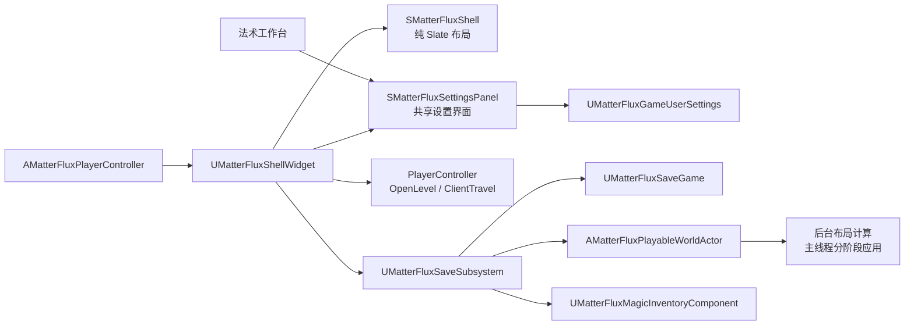

# MatterFlux 菜单、设置、存档与加载：UE 初学者指南

> 本文解释当前项目中已经运行的实现，面向刚接触 Unreal Engine C++、Slate、`USaveGame` 和异步任务的读者。

## 1. 玩家现在能看到什么

游戏顶部常驻一条白色面板和黑色描边的顶栏。第一次进入 Standalone 或 Listen Server 时，开始界面先选择“单人游戏 / 多人游戏”；单人页提供继续、新游戏和载入，多人页提供创建房间与加入房间。`Escape` 打开或关闭游戏菜单；新建地图、读取存档和恢复世界时显示真实进度与阶段文字。

所有页面沿用法术工作台的黑白样式：白底、黑色 2 px keyline、黑字、悬停时浅灰。长说明保留在 tooltip 中，不占用主布局。

## 2. 总体结构



职责分离如下：

- PlayerController 拥有本地 UI，并切换鼠标、键盘和暂停状态；
- Widget 只显示状态并发出用户意图；
- GameUserSettings 保存本机画面、声音和窗口选项；
- SaveSubsystem 编排异步写盘、读盘、地图生成和状态恢复；
- WorldActor 负责生成和恢复世界，不知道菜单长什么样。

## 3. 建议阅读的文件

| 文件 | 作用 |
|---|---|
| `Public/UI/MatterFluxShellWidget.h` | 页面枚举和菜单公开操作 |
| `Private/UI/MatterFluxShellSlate.cpp` | 顶栏、开始菜单、设置、存档槽和进度面板 |
| `Private/UI/MatterFluxShellWidget.cpp` | UMG 生命周期、菜单状态和领域命令 adapter |
| `Private/UI/MatterFluxSettingsPanel.h/.cpp` | Shell 与工作台共用的设置控件、即时预览、应用与保存逻辑 |
| `Private/UI/MatterFluxPaperWindow.h/.cpp` | Shell 与工作台共用的大页面窗框、页签、帮助和关闭按钮样式 |
| `Private/Game/MatterFluxPlayerController.cpp` | 创建 UI、输入模式、暂停与工作台切换 |
| `Public/Settings/MatterFluxGameUserSettings.h` | 自定义本机设置字段 |
| `Private/Settings/MatterFluxGameUserSettings.cpp` | 校验、应用和写入配置 |
| `Public/Save/MatterFluxSaveTypes.h` | 可序列化的玩家、法杖、物质和碎片状态 |
| `Public/Save/MatterFluxSaveGame.h` | 正式存档和动态存档索引元数据对象 |
| `Private/Save/MatterFluxSaveSubsystem.cpp` | 新游戏、保存、加载和错误处理状态机 |
| `Private/Game/MatterFluxPlayableWorldActor.cpp` | 异步地图生成与世界快照恢复 |
| `Source/MatterFluxDeveloper/Private/MatterFluxVisualCapture.cpp` | 只进入开发目标、可从外部调用的 UI/画面截图验收命令 |

## 4. 为什么 UI 由 PlayerController 持有

`AMatterFluxPlayerController::CreateShell()` 使用本地 PlayerController 作为 Owning Player：

```cpp
ShellWidget = CreateWidget<UMatterFluxShellWidget>(
    this,
    UMatterFluxShellWidget::StaticClass());
ShellWidget->AddToPlayerScreen(10);
```

UI 是每位本地玩家自己的对象，不应该复制，也不应该由服务器为所有连接创建同一个实例。PlayerController 同时管理输入模式：

- 正常游戏：`FInputModeGameOnly`，隐藏鼠标；
- 菜单打开：`FInputModeUIOnly`，显示鼠标并把焦点交给 Shell；
- Standalone 菜单：暂停游戏；
- 地图生成或加载：临时解除暂停，让 WorldActor 的分阶段 Tick 继续。

Dedicated Server 没有视口，因此不会创建界面。普通 Client 可以看到游戏 UI，但共享世界存档只允许 Standalone 或权威 Host 操作。

## 5. 开始菜单与顶栏

`UMatterFluxShellWidget` 使用 `EMatterFluxShellView` 表示页面：

```text
Gameplay / StartMenu / SinglePlayerMenu / MultiplayerMenu / CreateRoomMenu / JoinRoomMenu
         / PauseMenu / Settings / SaveSlots / LoadSlots
```

同一个 Widget 常驻 PlayerScreen，顶栏始终存在；中央菜单根据 View 重建。所有前端页面都被视为开始流程，不能用 `Escape` 绕过。开始菜单顶栏最后一个按钮是“退出”，游戏中才是“菜单/关闭”。

“继续游戏”读取元数据中时间最新的槽。没有存档时，“继续游戏”和“载入存档”会禁用。

“创建房间”先选择新世界或动态列表中的任意已有存档，再通过 `OpenLevel("/Game/Default", "listen")` 建立 Listen Server。已有存档行本身只负责选择：点击后整行变灰，并显示“已选择”；每行不再放容易误触的“创建”按钮。列表下方唯一的“从选中存档创建房间”在未选择时禁用，选择后才可确认进入。单人保存、单人载入和多人续档列表都是固定高度的纵向滚动区，右侧滚动条始终可见，不限制项目级存档数量；保存列表末尾始终有“新建存档”。每条已有存档都能重命名、异步复制和删除。选择存档时，受控 URL 选项只携带稳定槽 ID；新世界的权威 PlayerController 启动后由 `UMatterFluxSaveSubsystem` 重新读取、校验并异步恢复存档，客户端不会接触主机文件。为避免先随机生成再覆盖，`AMatterFluxPlayableWorldActor` 检测到受控存档槽选项时会推迟首次世界构建。“加入房间”校验 `IP/主机名:端口` 后调用本地 PlayerController 的 `ClientTravel`。省略端口时补为 `7777`，并拒绝空地址、越界端口、未加方括号的 IPv6 和 `?listen` 一类 URL 选项注入。当前没有接入 Steam/EOS 房间发现服务，因此加入方式是局域网或公网地址直连；公网房主仍需处理防火墙和端口转发。

## 6. 本机设置为什么不用 SaveGame

Shell 设置页和法术工作台设置页都嵌入同一个 `SMatterFluxSettingsPanel`。调用方不需要知道画质应该用下拉框、VSync 应该用复选框、音量应该用滑动条，也不负责刷新或保存：

```cpp
SNew(SMatterFluxSettingsPanel)
```

这是项目中的一个深模块：接口只有“创建这个面板”，实现内部则负责读取 `UMatterFluxGameUserSettings`、即时预览、范围限制、应用、持久化和下拉菜单刷新。黑白颜色 token、字体、按钮状态和双层描边由 `MatterFluxPaperStyle` 唯一提供。删除这两个 module 会让行为和视觉复杂性重新散落到 Shell 与工作台，因此它们提供了实际的复用和 locality。

设置内容之外，两个入口现在还直接复用 `SMatterFluxPaperWindow` 和 `SMatterFluxPaperTab`。前者统一整页白色 surface、2 px 黑色 keyline、顶部栏与正文间距，后者统一普通页签、黑底选中态、帮助按钮和关闭按钮。Shell 不再自行套一个固定尺寸弹窗并在底部另放“返回”，而是像工作台一样占满可用菜单区，由右上角 `×` 返回上一页。因此后续调整窗框或页签只需改一个 module，不会再次出现“设置项一样但页面看起来不是一套”的漂移。

画面质量、窗口模式、VSync、音量和 UI 缩放属于本机偏好，不属于某个世界，因此继承 `UGameUserSettings`，写入平台配置而不是世界存档。

当前自定义字段是：

```cpp
UPROPERTY(Config) float MasterVolume = 0.8f;
UPROPERTY(Config) float InterfaceScale = 1.0f;
```

`ValidateSettings()` 会修复 NaN、无限值和越界数据。主音量限制在 0%～100%，UI 缩放限制在 80%～125%，非有限值回到安全默认值。

`ApplyNonResolutionSettings()` 把音量交给主 Audio Device，并在真实 Game 进程中调用 Slate 的 `SetApplicationScale`。它不会在普通 PIE 中缩放整个编辑器窗口。

项目通过 `DefaultEngine.ini` 指定自定义类：

```ini
[/Script/Engine.Engine]
GameUserSettingsClassName=/Script/MatterFlux.MatterFluxGameUserSettings
```

## 7. 存档里保存了什么

`UMatterFluxSaveGame` 当前版本是 2，包含：

- UTC 保存时间、地图 seed 和玩家 Transform；
- 法术堆、法杖实例、法术槽、法力、抽取位置和冷却剩余时间；
- 四个装备槽和当前装备槽；
- 分块材质模拟活动状态；
- 流式可破坏 Source 的 `SourceId`、revision、mask、Transform 和脱离地形状态；
- Source 与地面的燃烧、残渣和点燃历史；
- 已从确定性地图中永久移除的 Source ID。

每个世界存档使用稳定名字 `MatterFlux_Save_<槽 ID>`，例如前两个是 `MatterFlux_Save_00` 和 `MatterFlux_Save_01`。`%02d` 中的 `02` 只是最少显示两位，不是 99 个或 3 个的上限。`UMatterFluxSaveMetadata` 只保存已有存档的槽 ID、seed 和 UTC 时间，用于快速构建菜单；它不再预先创建空槽。新建存档选择最小的未使用非负 ID，所以删除存档 2 后，下次新建会复用这个空洞，而其他存档的 ID 不会改变。

元数据版本 3 使用“稀疏动态集合”，并为每条记录增加最多 32 个字符的可选显示名。读取旧版三槽元数据时，迁移逻辑保留真实存档 1～3，删除空占位，再按稳定槽 ID 排序；重复、负数或字段损坏的记录会被丢弃。旧存档没有显示名时自动显示“存档 N”。磁盘文件已经不存在的记录也会从元数据移除并立即写回。这一点很重要：界面行号不能再当作槽 ID，否则删除第一行后，点击第二行可能误载另一个世界。

重命名只更新轻量元数据，不改变磁盘槽名和 Host URL。复制则先异步读取源 `UMatterFluxSaveGame`、运行同一套版本与坏数据校验，再异步写入新的槽 ID；只有写盘成功后才添加元数据记录，因此中途失败不会在菜单里留下一个无法载入的假副本。删除会同时删除 `.sav` 和对应元数据记录。

当前简单存档不会保存已经自由飞行的临时动态碎片 Actor，也不保存相机瞬时状态。后续若要长期持久化这些对象，需要专门的数据格式和恢复规则。

## 8. 版本和坏数据校验

读取磁盘后不会立刻修改世界。`ValidateAndMigrate()` 先检查：

- 版本不能来自未来；版本 0～1 可迁移到版本 2；
- seed 和 Transform 合法；
- 法术堆、法杖和装备引用不重复、不越界；
- 法力、冷却和燃烧累积值有限且非负；
- mask 只能包含 0/1，并受最大 cell 数预算限制；
- Source ID、移除列表和点燃历史不能有非法重复项；
- 整体数组和物质状态字节数不超过预算。

这叫“先验证，后作用”。坏存档不会先重建地图再在最后一步失败。

## 9. 保存和加载状态机

```text
Idle
  ├─ Saving ────────────────> Complete / Failed
  ├─ Loading
  │    └─ GeneratingWorld
  │         └─ ApplyingWorld ─> Complete / Failed
  └─ GeneratingWorld ───────> ApplyingWorld ─> Complete / Failed
```

保存时先在主线程捕获一致快照，再用 `AsyncSaveGameToSlot` 写盘。加载时用 `AsyncLoadGameFromSlot` 读取和校验，然后按存档 seed 重新生成确定性基础地图，最后应用玩家、法杖、物质和 Source 变化。

按钮返回的 `bool` 只表示请求是否成功启动。即使同步失败，Shell 也会立即读取错误文字、确认失败状态并把提示显示在当前页面。

## 10. 地图生成为什么拆成后台和主线程阶段

纯数据布局计算不访问 UObject，可以在线程池执行；Actor、Component 和 World 修改必须回到 GameThread。

| 阶段 | 起始进度 | 工作 |
|---|---:|---|
| BuildingLayout | 5% | 计算地形、河流和生态分布 |
| InitializingSimulation | 55% | 初始化液体、气体和燃烧模拟 |
| BuildingStreaming | 68% | 构建可见地形分块 |
| SpawningWorldObjects | 82%～99% | 按帧预算生成树木、花草和可破坏物体 |
| Complete | 100% | 新世界可以游玩 |

最后一阶段复用原有每帧生成预算，因此进度条既是反馈，也是避免长帧的手段。加载存档把磁盘读取、基础地图重建和最终状态恢复映射到不同进度区间，所以“正在加载世界”与“正在生成地图”的标题和百分比不同。

进度值有两种语义，不能混用：

- `AsyncSaveGameToSlot` 和 `AsyncLoadGameFromSlot` 没有提供已写入字节数，因此界面显示移动条纹和“处理中…”，不伪造 35% 或 8%。
- 地图 Actor 提供真实的阶段进度。新游戏直接显示 5%～97%；载入存档把同一段映射到 15%～97%，为已经完成的读盘留出前段。应用玩家和世界状态是 98%，成功完成是 100%。

`SMatterFluxProgressBar` 是 Shell 和法杖工作台共用的 Slate 组件：方角、2px 黑描边、白色轨道、黑色填充。不再直接使用引擎默认进度条皮肤，避免不同页面出现圆角、灰色边距或不同粗细。

## 11. 多人边界

共享世界保存/加载要求本地 Controller 有 Authority、当前不是 `NM_Client`，并且没有另一个操作正在运行。因此 Standalone 和 Listen Server Host 可用，普通 Client 不能直接改服务器世界，Dedicated Server 没有本地菜单。这是主机本地存档，不是云存档或多人投票保存系统。

## 12. 怎样测试

专项与完整测试命令：

```text
Automation RunTests MatterFlux.Save
Automation RunTests MatterFlux.Settings
Automation RunTests MatterFlux
```

专项覆盖初始化、版本迁移、坏数据拒绝、真实 `USaveGame` 内存往返、旧三槽到动态集合的迁移、127 个存档记录、删除空洞复用、进度范围/单调性/阶段端点/不确定读盘语义，以及设置默认值、边界和 NaN 修复。

从外部截图不需要模拟鼠标：

```text
mf.UI.Capture start 1 1
mf.UI.Capture settings 1 1
mf.UI.Capture create 1 1
mf.UI.Capture save 1 1
mf.UI.Capture load 1 1
mf.UI.Capture progress 1 1
mf.UI.Capture load-progress 1 1
```

参数依次是页面、延迟秒数、截图后是否退出。`progress` 会真的生成固定 seed 地图；`load-progress` 会真的保存并加载一个槽，验收时应配合独立 `-UserDir`，避免触碰正式存档。截图写入当前 UserDir 下的 `Saved/Screenshots/WindowsEditor`。

固定使用 1600×900 截取 `progress` 后，可以用像素检查脚本验证黑色方角描边和填充比例。坐标参数对应这套固定分辨率：

```powershell
.\Scripts\Verify-MatterFluxProgressScreenshot.ps1 `
  -Path .\Saved\Screenshots\WindowsEditor\MatterFluxShell-progress-时间戳.png `
  -ExpectedFraction 0.82
```

## 13. 初学者最容易犯的错误

1. 在后台线程 SpawnActor 或修改 Component。后台线程只计算纯数据。
2. 把本机画面设置放进世界 SaveGame。两者生命周期和多人所有权不同。
3. 只保存随机 seed。切割 mask、燃烧和法杖状态也必须进入快照。
4. 读到对象后立即应用。必须先完成版本、预算和引用校验。
5. 菜单暂停后发起生成，却忘记解除暂停。分阶段 Tick 会无法完成。
6. 把 `Slots` 的数组下标当作持久槽 ID。动态列表删除或排序后，下标会变化；保存、载入、删除和 Host URL 都必须传 `SlotIndex` 字段。
6. 只看进程退出码。Automation 的最终证据是 JSON 中每条测试状态。

理解这套实现的主线是：**Widget 发出意图，Subsystem 维护操作状态，纯数据在后台计算，UObject 在主线程应用，进度界面只读取真实状态。**
