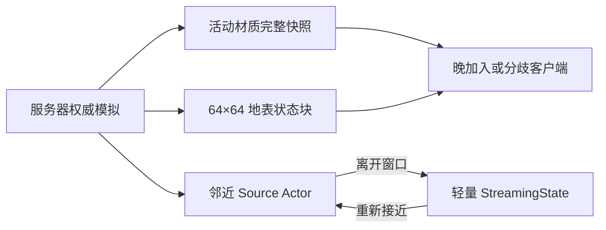

# MatterFlux 多人复制、流式加载与性能测试入门

> 本文面向刚接触 Unreal Engine 联机的读者，描述当前仓库中的实际实现。阅读前只需要知道：服务器保存游戏真值，客户端显示服务器允许它看到的结果。

## 1. 这轮修复解决了什么

旧方案只复制“当前活动焦点”和“已经模拟多少步”。这两项是重放提示，不是完整状态：
晚加入客户端没有旧输入；丢过一次焦点更新的客户端也无法凭最终步数还原中间发生的
液体流动、反应和燃烧，因此可能得到不同世界。

现在有两条权威状态通道：

1. 动态材质世界通过 `FMatterFluxReplicatedMaterialState` 发送可恢复的完整活动状态。
2. 地表燃烧和残渣通过 64×64 cell 的 `AMatterFluxGroundStateChunkActor` 分块发送。

流式装饰 Source 的生命周期也已改变。燃烧中、已经切过或带残渣的 Source 离开玩家
窗口时，会先导出 `FFragment2DSourceStreamingState`，再销毁 Actor；玩家返回时根据
状态恢复。这样长距离探索不会因为“不能卸载已修改 Actor”而持续堆积 Actor。



## 2. 为什么焦点和步数不能代替状态

假设服务器依次模拟了 A、B、C 三个活动区域，客户端只收到 C 和 `Step=100`。客户端
不知道 A、B 中曾有哪些水、沙、蒸汽或化学反应，也不知道随机决策发生时的完整输入。
即使所有算法确定性相同，初始状态不同仍会得到不同结果。

可靠做法是区分两类数据：

- 命令/元数据：焦点、步数、玩家操作，适合驱动未来模拟。
- 状态快照：当前每个活动 cell 的材质和必要状态，用于加入、修复和重新同步。

`FChunkedMaterialWorld::ExportActiveState` 把服务器活动区域导出；客户端在 RepNotify 中
调用 `ImportActiveState`。导入是事务式的：长度、内容和校验不合法时，不部分覆盖
客户端原状态。

当前 wire format 为 v2：除了 step 和 tick，还保存按 chunk/cell 坐标规范排序的完整
焦点列表。导入器仍接受 v1 的单焦点状态。服务器对所有权威 Pawn 去重；材质世界按
距离环在焦点之间 round-robin，并用 `MaxActiveChunks` 截断活动集合。因此多人分散时
不会只推进第一名玩家附近，输入 Controller 的迭代顺序也不会改变快照字节。

对应代码：

- `Source/MatterFlux/Public/Material/MatterFluxMaterialWorld.h`
- `Source/MatterFlux/Public/Game/MatterFluxPlayableWorldActor.h`
- `Source/MatterFlux/Private/Game/MatterFluxPlayableWorldActor.cpp`

## 3. 地表燃烧为什么单独分块

测试地图是 512×384 cell。每次一个火点变化就复制整张地图，CPU 和带宽都不划算；
只复制“最新火点”又不能修复漏包或晚加入客户端。因此地表被划为 64×64 cell，共
8×6=48 个状态 Actor。

每个 `FMatterFluxGroundStateChunk` 包含：

- 块坐标和独立 `Revision`；
- 4096 个残渣标志，压成 512 字节 bitset；
- 4096 个 `uint8` 燃烧剩余时间；
- zlib 压缩结果；压缩无收益时使用原始数据；
- CRC，用来拒绝损坏或截断的 payload。

单块原始上限是 4608 字节。Actor 使用当前完整块状态而不是依赖历史 delta，所以
晚加入客户端建立网络通道时即可获得该块当前真值。客户端只接受更新 revision，并且
完整解码成功后才替换本地块；这就是“原子应用”。

燃烧步进会返回改变过的 cell 索引，世界只把这些 cell 所属块标脏。一个 0.2 秒传播
周期内的多次点燃会批量合并，最后统一发布；没有变化的 47 个块不会重新编码。

对应代码：

- `Source/MatterFlux/Public/Game/MatterFluxGroundStateChunkActor.h`
- `Source/MatterFlux/Private/Game/MatterFluxGroundStateChunkActor.cpp`
- `AMatterFluxPlayableWorldActor::ApplyReplicatedGroundStateChunk`

## 4. Source 为什么默认不需要 Actor

“服务器不把远处 Actor 复制给客户端”和“服务器销毁远处 Actor”是两件不同的事。
Net Relevancy 只节省客户端通道，Actor 仍可能留在服务器世界里。

当前 Source 流式流程是：

1. pristine Source 始终是 `FragmentSourceChunks` 中的轻量逻辑记录；区块代理把多个
   Source 合并成 ProceduralMesh section，不为每棵树、花或草创建 Actor。
2. 切割等需要复用 Actor 事务管线的操作只把命中候选短暂提升为
   `AFragment2DSourceActor`。
3. 若结果仍连接地形，完整 mask/revision/燃烧状态先回写逻辑存储，再销毁临时 Actor；
   真正脱落并需要独立 Chaos 与 replicated movement 的结果才保留 Actor。
4. 已切空且没有燃烧残渣的状态是 durable tombstone。它继续参与存档和复制，但不会
   重新物化为不可见 Actor；这也防止已消失树冠在树干倒下时被塞入 Carrier。

这使“活动 Actor 数量”由正在发生的交互和独立物理对象限制，而不是由森林大小或探索
距离限制。需要诚实区分：修改过的远处 Source 仍会占用一份轻量状态记录，所以无限
探索最终还需要存档分片、区域淘汰或磁盘持久化；当前解决的是昂贵
Actor/ProceduralMesh 的无限积累。

区块代理有独立预热上限；当前测试森林在加载期完成网格缓存，普通移动跨区块只切换
已建好的 section 和碰撞，不再逐装饰实例化 Actor。

地形、关卡层和 Source 现在共用 `MatterFluxWorldStreamingPlan`。它先规范化全部焦点和
镜头偏移，再输出按 `X/Y` 排序的唯一区块数组；地形组件只能按这个数组顺序创建。
活动区块在同一次刷新中共享 LRU generation，淘汰代数相同时也按坐标仲裁。这样 near/far
PIE 中区块并集相同就会得到相同创建与淘汰顺序，而不是偶然依赖某个 `TSet`/`TMap`。
窗口预算或坐标检查失败会保留旧窗口与旧焦点，不会半提交。

## 5. Net Relevancy 中容易误解的参数

`AActor::IsNetRelevantFor` 的 `SrcLocation` 是连接的观察位置，不是当前 Source 的位置。
旧实现把它当 Source 坐标，导致距离判断错误。当前实现比较：

```text
Source.GetActorLocation()  <->  ViewTarget/RealViewer.GetActorLocation()
```

普通 Source 的裁剪距离为 1100cm，动态碎片为 1400cm。覆盖函数还必须尊重
`bAlwaysRelevant`；否则一个显式要求全局相关的测试/任务 Actor 仍会被距离裁掉。

普通 Source 已不再靠 Net Relevancy 控制数量，因为它根本没有 Actor channel。这里的
1100cm 规则只作用于短暂物化、尚未回到区块代理的 Source Actor；动态碎片继续使用
1400cm。`AMatterFluxPlayableWorldActor` 当前仍同时协调生成、地形流送、物质模拟、燃烧、
复制和存档，因此后续仍要继续提取 deep module，让 Actor 只保留 UE 生命周期和复制
adapter。

2026-08-09 的 2～4 人 near/far PIE 矩阵为 6/6。四人 far 场景维持 41 个 terrain
chunk，服务器和单客户端 Source Actor 峰值都是 8；这些 Actor 来自当时的交互，不是
pristine 森林常驻对象。

## 6. 燃烧传播的性能处理

当前实现避免了几类明显的全量工作：

- 地表只重建活动 terrain chunk 中被标脏的视觉块；Dedicated Server 不建地表 HISM。
- 一个燃烧 Source 只向地表播种一次，不会每 0.2 秒寻找新的最近地面。
- Source 到 Source 的传播分为逻辑 Source 和已物化 Actor 两条路径。前者查询
  `FSourceSpatialIndex`，后者查询 Subsystem 的注册索引；传播不会为了命中邻居而把
  pristine Source 物化。
- 局部点燃、法杖火焰、火球落点和世界切割先查 `FSourceSpatialIndex` 或 Subsystem 的
  已注册 Actor 索引，再执行精确判断。65,536 次远距离零命中查询从 5,146.99ms 降至
  最终全量测试中的 14.91ms。
- 地面燃烧运行时按 64×64 区块维护稀疏 burning/residue cell。多个活动区块通过
  `FSourceSpatialIndex::QueryMany` 一次得到稳定去重候选，再用 ground cell 和高度范围
  做精确判断；不会按每个燃烧 cell 重复查索引。
- 正在燃烧的逻辑 Source 继续逐步复制 mask 和显示共享火焰/烟雾，但昂贵实体网格只在
  熄灭后按 0.5 秒 chunk 批次合并一次；交互切割仍即时刷新。
- 同一传播周期的地表点燃批量发布 dirty chunk。
- 未燃烧 Source 默认不 Tick。

## 7. 怎样本地运行联机测试

先构建 Editor：

```powershell
& 'C:\Program Files\Epic Games\UE_5.8\Engine\Build\BatchFiles\Build.bat' `
  MatterFluxEditor Win64 Development "$PWD\MatterFlux.uproject" `
  -WaitMutex -NoHotReloadFromIDE -MaxParallelActions=1
```

跑 2～4 人近距/远距矩阵：

```powershell
& 'C:\Program Files\Epic Games\UE_5.8\Engine\Binaries\Win64\UnrealEditor-Cmd.exe' `
  "$PWD\MatterFlux.uproject" -unattended -nopause -nosplash -NullRHI -NoSound `
  '-ExecCmds=Automation RunTests MatterFlux.Network.Scale' `
  '-TestExit=Automation Test Queue Empty' `
  "-AbsLog=$PWD\Saved\Logs\NetworkScale.log"
```

加 `-MatterFluxStrictPerf` 会启用严格帧时门槛。不要在已经混跑一百多个测试的进程中
解释严格性能数字；该开关应在独立 Editor-Cmd 进程中使用。

其他关键测试：

```text
MatterFlux.Fragment.Network.DedicatedServerTwoClients
MatterFlux.Fragment.Network.ListenHostAndClient
MatterFlux.Material.AuthoritativeActiveStateRepairsDivergentClient
MatterFlux.Material.ReplicatedSnapshotCompressionIsBoundedAndLossless
MatterFlux.Material.GroundStateChunkIsAtomicBoundedAndLossless
MatterFlux.Playable.StreamingArchivesCombustingAndResidueSources
MatterFlux.Performance.LargeWorldStreamingMovementAndCombustion
```

## 8. 测试实际覆盖什么

每个规模用例创建一个 dedicated-server PIE world 和 2～4 个 client PIE world，并验证：

- 每个客户端的移动输入确实推动服务器权威 Pawn；
- 服务器位置与客户端代理在容差内收敛；
- 测试 Source 已复制后，各客户端通过 ServerOnly GAS 请求切割；
- Source revision、broken 状态和相关碎片 ID 在应看到它的客户端收敛；
- 每个客户端喷火，服务器点燃目标并复制燃烧状态；
- near 场景复用相邻区块，far 场景形成更大的区块并集；
- terrain cache、服务器/客户端 Source Actor 和碎片 Actor 数量保持上限。

同进程 PIE 会串行 Tick 服务器和所有客户端世界，因此日志帧时是这台机器上多个完整
世界的合计 CPU 成本，不能直接当成独立客户端的屏幕 FPS。

## 9. 目前的实测结论

大型世界单机回归（固定 seed 24681357）：

| 场景 | p95 | 边界最大 World Tick |
|---|---:|---:|
| 500cm/s 步行 | 1.00ms | 0.81ms |
| 1200cm/s 冲刺 | 1.37ms | 1.27ms |
| 2500cm/s 高速 | 2.23ms | 0.67ms |

2～4 人联机的功能矩阵可以完成移动、切割、喷火和复制收敛。压力最大的 4 人远距
场景会维持约 41 个 terrain chunk，本轮独立矩阵中移动 p95 24.78ms、动作 p95
62.31ms、最大帧 400.68ms；服务器/单客户端 Source Actor 峰值为 8，碎片峰值 107，
材质快照 68 字节。Source 数量问题已经从“每个装饰一个 Actor”转为“只为当前交互
物化 Actor”，但高破坏时的碎片网格/物理尖峰仍然存在，因此当前结论是：
**功能正确、静态 Source 数量有界，局部查询已索引化；高破坏瞬间仍需继续做帧预算和
碎片合并。**

2026-08-09 的当前重点验收只要求 Host+Client：
`MatterFlux.Fragment.Network.ListenHostAndClient` 通过；地面燃烧 15/15、空间索引 3/3
通过。大世界独立进程记录无火 348.52ms、燃烧 622.75ms，燃烧增量 274.23ms/120 tick，
低于 275ms 门槛。此轮没有把独立 Server Target 作为阻塞条件。

随后 Source Fast Array 增加 GUID 索引与 payload 字节缓存；4096 条状态上的 8192 次
覆盖更新为 2.36ms，预算拒绝保持原子。相同回归组合继续通过，大世界独立进程更新为
无火 338.37ms、燃烧 602.74ms，增量 264.37ms/120 tick。

2026-08-10 又补齐客户端一侧：Fast Array 回调只收集本次 add/change/remove，普通收包不再
遍历最多 4096 条历史。回调保存可重建的 ReplicationID/SourceId，不保存数组压缩后可能失效
的旧下标；映射不完整时自动回退当前完整快照。4096 条历史下 1/16/64 delta 计划平均为
0.000/0.000/0.001ms；Listen Host+Client、双客户端 Source 收敛以及完整 186/186 套件均通过。

同日进一步把 Actor→Actor 与地面→Actor 的候选查询改为 Subsystem 空间索引批量接口。
回归测试先复现“一个燃烧树干把 6 个逻辑邻居物化”的失败，再确认修复后 Actor 保持为
1 个而逻辑燃烧继续传播。最终 `MatterFlux.Fragment.SpatialIndex` 4/4、Combustion 16/16、
Listen Host+Client 1/1 通过；大世界无火 238.77ms、燃烧 410.09ms，增量 171.32ms/120 tick。

同日又统一了确定性世界流式计划。专项规划器 4/4、Playable 9/9、Listen Host+Client 1/1、
2～4 人 near/far 6/6。1200 cm/s 和 2500 cm/s 都连续跨越 9 个区块边界，最终边界 World Tick
最大分别为 0.31ms 和 0.30ms；四人 far 仍维持 41 个可见区块、服务器和客户端 Source
Actor 峰值均为 8。高密度切割帧仍可达到约 222ms，因此下一性能目标是破坏/燃烧几何，
不是已经稳定且低于 1ms 的区块边界规划。

完整套件首次运行还暴露了两个与窗口算法相邻但独立的问题：测试模块 Unity Build 让 Forge
入口补丁 5 项失效；地表燃烧微基准因每 cell 重复维护稀疏 membership 达到 108.57ms。
禁用 `MatterFluxTests` Unity 并去掉不改变 burning/residue 布尔状态的集合查询后，Forge 为
12/12，地表 advance 为 64.10ms；大世界 120 个燃烧 tick 为 409.15ms。最终完整套件
175/175、退出码 0。

2026-08-10 的最终 Host 范围增加了真实 `Host + 3 Clients` PIE 门禁：四个世界都必须
生成 Pawn、看到完整的四人 `PlayerState`，并逐客户端验证 Source、切割 payload、材质、
FragmentId 与碎片物理位置收敛。客户端碎片只把本地 Chaos collision cook 改为异步；
服务器仍同步完成碰撞和质量计算，避免改变权威伤害事务。最终完整套件为 192/192。

同一轮 4 人压力的最终完整套件数据如下：

| 场景 | 移动 p95 | 动作 p95 | 最大帧 | 切割复制 | 火焰复制 |
|---|---:|---:|---:|---:|---:|
| far（41 个可见区块） | 20.23ms | 39.11ms | 259.70ms | 1702.64ms | 395.35ms |
| near（23 个可见区块） | 20.28ms | 43.22ms | 124.76ms | 646.02ms | 80.43ms |

这里的“切割复制”包含破坏、几何生成、物理创建以及同进程多个世界串行 Tick，不能当作
公网 RTT。它适合用来发现主线程尖峰和复制不收敛；真实网络时延仍应在后续多进程、带
延迟/丢包仿真的测试环境中测量。本轮范围按 Host + Client 收口，不把独立 Server Target
作为结束条件。

## 10. 怎样读日志

若 Zen/DDC 路径损坏导致 Editor-Cmd 报“no writable nodes”并在测试前崩溃，自动化命令
可加入 `-DDC-ForceMemoryCache`。这是本机缓存启动修复，不应算作项目测试失败。

最终依据是：

```text
Test Completed. Result={Success}
Test Completed. Result={Fail}
```

`LogFab: EOS is not initialized`、无头模式的 Zen/DDC fallback、未安装目标平台 SDK，
以及 PowerShell profile 找不到 `posh-git`，都可能出现在终端中；它们不能代替测试
结果。构建日志已证明当前使用 MSVC 14.44。若 `dotnet` 或 UBT 真正崩溃，通常不会
出现正常的 `Result: Succeeded` 和完整 Automation 队列结束记录。

当前安装的是 Epic 预编译 UE 5.8：Editor 和 Game Development 均可构建，但独立
`MatterFluxServer` 会被引擎明确拒绝，提示该发行版不支持 Server target。这不是
MSVC 版本问题；需要源码版或包含 Dedicated Server 支持的引擎发行版。当前服务器
权威逻辑由 dedicated-server PIE world 覆盖，使用发布脚本时可显式传 `-SkipServer`。

理解这套系统最重要的一句话是：**复制当前真值来修复历史缺失；把远处实体降级成
轻量状态来控制 Actor 数；把严格性能测试放在隔离进程里，并把功能正确与性能门槛
分开判断。**
