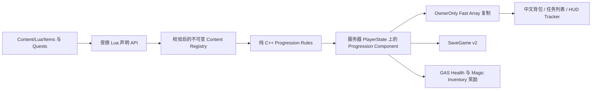

# MatterFlux 任务与道具系统：UE 初学者指南

这份文档解释 MatterFlux 当前的任务系统和普通道具背包。它不要求你熟悉 GAS、网络复制或 Lua；读完后，你应该能找到配置、添加一个道具、添加一个任务，并知道游戏代码应在何处上报进度。

## 1. 玩家实际看到什么

- 按 `I` 或 `Tab` 打开统一工作台，在“法术编程 / 法杖背包 / 道具背包 / 任务 / 设置”之间切换。
- 按 `J` 直接打开任务页；再次按 `J` 关闭。
- 道具页左键选择，右键或 `Enter` 使用可消耗道具。
- 任务页左侧选择当前追踪任务，右侧显示说明、必需目标、可选目标和数量进度。
- 游戏画面右上角始终显示一个小型任务追踪器。
- 所有界面采用 PaperMagic 风格的白底、黑色描边和中文信息；详细说明放在 tooltip 或详情区，不挤占主列表。

## 2. 最重要的架构



系统被分成五层：

1. **Lua 内容层**只描述“是什么”和“允许做什么”。
2. **Registry 编译层**检查 ID、数量、引用和任务图，失败时保留上一份可用内容。
3. **纯规则层**只接收普通数据，生成候选状态和副作用清单，容易测试。
4. **服务器组件层**负责权限、事务提交、复制和存档。
5. **UI 层**只读取快照并发请求，不直接改数量或任务状态。

这比参考项目中的全局 Manager 和可直接产生副作用的 Lua 更安全：Lua 热更不能绕过服务器、直接改 Actor、背包或存档。

## 3. 配置文件在哪里

```text
Content/Lua/
├─ MatterFluxEngine.lua       # 给内容作者使用的窄 API
├─ MatterFluxContent.lua      # 内容包入口和 revision
├─ Items/
│  ├─ Coin.lua
│  └─ HealingPotion.lua
└─ Quests/
   ├─ Tutorial/               # 新手主线
   ├─ Camp/                   # 购买与 Boss 支线
   └─ Templates/              # 参考项目迁移的模板任务链
```

当前已经迁移参考项目的 10 个任务：新手主任务、装备法杖、装备法术、击杀 3 个敌人、消费金币、击杀两个二级 Boss，以及 `kill10 + 可选精英 + 父任务 + 后继任务` 模板链。普通道具有金币和治疗药剂。

## 4. 如何写一个道具

治疗药剂位于 `Content/Lua/Items/HealingPotion.lua`：

```lua
item.define({
    id = "std.heal_item",
    name = "治疗药剂",
    description = "恢复 30 点生命。右键或 Enter 使用。",
    icon = "paper/default_item",
    category = "consumable",
    max_stack = 20,
    starter_count = 2,
}, function(use)
    use.restore_health(30, 1)
end)
```

字段含义：

| 字段 | 含义 |
|---|---|
| `id` | 全局稳定 ID；存档和网络都使用它，不要随意修改 |
| `name` / `description` | 中文名称和说明 |
| `icon` | 逻辑图标键；目前 UI 会回退到黑白文字徽标 |
| `category` | `consumable`、`material` 或 `quest` |
| `max_stack` | 单个逻辑堆叠的上限 |
| `starter_count` | 新玩家初始数量；省略就是 0 |

目前开放三个行为能力：

```lua
use.restore_health(30, 1)
use.restore_wand_mana(50, 1)
use.gameplay_event("Event.Item.Custom", 1.0, 1)
```

一个道具最多声明一个主行为。没有行为的金币仍能被任务、商店和奖励增减，但 UI 不会给它“使用”按钮。

### 为什么不直接把 UObject 传给 Lua

如果 Lua 能直接调用 `Actor:Destroy()` 或修改 `Health`，客户端脚本、错误热更和恶意输入都可能破坏权威状态。MatterFlux 的 Lua 只会编译出类似“恢复生命 30”的数据；真正的合法性检查和 GAS 属性修改发生在服务器 C++。

## 5. 如何写一个任务

主任务可以等待所有必需子任务完成：

```lua
quest.define({
    id = "std.init_quest",
    name = "教学任务",
    description = "学会装备法杖、编排法术并击败敌人。",
    category = "main",
    starter = true,
    focus_on_activate = true,
    children = {
        "std.init_quest.equip_wand",
        "std.init_quest.equip_spell",
        "std.init_quest.kill_enemy",
    },
}, function(q)
    q.complete_children()
end)
```

击杀任务和奖励：

```lua
quest.define({
    id = "std.init_quest.kill_enemy",
    description = "使用法术击败敌人。",
    category = "objective",
    prerequisites = { "std.init_quest.equip_spell" },
}, function(q)
    q.kill_enemies({ target_count = 3 })
    q.reward("spell", "std.jump", 1)
end)
```

可用目标：

- `q.complete_children()`：所有非可选子任务完成。
- `q.equip_wand({ equipment_slot = 0 })`：装备法杖；参数可省略。
- `q.equip_spell({ target_id = "std.default" })`：装备指定法术；参数可省略。
- `q.kill_enemies({ target_id, target_level, target_count })`：按 ID、等级和数量过滤击杀。
- `q.spend_item({ target_id = "std.coin", target_count = 1 })`：观察实际减少的道具数量。
- `q.never()`：不会自动完成，适合模板或以后由新能力接管。

奖励分为激活奖励和完成奖励：

```lua
q.activation_reward("spell", "std.default", 5)
q.reward("item", "std.coin", 10)
q.reward("wand", "std.apprentice_wand", 1, 2)
```

Registry 会检查任务、子任务、前置任务、道具、法术和法杖引用，并拒绝循环任务图。激活与完成奖励各有一个持久化布尔标记，因此网络重放、重新选择或热重载不会重复发奖。

## 6. 游戏代码如何上报进度

敌人死亡等事实必须由服务器上报：

```cpp
FMatterFluxQuestEvent Event;
Event.Type = EMatterFluxQuestEventType::EnemyKilled;
Event.SubjectId = EnemyDefinitionId;
Event.SubjectLevel = EnemyLevel;
Event.Amount = 1;

FString Error;
Progression->NotifyQuestEventAuthority(Event, Error);
```

装备变化由 Magic Inventory 的变更 delegate 自动触发 `Refresh`。道具数量变化由 `AddItemAuthority` 产生准确的旧数量和新数量，因此“花费一个金币”只在数量真的下降时推进，不能靠重复发送事件刷进度。

客户端只能调用：

```cpp
Progression->RequestUseItem(ItemId);
Progression->RequestSelectQuest(QuestId);
```

服务器 RPC 会重新检查 ID、权限和客户端看到的 revision。过期 UI 请求会失败，而不是覆盖新状态。

## 7. 事务是怎么工作的

“事务”在这里指：要么全部成功，要么完全不变。

1. 复制当前道具、任务和选择到临时数组。
2. 纯规则只修改临时数组，并输出奖励/道具效果。
3. 校验堆叠上限、GAS 状态、Gameplay Tag 和魔法奖励。
4. 魔法背包通过 `ApplyProgressionEffectsAuthority` 在临时法术、法杖、装备和法力状态
   上准备整批变化；任一奖励非法便全部丢弃。
5. 全部成功后替换实时数组、递增 revision、标记 Fast Array dirty，再提交生命值等
   不会失败的属性变化；可重入 Gameplay Event 最后发送。
6. 任一步失败，丢弃临时数组。

Lua 热重载也使用同样方式。被删除的内容只在新的任务图成功刷新后才提交；错误 Lua 不会让玩家的旧任务先消失一半。

## 8. 多人复制为什么放在 PlayerState

`UMatterFluxProgressionComponent` 创建在 `AMatterFluxPlayerState` 上。PlayerState 比 Pawn 更适合玩家长期数据：Pawn 死亡或重生时，任务和背包不应一起丢失。

- 道具和任务状态使用 `FFastArraySerializer`，只发送增加、改变或删除的条目。
- 数据使用 OwnerOnly 条件，其他玩家看不到你的完整背包与任务日志。
- revision、当前任务和 Fast Array 到达客户端后统一排序再广播 UI 更新，避免不同网络到达顺序导致列表抖动。
- dedicated server + 两客户端测试验证：客户端不能直接改权威状态、拥有者字段逐项一致、旁观客户端收不到私有数据。

## 9. 道具与 GAS

玩家的 `UMatterFluxPlayerAttributeSet` 目前包含复制的 `Health` 和 `MaxHealth`。治疗药剂由服务器通过 Ability System Component 修改 Health，并限制在 MaxHealth 以内。满血时使用会失败，药剂不会被扣除。

法术、法杖奖励进入 `UMatterFluxMagicInventoryComponent`；法杖奖励使用确定性 GUID。普通道具、任务、魔法背包虽然属于不同组件，但奖励与法力恢复会作为同一批次先完整合法性检查，再在服务器提交。自动化测试会故意混入无效法术奖励，并确认法力、背包数组和 revision 都保持不变。

## 10. 存档和热更

`UMatterFluxSaveGame::CurrentVersion` 当前为 2，保存：

- 道具 ID 与数量；
- 任务 ID、状态、进度；
- 激活/完成奖励是否已发；
- 当前追踪任务；
- Progression revision。

旧 v0/v1 存档没有任务数据，迁移时 revision 设为 0；服务器据此从当前 Lua 重新建立初始任务。revision 0 只允许空载荷，避免损坏数据被误当作旧版本迁移。

保存 Lua 文件后，内容模块对 `Items/`、`Quests/`、`Spells/`、`Wands/` 的白名单包重新计算 hash，并先在候选 Registry 中完成编译和交叉引用校验。失败时继续使用上一份 Registry。

## 11. UI 代码位置

- 工作台 Slate implementation：`Source/MatterFlux/Private/Magic/MatterFluxMagicWorkbenchSlate.cpp`；UMG adapter 位于同目录的 `MatterFluxMagicWorkbenchWidget.cpp`
- HUD 任务追踪器：`Source/MatterFlux/Private/Progression/MatterFluxQuestTrackerWidget.cpp`
- 按键与页面切换：`Source/MatterFlux/Private/Game/MatterFluxPlayerController.cpp`

UI 是运行时 Slate，通过 `UUserWidget::RebuildWidget` 组合。它订阅背包/任务变更 delegate，而不是 Tick 中每帧重建。列表只显示摘要，说明进入 tooltip 和详情区。

## 12. 测试与验收

在 UE 编辑器 Session Frontend 中运行：

```text
Automation RunTests MatterFlux.Progression
Automation RunTests MatterFlux.Save
Automation RunTests MatterFlux.Lua
Automation RunTests MatterFlux
```

命令行示例：

```powershell
& 'C:\Program Files\Epic Games\UE_5.8\Engine\Binaries\Win64\UnrealEditor-Cmd.exe' `
  "$PWD\MatterFlux.uproject" -Unattended -NullRHI -NoSound -NoSplash `
  '-ExecCmds=Automation RunTests MatterFlux.Progression' `
  '-TestExit=Automation Test Queue Empty' `
  '-log=Progression.log'
```

专项测试覆盖纯规则确定性、道具使用和消费事务、保存往返、热重载新增节点、服务器权威、OwnerOnly Fast Array，以及 dedicated server + 两客户端复制。

## 13. 从外部打开页面并截图

```powershell
& 'C:\Program Files\Epic Games\UE_5.8\Engine\Binaries\Win64\UnrealEditor.exe' `
  "$PWD\MatterFlux.uproject" /Game/Default -game -windowed `
  -ResX=1280 -ResY=720 -MatterFluxSkipStartMenu `
  '-ExecCmds=mf.Visual.Capture 5 1 1 1337 1 0 0 nested quest' -log
```

最后一个参数可为 `spell`、`wand`、`item`、`quest` 或 `settings`。截图写入 `Saved/Screenshots/WindowsEditor`。这一接口不需要把窗口置于前台，适合自动视觉回归。

## 14. 常见误区

- Lua 热更不是“Lua 随便调用 UE API”；权限和预算必须留在 C++。
- UI 显示成功不代表服务器已经接受请求；等待复制回来的 revision 和状态。
- 不要从客户端直接调用带 `Authority` 后缀的方法。
- 任务只记录领域事实，例如“二级敌人死亡”；不要让敌人代码知道具体任务 ID。
- 新目标类型应增加一个窄能力和纯规则分支，不要在每个任务脚本里复制流程代码。
- `FastArray` 节省的是差量带宽，不保证客户端数组的物理顺序；显示前仍需稳定排序。

## 15. 当前边界

现在已有可配置任务图、普通道具背包、治疗与自定义 Gameplay Event、任务/魔法/道具奖励、中文 UI、HUD tracker、热重载、存档和多人权威复制。商店交互、地面拾取/掉落、正式图标资产、任务失败/限时条件、对话和地图标记尚未实现；这些可以继续通过新的窄能力和领域事件扩展，不需要推翻现有架构。
