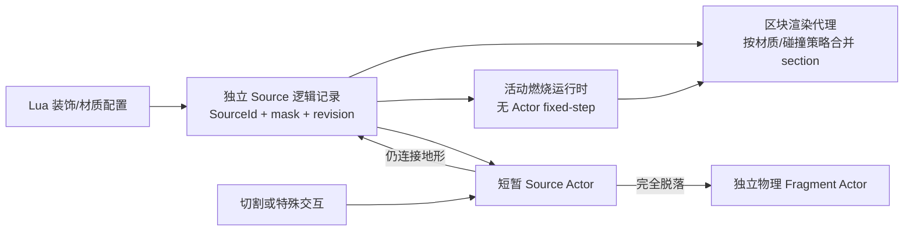

# MatterFlux 实现与 Unreal Engine 入门指南

> 面向第一次接触 UE C++、GAS、运行时网格和多人复制的读者。本文描述的是当前仓库中的实际实现，不是未来设计稿。

## 1. 这个项目做了什么

MatterFlux 是一个服务器权威的二维碎片原型。关卡中的每个可破坏对象都有独立的 `SourceId`、二维实心/空白 mask、材质和 revision，但静态对象不等于 UE Actor：树木、花草与岩石平时是世界逻辑存储中的轻量记录，由区块代理合并绘制和碰撞。只有交互期间会短暂物化 `AFragment2DSourceActor`；真正脱落、需要独立物理和网络移动的碎片才成为长期 Actor。伤害把一部分实心格子切空，系统从剩余格子提取轮廓和孔洞，进行约束 Delaunay 三角剖分，再把二维面沿 Y 轴挤出为三维网格。

当前可玩演示同时支持 Standalone 和 Listen Server。角色可以在 2.5D 平面上移动、
跳跃和控制斜视镜头；GameMode 自动生成带光照、碰撞、材质模拟和随机森林的场景。
玩家用左键、右键、`Q`、`E` 分别触发四个法杖装备槽；默认左键法杖装有切割，
右键法杖装有火焰。它们都通过同一个 ServerOnly GAS 法杖能力执行，服务器创建碎片
或点燃材质并同步给客户端。按 `I`/`Tab` 可打开中文法杖工作台，编辑背包、装备槽
和法术顺序。专项讲解见
[`MatterFlux_Magic_System_Beginner_Guide.md`](MatterFlux_Magic_System_Beginner_Guide.md)。
切割、支撑、Lua 小块阈值和组合树木的专项讲解见
[`MatterFlux_Cutting_For_UE_Beginners.md`](MatterFlux_Cutting_For_UE_Beginners.md)。

想先玩再读代码，可直接看
[`MatterFlux_Playable_Demo.md`](MatterFlux_Playable_Demo.md)。

开始菜单、常驻顶栏、本机设置、无上限动态存档列表、异步地图生成和加载进度见
[`MatterFlux_Menu_Settings_Save_Beginner_Guide.md`](MatterFlux_Menu_Settings_Save_Beginner_Guide.md)。

多人状态修复、晚加入同步、Source 流式生命周期和 2～4 人性能测试见
[`MatterFlux_Multiplayer_Streaming_Testing_Guide.md`](MatterFlux_Multiplayer_Streaming_Testing_Guide.md)。

### 怎样使用这份指南

第一次阅读先看第 1～5 节，只建立“输入事件 → 事务式 mask → payload”的主线；
第二次再看第 6～9 节的几何、碰撞和复制细节；最后对照第 12、13 节亲自读测试和
运行门禁。每读完一部分，先不翻答案，尝试回答：

1. 为什么 damage 不能直接修改 `RuntimeMask` 后再尝试生成几何？
2. 为什么 `SpawnPayload` 只初始复制，而 Transform 不能在 `OnRep` 中重设？
3. 为什么 UBT 的 Game 构建成功还不能证明打包游戏能启动？

文中的类名、函数名、测试名和日志目录都来自当前仓库，可直接全局搜索作为下一步
阅读入口。

```mermaid
flowchart LR
    Input["移动 / 跳跃 / F / R<br/>Enhanced Input"] --> Character["MatterFluxCharacter<br/>2.5D Camera + CMC"]
    Character --> ServerRPC["拥有者 Server RPC"]
    ServerRPC --> Subsystem["FragmentSimulationSubsystem"]
    Subsystem --> Source["Fragment2DSourceActor<br/>事务式切割"]
    Source --> Geometry["mask → component → 轮廓/孔洞 → 三角形"]
    Geometry --> Payload["FFragmentSpawnPayload"]
    Payload --> Fragment["Fragment2DActor<br/>网格 + 凸碰撞 + 物理"]
    Fragment --> Clients["InitialOnly payload<br/>+ replicated movement"]
```



静态场景的另一条主线是：



## 2. 建议先认识目录

```text
MatterFlux/
├─ MatterFlux.uproject                 项目、模块和插件声明
├─ Config/                             默认地图、GameMode、渲染设置
├─ Content/                            地图、DataAsset、输入和材质资源
├─ Source/
│  ├─ MatterFlux/                      运行时模块
│  │  ├─ Public/Fragment/              碎片公共数据和接口
│  │  ├─ Private/Fragment/             几何、Actor、Subsystem 实现
│  │  ├─ Public|Private/Game/           GameMode、角色、控制器、PlayerState
│  │  └─ Public|Private/GAS/            调试 Gameplay Ability
│  ├─ MatterFluxDeveloper/             Development/Editor 捕获、录制与回放工具
│  └─ MatterFluxTests/                 只在 Editor 中加载的测试模块
└─ Docs/                               设计资料和本教程
```

初次阅读建议按下面顺序打开：

1. `FragmentTypes.h`：先看系统在传递哪些数据。
2. `Fragment2DSourceActor.cpp`：理解一次破坏事务。
3. `FragmentGeometry.cpp`：理解 mask 如何变成网格。
4. `FragmentSimulationSubsystem.cpp`：理解谁负责生成碎片。
5. `Fragment2DActor.cpp`：理解网格、碰撞、物理和复制。
6. `MatterFluxCharacter.cpp`、`MatterFluxPlayableWorldActor.cpp`：理解可玩输入、Host
   RPC、2.5D 镜头和 seed 随机关卡。
7. `MatterFluxPlayerController.cpp`、`MatterFluxPlayerState.cpp`、
   `GA_FragmentDebugDamage.cpp`：理解隔离的开发调试输入和 GAS。
8. `Source/MatterFluxTests/Private/`：用测试反向确认行为约束。

## 3. UE C++ 最基础的几个概念

### 3.1 模块、`.Build.cs` 和 `.uproject`

UE 不会把整个项目当成一个普通 C++ 程序直接编译，而是先按模块组织代码。

- `MatterFlux` 是 Runtime 模块，Game、Editor 和 Server Target 都会使用它。
- `MatterFluxDeveloper` 是 DeveloperTool 模块，只在 `bBuildDeveloperTools` 的 Development
  Game 和 Editor 中加载；外部截图、稳定帧序列、会话录制/回放、树木点燃和自动法杖
  触发命令放在这里，Shipping 不链接这些实现。
- `MatterFluxTests` 是 Editor 模块，只进入 `MatterFluxEditorTarget`，不会被打进 Game 或 Dedicated Server。
- `MatterFlux.Build.cs` 声明依赖。公共头需要的 `GameplayAbilities` 是公共依赖；只在
  implementation 中使用的 `ProceduralMeshComponent`、`GeometryCore`、`GeometryAlgorithms`
  是私有依赖。录制 JSON 只由 `MatterFluxDeveloper` 私有依赖，Runtime 不再依赖 `Json`。
- `MatterFlux.uproject` 启用了 `GameplayAbilities`、`EnhancedInput` 和 `GeometryProcessing` 等插件。

一个实用判断是：如果某个类型出现在公共头文件中，提供它的模块通常需要是公共依赖；只在 `.cpp` 出现时优先使用私有依赖。这能减少模块之间的耦合。

模块类型和 `#if UE_BUILD_SHIPPING` 不是一回事。后者只在单个编译单元里裁掉代码，文件、
依赖和命令名仍可能因为其他引用进入发布产物；DeveloperTool module 则从 Target 的依赖图
上排除整组实现。本项目让 `MatterFluxDeveloper` 单向依赖 `MatterFlux`，Runtime 不反向依赖
开发模块。这样删除 Developer module 后，游戏规则仍能完整构建；消失的只是捕获、录制、
回放和调试命令等开发验收能力。

录制系统展示了跨模块解耦的典型做法：Runtime Character 只发布
`EMatterFluxPlayerOperation`，不知道 JSON、截图或 Recorder UObject；Developer recorder
订阅该事件并适配到文件和回放。Shipping 删除 Developer module 后，角色输入和网络玩法
仍然存在，只是没有录制监听者。

### 3.2 `UCLASS`、`USTRUCT`、`UPROPERTY`

这些宏让 Unreal Header Tool（UHT）为 C++ 类型生成反射信息。

- `UCLASS()`：让类进入 UE 对象系统，可被编辑器、蓝图、复制和垃圾回收识别。
- `USTRUCT(BlueprintType)`：让值类型可参与反射和蓝图。
- `UPROPERTY(...)`：告诉 UE 这个成员需要怎样被编辑、序列化、复制或垃圾回收。
- `GENERATED_BODY()`：插入 UHT 生成的代码。

例如 `FFragmentSpawnPayload` 是一个 `USTRUCT`。其中的 `TArray`、`FGuid`、`FTransform` 都能被属性复制系统序列化，但“可以序列化”不等于“可以无限大”。本项目在生成端和接收端都调用 `IsSpawnPayloadWithinReplicationBudget`，把面顶点、三角形索引、轮廓数量和轮廓顶点限制在保守的初始复制预算内。Actor 中持有 UObject 时使用 `TObjectPtr<T>`，让 UE 能正确跟踪引用。

### 3.3 Actor 生命周期

本项目涉及几个常见阶段：

- 构造函数：创建默认组件，例如 `CreateDefaultSubobject<UProceduralMeshComponent>`。
- `OnConstruction`：Actor 被放进关卡或属性变化时执行，source 在这里初始化 mask 并预览网格。
- `BeginPlay`：真正开始游戏时执行。
- `OnRep_...`：客户端收到复制属性变化后执行。

不要在 `OnRep_SpawnPayload` 中重设碎片 Transform。payload 只负责重建网格；Actor 的位置交给 UE 的 replicated movement，否则旧 payload 可能把已经运动的碎片拉回出生点。

### 3.4 为什么“逻辑独立”不等于“每个物体一个 Actor”

初学 UE 时很容易把每棵树都写成 Actor，因为 Actor 能放置、能挂组件、还能复制。但 Actor 会带来 UObject 生命周期、组件注册、网络通道、Tick 调度和物理状态等固定成本。森林里上千棵尚未互动的树并不需要这些能力。

MatterFlux 因而把身份和表现拆开：

- 逻辑身份：`FragmentSourceChunks` 中的轻量记录。每个对象仍有自己的 GUID、mask、材质、碰撞配置和聚合关系，可以单独切割或点燃。
- 静态表现：`UMatterFluxFragmentSourceProxyComponent` 把同一区块内兼容的几何按材质、颜色和碰撞策略写入少量 `UProceduralMeshComponent` section。逻辑上有很多对象，渲染线程看到的却是少量批次。
- 活动模拟：`FSourceCombustionRuntime` 是普通 C++ 对象，不依赖 UObject 或 Actor。只有正在燃烧的 Source 才进入活动表；残渣回写区块 mesh，火焰和烟雾使用共享 ISM。
- 独立物理：物体完全脱离地形后才创建 `AFragment2DActor`。此时它确实需要自己的 Transform、Chaos 刚体、寿命和 replicated movement，所以 Actor 是合理成本。
- 刚性聚合体：整棵树倒下时只有一个 `AFragment2DActor` Carrier。树干和树冠材质不同，但它们共享同一个刚体 Transform；树冠继续以独立 `FFragmentAggregateSourceState` 保存 SourceId、燃料/残渣/燃烧 mask、局部 Transform、材质和碰撞策略，只把几何并进 Carrier 的多 section 网格。材质不同意味着不同 section，不意味着不同 Actor。需要碰撞的成员把凸体加进 Carrier 的复合刚体；燃烧成员的化学步骤仍由世界逻辑 runtime 推进。

这里最重要的不变量是“同一个静态 Source 同一时刻只能由区块代理或临时 Actor 之一显示”。临时 Actor 返回区块前，会先准备一份完整候选快照；只有燃料、燃烧、残渣、随机状态和 fixed-step 时间债都能恢复时才提交并销毁 Actor。失败时保留旧所有者，避免一帧内既重复显示又丢失模拟。

多人复制也遵循同样分层。服务器不复制整片初始森林，客户端用相同 seed 和 Lua 配置重建 pristine 世界；只有改过的 Source 通过 Fast Array 增量发送。这样仍能逐对象同步 revision 和 mask，却不会为每棵树打开一个 Actor 网络通道。

当静态 Source 被刚性 Carrier 接管时，世界存储会记录“动态所有权”。普通成员还会发布全零 mask tombstone；正在燃烧的成员则保留完整燃料、残渣和 fixed-step 快照，不能为了 tombstone 丢掉化学状态。两种路径都会让静态区块代理隐藏该 Source。客户端即使晚加入，或 Carrier 30 秒寿命结束，也不会在原地重新长出树冠。

## 4. 核心数据模型

### 4.1 Mask

mask 是一个一维 `TArray<uint8>`，逻辑上表示宽为 `Width`、高为 `Height` 的二维网格：

```cpp
Index = Y * Width + X;
```

值为 0 表示空白，非 0 表示实心。`UFragment2DAsset` 保存初始 mask 和配置：

- `MaskWidth`、`MaskHeight`：1 到 256。
- `CellSize`：每格对应多少 UE 单位。
- `MinFragmentAreaPixels`：source 的局部下限；实际阈值还会和
  `Content/Lua/MatterFluxEngine.lua` 中的全局下限取最大值。
- `MaxFragmentsPerBreak`：一次最多保留多少碎片；编辑器配置和运行时深模块都硬性封顶 16。
- `SolidMask`：可选的初始内容；尺寸不匹配时退化为全实心。

二维几何使用 `FVector2D(X, Y)`，生成三维网格时映射到 UE 的 X/Z 平面；厚度沿 Y 轴。因此代码中的二维 Y 最终对应三维 Z。

### 4.2 伤害事件

`FFragmentDamageEvent` 包含：

- `SourceId`：事件要作用于哪个 source。
- `BaseRevision`：客户端或调用方基于哪个版本发起请求。
- `DamageShape`：圆、矩形或线段，以及世界变换。
- `DamagePower`：初速度强度。
- `EventSeed`：确定性随机种子。

`SourceId + BaseRevision` 类似一次乐观并发检查：即使请求迟到或指错 Actor，也不能修改当前状态。

### 4.3 轮廓和生成 payload

`FFragmentContour` 只保存一个闭合环的顶点；首顶点不会在数组末尾重复。

`FFragmentSpawnPayload` 是服务器交给碎片 Actor、并在初始复制时发给客户端的完整出生数据：

- `FragmentId`、`Revision`。
- `Vertices2D`、`TriangleIndices`：正反面的三角剖分结果。
- `OuterContours`、`HoleContours`：所有外轮廓和孔洞。
- `CollisionContours`：每个外轮廓的凸包。
- `Thickness`、`InitialTransform`、质量和初始速度。

把这些字段放进一个 payload 的好处是：碎片的几何和物理出生信息是一个完整快照。
材质作为另一个 `COND_InitialOnly` 属性复制，因为它是 UE 资源引用而不是几何值；
`OnRep_SpawnPayload` 和 `OnRep_FragmentMaterial` 都可独立、重复执行，所以两个属性以
任何顺序到达都能得到相同外观。

## 5. 一次伤害为什么是“事务”

核心入口是 `UFragmentSimulationSubsystem::RequestFragmentDamage`。source 内部把事务拆成准备与提交两个阶段：

```text
验证 authority / SourceId / Revision / mask / shape
        ↓
复制 RuntimeMask → CandidateMask
        ↓
只修改 CandidateMask
        ↓
提取 component，生成全部几何和 payload，并检查复制预算
        ↓
deferred spawn 所有候选 fragment
        ↓
逐个 FinishSpawning，并让 InitializeFromPayload 构建网格/碰撞
        ↓
任一步失败：销毁全部候选 Actor，原 mask/revision/broken 不变
        ↓
全部成功：提交 RuntimeMask 和 Revision
```

这里有三个容易混淆的返回情况：

- 形状没有切到任何实心 cell：返回 `false`，状态不变。
- 输入不合法或几何生成失败：返回 `false`，状态回滚。
- 破坏有效，但所有失去支撑的块都小于最小面积：返回 `true`，mask 和 revision 已提交，只是 payload 数量为 0。

因此 `RequestFragmentDamage` 的 `bool` 表示“事件被接受且破坏状态已提交”，不表示“一定创建了碎片”。仍连接支撑面的 mask 会原地重建为静态残余；只有 supported mask 为空时，source 才被销毁，或通过复制的 `bBroken` 在服务器和客户端统一隐藏并关闭碰撞。

## 6. 从 mask 到三角形

这部分集中在 `MatterFlux::FragmentGeometry` 命名空间中。对其他类而言，它是一个“深模块”：调用者只提交 mask 或 component，不需要理解边追踪和三角剖分细节。

### 6.1 切割 cell

`ApplyDamageShape` 遍历实心 cell 的中心点，把世界伤害 Transform 转成 source 局部 Transform 后，判断中心是否落在圆、框或线段中。命中的 cell 被置 0。

这是栅格切割，所以精度由 `CellSize` 决定：格子越小，边缘越细致，但 cell 数、轮廓和复制数据也会增加。

### 6.2 8-neighbor 连通分量

`ExtractConnectedComponents` 使用队列进行广度优先搜索（BFS），八个方向都算相邻，包括对角线。

这意味着两个只在角上接触的 cell 属于同一个 component，但它们仍可能形成两个独立外轮廓。代码没有错误地假设“一个 component 必然只有一个外环”。

### 6.3 暴露边和闭合环

每个实心 cell 检查上下左右四个邻居。如果邻居为空，当前边就是边界边。边按固定方向加入，使实心区域始终位于边的左侧：

- 外轮廓自然为逆时针（CCW）。
- 孔洞自然为顺时针（CW）。

追踪器从一条未使用边出发，在每个顶点按固定转向优先级选择下一条边，并明确要求最终回到起点。没有闭合的路径会让整个几何构建失败，而不会作为半成品继续使用。

随后系统会：

1. 删除相邻重复点。
2. 删除共线点。
3. 统一外环 CCW、孔洞 CW。
4. 把每个环旋转到“字典序最小顶点”为起点。
5. 按固定规则排序所有轮廓。

这些步骤既减少无用顶点，也是确定性输出的基础。

### 6.4 孔洞归属和约束 Delaunay

每个孔洞用点在多边形测试寻找包含它的最小外轮廓。然后用 GeometryProcessing 提供的：

- `TPolygon2<double>`
- `TGeneralPolygon2<double>`
- `FConstrainedDelaunay2d`

分别三角剖分每个“外轮廓 + 它的孔洞”。代码直接检查 `Triangulate()` 的返回值，并在继续前验证库返回的顶点索引和三角形面积；失败会返回到伤害事务并回滚。约束三角剖分会保留边界，不会用三角形填满孔洞。

三角剖分库返回的顶点和三角形顺序不应直接当成网络协议。MatterFlux 会再次按坐标排序顶点、重映射索引、统一三角形朝向和起点，并按索引排序三角形。

### 6.5 确定性 FragmentId

component 先按面积降序，再按从 cell 推导出的边界坐标升序稳定排序；若面积和包围盒都相同，最后逐个比较排序后的 cell 坐标。代码不信任外部传入的缓存 `Min/Max`，会重新从 cell 计算边界。

`FragmentId` 使用 `FGuid::NewDeterministicGuid`，签名由以下稳定字段组成：

- `SourceId`、`Revision`、`EventSeed`。
- mask 宽高。
- `CellSize` 的 IEEE 原始位模式。
- 排序后的整数 cell 坐标。

签名不再依赖浮点数转字符串，因此不会受到地区小数格式或格式化实现差异影响。相同输入和 seed 会得到相同 ID、轮廓、三角形、质量和初速度。

## 7. 二维面如何挤出为三维网格

`BuildExtrudedMesh` 输出 `UProceduralMeshComponent::CreateMeshSection` 所需的四个数组：顶点、三角形索引、法线和 UV。

### 7.1 正反面

每个二维顶点复制两次：

- 前面：`Y = +Thickness / 2`，法线为 `+Y`。
- 后面：`Y = -Thickness / 2`，法线为 `-Y`。

三角形绕序决定哪一侧是正面。前后面使用相反绕序，使法线朝外。

### 7.2 侧面

每条轮廓边都创建独立的四个顶点，而不是和前后面共享。这是有意设计：共享顶点只能有一组法线，会把直角边缘平滑掉；独立顶点能让每个侧面保持硬边。

二维有向边 `Edge = B - A` 的外向侧面法线为：

```cpp
FVector(Edge.Y, 0, -Edge.X).GetSafeNormal()
```

外环是 CCW、孔洞是 CW，所以同一个公式既能让外壁向外，也能让孔洞内壁朝向空洞。侧面 U 随边长增长，V 随厚度增长。

构建函数会拒绝：非有限顶点、越界索引、重复索引、退化三角形、缺少外环、错误环绕序、零长度边和非法厚度。失败时所有输出数组保持为空，Actor 不会调用 `CreateMeshSection`。

## 8. 可视网格和物理碰撞为何不同

静态 source 和动态 fragment 使用不同碰撞策略。

### 8.1 Source：精确三角网格查询

需要碰撞的 source 是静态的，`bUseComplexAsSimpleCollision = true`，并在创建 mesh section
时生成碰撞。查询碰撞可以使用实际三角网格，所以 L 形和孔洞能保持精确。花、草和
树冠等 `bEnableSourceCollision=false` 的装饰仍有相同可视网格，但创建 section 时直接
传入 `bCreateCollision=false`；不能先烹饪物理数据再关闭碰撞，否则交互物化时仍会卡顿。

### 8.2 Fragment：简化凸碰撞

Chaos 动态刚体适合使用简单凸碰撞。系统为每个外轮廓计算一个二维凸包，再复制到前后两层形成凸体。

代价是：

- 凹形外轮廓会被凸包填平。
- 孔洞只影响可视网格，不会成为动态碰撞中的空洞。

这是当前原型明确接受的物理近似。若可视网格非法或没有有效凸体，碰撞会被关闭，Actor 也不会开始物理模拟，避免“看不见但能撞到”的幽灵刚体。

`FFragmentSpawnPayload::bEnableCollision` 会把 Source 的策略带到脱落碎片。树干碎片继续
生成凸体并模拟物理；花草树叶碎片只创建显示网格，省略碰撞轮廓、碰撞烹饪和 Chaos
刚体。这样配置项同时约束静态 Source 与动态结果，而不是只影响破坏前的对象。

同一棵树的多个部分共享刚体时，Carrier 会把每个 `bEnableCollision=true` 成员的凸体按
成员局部 Transform 转换到 Carrier 空间，再全部加入同一个 `UBodySetup`。这叫复合碰撞：
逻辑上仍能按 SourceId 区分树干和树冠，物理求解器却只管理一个刚体和一次 replicated
movement。燃烧把木材换成固体残渣时，碰撞使用“剩余燃料 ∪ 固体残渣”，不会因为颜色
变成木炭就突然失去支撑。

Source 和 Fragment 的 `UProceduralMeshComponent` 都调用
`SetCanEverAffectNavigation(false)`。当前原型没有 AI 导航需求，动态碎片也不应在
移动时反复要求 NavMesh 重建；显式关闭后还能避免组件尚未生成顶点时被导航系统
读取而产生 empty-bounds 警告。以后若需要让 AI 绕开静态 source，宜单独设计稳定的
导航代理或 `NavModifierComponent`，而不是让所有物理碎片直接参与动态导航。

流式地形区块同样关闭导航影响。它们会随玩家跨区块频繁切换可见性，让可移动的
程序化地形直接注册导航八叉树会把导航更新集中到边界帧。未来需要 AI 行走时，
应为地形生成稳定、独立的导航代理，而不是重新开启这些流式组件的动态导航。

## 9. 多人复制和服务器权威

### 9.1 谁能修改破坏状态

只有服务器能在 GameWorld 中接受伤害。Subsystem 和 source 自身都检查 authority，这是纵深防护：即使客户端 C++ 绕过 Subsystem 直接调用 source，也不能修改 mask 或 revision。

编辑器非 GameWorld 仍允许直接调用，用于纯逻辑自动化测试和 Call In Editor 调试。

### 9.2 Source 复制什么

`AFragment2DSourceActor` 复制：

- `SourceId`
- `Revision`
- `bBroken`，带 `OnRep_Broken`
- `FragmentMaterial` 和 `FragmentColor`，只在 Actor 初次复制时发送
- `ProceduralSource`，只在程序化 source 初次复制时发送，包含 mask 尺寸、CellSize 和二值格子

不销毁 source 时，客户端收到 `bBroken` 后统一隐藏 Actor、隐藏 mesh 并禁用碰撞。

### 9.3 Fragment 复制什么

`AFragment2DActor` 开启：

```cpp
bReplicates = true;
bAlwaysRelevant = false;
InitialLifeSpan = 30.0f;
SetReplicateMovement(true);
```

`SpawnPayload`、`FragmentMaterial` 和 `FragmentColor` 使用 `COND_InitialOnly`：客户端第一次认识这个
Actor 时收到受预算约束的完整几何、材质引用和颜色，之后不反复发送这些出生数据。服务器
使用 deferred spawn，在 Actor 完成出生和打开初始复制通道之前写入两者。

`AggregateSources` 不是 `COND_InitialOnly`。树倒下后，成员的局部 Transform、碰撞配置和
材质身份通常不变，但燃料、残渣和燃烧 mask 会继续变化，因此服务器复制这个数组的最新
状态。三个 mask 都使用 `FFragmentSourceMask::NetSerialize` 按 1 bit/cell 发送；燃烧剩余
步数不会塞进可视 mask，而是留在服务器的纯 C++ runtime 中。

`OnRep_SpawnPayload` 只重建网格和按策略启用的碰撞，`OnRep_FragmentMaterial` 只应用材质。
后续位置、旋转和速度收敛由 replicated movement 负责。

source 和 fragment 都使用空间相关性。未交互、无碰撞的装饰甚至不会先创建 source Actor，
而是由客户端根据复制的地图 seed 重建区块代理；服务器只有在交互查询命中时才实体化它。
fragment 有 30 秒默认寿命，离开相关范围后不再占用该连接的 Actor channel。
`COND_InitialOnly` 在 Actor 重新相关时会再次提供出生数据，因此 `OnRep_SpawnPayload` 必须
保持幂等。生产项目还可以继续加入对象池、休眠和 Replication Graph。

`RuntimeMask` 本身是瞬态数组，不直接参与复制；提交破坏时，服务器会把它写回
`ProceduralSource.SolidMask`。`ProceduralSource` 使用二值位压缩 `NetSerialize` 正常
复制，客户端在 `OnRep_ProceduralSource` 中把它恢复为 `RuntimeMask` 并重建 source
网格。因此仍受地形支撑的树桩可以连续被切割，客户端也会看到相同 revision 和剩余
形状。当前协议发送完整压缩快照；若以后把单个 source 扩大到很高分辨率，可以再设计
按 revision 的 mask 增量。

没有常驻 Actor 的逻辑 Source 则由世界 Actor 中的 Fast Array 复制“已经修改过的当前
真值”。Fast Array 的意义是：一棵树变化时只产生这一项的网络 delta，而不是重发所有
树。容器还维护 `SourceId → 数组下标` 和当前压缩 payload 总字节数，所以服务器覆盖一项
时可以 O(1) 找到旧值并计算新预算。预算检查先于修改；条目数超限、字节数超限或非法
状态都会保留旧 revision 和旧 mask。覆盖现有元素时不能直接把整个结构体 move-assign
过去，因为 `FFastArraySerializerItem` 内部的 replication ID/key 也会被覆盖；实现只移动
业务字段，再调用 `MarkItemDirty`。这是“网络增量协议”和“事务式状态提交”在同一容器里
配合的一个具体例子。

服务器的地形和装饰流式窗口会遍历所有拥有 Pawn 的 `APlayerController`，把每位玩家
附近的区块做并集；客户端只使用本地 Controller。材质模拟也收集全部权威 Pawn 的
chunk 焦点，并以确定性 round-robin 在固定预算内分配活动块，不再只跟随第一位玩家。
任何未脱离地形的实体 source 离开所有玩家窗口时都会销毁 Actor；未交互的显示型
source 从一开始就只存在于 `UMatterFluxFragmentSourceProxyComponent` 的区块网格中。
受损 source 缓存
runtime mask 和 revision；燃烧中或只剩残渣的 source 还会缓存燃料、残渣、每格剩余
燃烧时长、随机种子、模拟 Tick 和 fixed-step 余量。玩家回来后按同一 SourceId 恢复，
卸载期间火势休眠，恢复后继续，且不会复活已烧掉的燃料。这说明“持久游戏状态”和
“常驻 UE Actor”是两回事。

材质世界也不再让客户端根据 `focus + step` 自己重放历史。服务器复制带 map seed、
revision、完整 focus 列表、step 和内部 tick 的活动区快照；客户端先完整校验，再原子替换本地
活动格。晚加入或漏掉旧焦点的客户端收到当前属性值即可恢复，不需要拥有从第 0 步
开始的事件历史。

材质模拟的“规则世界”和“每帧运行时”是两个不同层次：

- `FChunkedMaterialWorld` 负责格子、区块、液体/气体/颗粒移动和化学反应。
- `FSimulationRuntime` 负责什么时候 Step、焦点切换帧是否暂停、最多追几步、logical step，
  以及 active-state 快照的压缩、revision 去重和损坏拒绝。
- `AMatterFluxPlayableWorldActor` 只把玩家位置换算成 focus，把 runtime 结果映射到 replicated
  UPROPERTY，并在状态改变时标记可视化 dirty。

这样客户端晚加入或漏掉历史焦点时不需要重放模拟：收到新的原子快照后，runtime 只应用
一次 revision；CRC/解压或状态导入失败则记住 rejected revision，避免每帧重复解析同一
坏包。焦点变化造成区块归档/恢复时，该帧不再叠加 Step，但时间债务会在下一帧继续消费。
同一帧也不再执行 active-state 压缩或材质实例上传：runtime 保留 replication dirty 标记，
世界 Actor 在下一个焦点稳定帧发布快照并刷新显示。这里的“错帧”不是
丢状态，而是把三个都正确但较重的工作拆开，避免玩家跨区块时集中卡顿。

材质格子的显示也不能每次都 `ClearInstances()` 再把整个数组加回来。那种写法虽然最终
数据正确，但渲染线程可能观察到一个短暂的空数组，于是液体、颗粒或地表效果会“眨一下”。
当前实现把格子按“材质 × 64×64 模拟区块”分组，先按坐标稳定排序并计算 hash：

- hash 未变化的组不上传实例；
- 数量相同时用 `BatchUpdateInstancesTransforms` 原地更新；
- 数量变化时只添加或删除尾部；
- 离开窗口的 ISM 进入同材质组件池，进入新块时复用，而不是重新注册 UObject/渲染代理。

地面火焰、烟雾、残渣、可破坏 Source 自身的火焰/烟雾，以及需要流送的 HISM 层都
复用同一个“无清空同步”helper，因此周期性特效更新也不会先出现一帧空白。只有技能
特效明确结束时才会清空实例；地图重生成则先在候选状态中构建新场景，成功后一次提交。

## 10. 可玩角色、Host 与 GAS

### 10.1 Standalone、Listen Server 和 Client

这个项目并不要求“先启动一个 Server，再启动一个 Client”才能玩。UE 有四种常见身份：

- Standalone：一个离线进程；它没有网络连接，但对自己的世界拥有 authority。
- Listen Server：Host 同时运行权威服务器和一个本地玩家，最适合本机单人及开房测试。
- Client：拥有本地输入，但不能直接提交 mask、revision 或随机地图 seed。
- Dedicated Server：只有权威世界、没有本地玩家和画面，适合自动化与正式部署。

默认 PIE 配置是两个玩家的 Listen Server：一个本地 Host 加一个远端 Client，且在
同一进程中运行，适合直接观察两扇游戏窗口。UE 的玩家数量包含 Host，所以这里配置
`PlayNumberOfClients=2`。Host 上的 Character 同时满足
`HasAuthority()` 和 `IsLocallyControlled()`；普通客户端 Character 只有后者。因此
输入处理不能用“本地控制”替代“服务器权威”判断。

随机地图只需要维护一个设计好的 `PlayerStart`。当 Client 加入而该出生点已经被 Host
占用时，`AMatterFluxGameMode` 会按固定的 X/Y 邻格顺序寻找无碰撞位置，再生成第二个
Pawn。这样地图生成器不需要预先猜测房间人数，也不会因为两个胶囊重叠而让 Client
进入世界后没有角色。

`AMatterFluxCharacter` 使用 `UCharacterMovementComponent` 的内建预测和复制，WASD
在地表 X/Y 平面按镜头方向移动；Spring Arm 以 -45° pitch、-45° yaw 形成斜俯视
2.5D 构图。细体素边缘与 TSR 的时间抖动采样并不匹配，因此项目在
`DefaultEngine.ini` 中把 `r.AntiAliasingMethod` 固定为 `1`（FXAA），并在相机
`FPostProcessSettings` 中把 `MotionBlurAmount` 覆盖为 `0`。FXAA 不依赖上一帧历史，
角色描边、草叶和地形台阶在相机静止时更稳定；Lumen 和虚拟阴影仍负责光照层次。
可玩世界的 Sky Light 也不是实时捕获：地图构建完成后调用一次 `RecaptureSky()`，
避免静态天空每帧产生额外捕获开销和细微亮度变化。

输入 Action 和 Mapping
Context 在运行时创建，所以初学者无需先维护一组二进制 `.uasset` 才能启动示例。
四个目标键先在本地 ASC 查找对应 InputID 的通用法杖 Ability Spec；`ServerOnly` GAS 能力把请求送到
服务器，服务器自行选择前方 source、读取当前 revision 或生成 seed，避免相信客户端
传入的权威数据。`R` 换图仍调用拥有者 Character 上的无参数 Server RPC。

`AMatterFluxPlayableWorldActor` 使用一个复制的 `MapSeed` 驱动随机地图。共享纯函数
`BuildLevelLayout` 在 512×384 的 8 cm 网格上逐像素调用多频
`FMath::PerlinNoise2D`，把结果量化为 8 cm 高度台阶，再通过 `FRandomStream` 摆放
溪流、树木、草丛、三色花朵和远景。`FLevelTerrain` 是高度、色带和像素尺寸的唯一
数据源；渲染器每次把 64×64 个像素的顶面及裸露侧面合并为
`UProceduralMeshComponent`，而不是创建 1024 个 Cube instance。这样仍保留清楚的
Noita/Minecraft 式体素台阶，却把 draw call 和组件数量限制在分块数量级。相邻块查询
同一个高度数组，所以块边界不会重复生成重合侧面；同一网格也用于静态复杂碰撞。

树干、树冠、草簇、花簇、岩石和草甸都生成 `FFragmentSourceMask`。包括碰撞树干在内的
pristine Source 都由 `UMatterFluxFragmentSourceProxyComponent` 按区块合批；碰撞策略不同
只会进入不同 batch，不会因此创建 Actor。切割、火焰、燃烧传播或整树脱离
需要修改某个代理时，服务器才按确定性 SourceId 将它提升为 Actor。因此“合批显示”没有
把装饰降级成不可破坏贴图，它仍走相同的 mask → 轮廓 → 三角剖分 → 挤出网格。
当前森林的代理区块总数处于默认 `FragmentSourceProxyCacheLimit = 128` 的硬上限内，
所以游戏在加载阶段按区块坐标稳定排序并预先建立代理网格；玩家移动时只切换可见性。
如果未来地图的代理块超过上限，组件自动回到按需构建，不会为了预热而把无限世界全部
常驻。代理内某个 Source 被实体化或恢复后会把所在块标为 dirty，下一次可见时才精确重建。
材质模拟、地面燃烧和装饰采样都读取 `FLevelTerrain`，避免视觉高度、碰撞高度与模拟高度
各维护一份副本。

### 10.2 为什么 ASC 放在 PlayerState

`AMatterFluxPlayerState` 实现 `IAbilitySystemInterface` 并创建复制的 `UAbilitySystemComponent`（ASC）。PlayerState 的生命周期通常长于 Pawn，因此角色死亡或换 Pawn 时能力状态更容易保留。

`AMatterFluxCharacter` 在两个时机调用 `InitAbilityActorInfo`：

- 服务器：`PossessedBy`。
- 客户端：`OnRep_PlayerState`。

ASC 的 Owner Actor 是 PlayerState，Avatar Actor 是当前 Character。服务器默认授予
`UGA_PlayerCut` 和 `UGA_PlayerFlameJet`；前者提交前向线形 mask damage，后者用渐宽
锥形选择前方可燃 source，并采样点燃地面。两者都是 `ServerOnly`。调试破坏能力不会
出现在默认能力数组中，避免任意联网客户端获得修改服务器世界的调试入口。

玩家输入使用两个正式 GameplayTag：

```text
Ability.Player.Cut
Ability.Player.FlameJet
```

能力完成后，服务器用不可靠 multicast 通知各客户端播放短暂表现。表现数据由
`BuildAbilityEffectTransforms` 确定性生成：刀光是 12 个青色方块，喷流是 24 个渐宽的
橙红方块。Dedicated Server 不创建实例，判定也不依赖这些视觉方块。

### 10.3 开发输入怎样激活服务器技能

`AMatterFluxPlayerController` 保留了把 F 键绑定到调试 Input Action 的开发工具，但 `bEnableDebugControls` 默认是 `false`。只有专门的开发 PlayerController 配置显式开启输入，并由服务器显式授予能力后，回调才会通过 GameplayTag：

```text
Ability.Fragment.DebugDamage
```

查找并激活 `UGA_FragmentDebugDamage`。该能力配置为：

- `InstancedPerActor`
- `ServerOnly`

显式启用后，客户端可以请求激活，但真正的切割逻辑只在服务器执行。多人自动化测试不会依赖发布默认值，而是在 dedicated-server world 中显式向对应 PlayerState 的 ASC 授予该能力。能力找到测试 source，创建线形伤害事件，并使用 `1337 + 当前 Revision` 作为可重复的调试 seed。

`DefaultGame.ini` 还为 `AbilitySystemGlobals` 显式配置了
`GameplayCueNotifyPaths=/Game`。这与 GAS 原先的回退搜索范围相同，但消除了每次
启动时“未配置路径、将扫描整个 `/Game`”的警告。以后把 GameplayCue 资源集中到
专用目录后，可以把该路径进一步收窄以缩短资源扫描时间。

## 11. World Subsystem 的职责

`UFragmentSimulationSubsystem` 是每个 `UWorld` 一份的服务对象。它负责流程编排：

1. 检查世界和 authority。
2. GameWorld 的世界切割命令先进入有界 FIFO，每帧执行固定数量，避免多人同帧施法叠加。
3. 用伤害包围盒查询邻近 Source 区块，再做 Source 包围盒和逐 cell 精确判断。
4. 让 source 准备候选 mask、revision 和全部 payload，但不修改权威状态。
5. 对碰撞 Source，deferred spawn 全部候选并完成网格/碰撞/物理初始化；任一失败就回滚。
6. 对无碰撞显示型 Source，先原子提交已验证的几何事务，再把可视碎片放入每帧预算队列。
7. 标记或销毁 source；客户端通过 Source 状态和 Fragment 初始 payload 收敛。

几何算法不依赖 Actor，Actor 不负责遍历全世界，Subsystem 不实现三角剖分。这样的边界让每个模块更容易单独测试。

### 11.1 为什么局部法术不能扫描整片森林

即使 pristine 树木没有 Actor，如果每次喷火或切割都遍历全部逻辑 Source，世界越大，
一次局部动作仍会越来越慢。MatterFlux 现在为同一份 Source 定义建立两个辅助索引：

- `SourceId → chunk` locator 用于按 GUID 直接读取 revision、mask 和复制状态。
- `FSourceSpatialIndex` 用 Source 的本地 `FBox` 建立空间桶，用于查询与伤害、火焰或
  投射物包围盒相交的少量候选。

已经短暂物化成 Actor 的 Source 则登记到 `UFragmentSimulationSubsystem` 自己的世界空间
索引。世界切割、法杖火焰和火球落点先取候选 Actor，再执行原有精确 bounds、锥体和
逐 cell 判断。空间索引是 broad phase，不负责决定“真的命中”；这样既快，也不会因为
粗包围盒而错误切掉邻近物体。

固定大地图测试会连续执行 65,536 次远处查询。全扫描版本需要 5,146.99ms，索引版本
首次绿色运行是 17.21ms，最终完整套件中是 14.91ms。这个测试还断言结果始终是零命中，
因此它同时守住性能和行为正确性。

索引查询也暴露过一个顺序相关问题：同一棵树的树冠先被切空后，树干倒下会尝试重新
物化这些空 Source 并交给 Carrier。现在全零且没有燃烧残渣的归档状态被视为 durable
tombstone，只保留 revision 和复制真值，不创建不可见 Actor；有木炭残渣的状态仍可
物化并随整棵树移动。这说明优化数据结构时，必须同时测试候选顺序变化是否破坏领域
不变量。

### 11.2 地面火为什么需要两层稀疏索引

地面燃烧本质上仍是一张二维数组，因为 fixed-step 模拟需要快速读取邻居；但“哪些格子
正在燃烧”和“哪些 64×64 区块有火”不应该每次通过扫描整张数组重新计算。当前
`FGroundCombustionRuntime` 额外维护 `BurningCellIndicesByChunk` 和
`ResidueCellIndicesByChunk`。它们按 64×64 区块保存稀疏 cell index；一个区块的集合
变空时，该 map entry 会自动删除。

点燃或熄灭一个 cell 时，这两份派生索引一起增量更新；最后一个 cell 熄灭时，对应区块
自动从 map 中删除。客户端成功解码一个复制块后只刷新该块的索引；读档则从权威 mask
完整重建一次。这里的原则是：mask 是真值，稀疏集合是可以重建的加速结构。

地面火向树木、花草传播时，流程是：

```text
活动燃烧区块
  → 查询 FSourceSpatialIndex 的少量候选
  → 检查 Source 原点对应 ground cell 是否真的在燃烧
  → 检查 Source 底部是否接触地面
  → 按 Lua combustion rule 点燃
```

为什么不直接“每个火格查询一次”？火势扩大后，相邻几千个格子会反复命中同一个空间
桶。为什么不只查询所有火格的一个大包围盒？两处相距很远的火会让包围盒覆盖中间整张
地图。按活动区块查询在二者之间取得平衡，并保留逐格 narrow phase 保证正确性。

多个燃烧区块会一次交给 `FSourceSpatialIndex::QueryMany`。它对空间桶候选去重、做精确
包围盒相交判断，最后只进行一次稳定 GUID 排序；公开接口测试固定验证重复 query bounds
不会产生重复 SourceId。大世界测试比较同一世界点燃前后的 120 tick，当前门槛要求
燃烧增量小于 275ms。

### 11.3 为什么燃烧时不每步重建实体网格

逻辑燃烧每 0.1 秒更新 fuel/burning/residue mask，但 mask→轮廓→三角剖分→ProceduralMesh
和碰撞烘焙比数组步进昂贵得多。区块代理因此把燃烧 Source 标为 active：燃烧期间继续
显示原实体网格，并用共享火焰/烟雾 ISM 表现过程；熄灭后把最终 mask 放入 0.5 秒的
按 chunk 去重批次，只重建一次最终实体/残渣。切割和 Actor 物化仍调用即时 Flush，
不承担这 0.5 秒延迟。这是“逻辑高频、表现分层、最终状态合并”的典型做法。

### 11.3.1 为什么还要单独维护“当前燃烧 Source”索引

`StreamedFragmentSourceStates` 不能在火灭后删除：其中的剩余木材、木炭、revision 和模拟
时间债是存档、流式返回与晚加入客户端所需的真值。可是火焰/烟雾每 0.1 秒刷新一次，若
每次都扫描这张历史表，玩家探索越久，即使当前只有一棵树着火也会越来越慢。

`FLogicalSourceCombustionIndex` 因此只保存 `BurningMask` 仍有非零 cell 的 SourceId：

```text
持久状态表：最后状态，允许长期增长
活动索引：当前工作集，熄灭立即移除
```

服务端步进和客户端 Fast Array 应用最新快照时都会更新活动索引；读档时可从持久表重建，
世界重生成时一起清空。共享火焰/烟雾、传播和“当前有几处火”的计数只读取活动索引。
这类结构叫“可重建派生索引”：它用于加速查询，不取代真正状态，也不需要单独复制或存档。

为了多人确定性，索引输出不使用 `TSet` 迭代顺序，而是按 `FGuid` 的 A/B/C/D 四个整数
分量排序。这样还避免了每次把 GUID 转成字符串再比较产生的短命内存分配。

### 11.3.2 为什么快照应该复用调用方的数组

`TArray` 不只是元素，还拥有一块堆内存。旧的 `CaptureState` 每次先执行“输出 = 空快照”，
等于主动释放三张 mask 的内存，随后又为相同尺寸重新分配。更严重的是，runtime 尚未初始化
时函数返回失败，却已经把调用方最后一份有效状态擦掉。

现在 `CaptureState(OutState)` 把 `OutState` 当作调用方拥有的可复用缓冲：验证失败完全不动
它，成功时直接覆盖字段和数组内容。因为同一 Source 的宽高不变，`TArray` 会复用已有
capacity。`FFragment2DSourceStreamingState` 本身就是一份 `FSourceRuntimeSnapshot` 再加
revision 等流式元数据，所以世界 Actor 可以直接写入持久 map：

```text
旧：runtime → 临时 snapshot（三次分配/复制）→ 流式状态（再复制三张 mask）
新：runtime → 持久流式 snapshot（复用原数组）
```

这也是事务思想在只读导出中的应用：失败不应该破坏调用方已经提交的旧值。当前门禁中，
三张 4096-cell mask 连续捕获 4096 次为 0.24～0.83ms。

### 11.3.3 为什么 runtime mask 和 fuel mask 不能各存一份

燃烧前，Source 只需要一张 runtime mask；燃烧开始后，fuel mask 就是“仍然存在的实体
格子”。如果同时保存 runtime 和 fuel，并规定两者永远相等，那么每次模拟都要多复制一张
数组，维护者还必须在存档、复制、Actor 和 Carrier 的每条路径里记住同步二者。

当前 `FFragment2DSourceStreamingState` 把 standalone mask 设为私有，只暴露：

```text
GetRuntimeMask()
SetRuntimeMask(mask)
CaptureCombustionState(runtime)
```

未燃烧时 `GetRuntimeMask()` 返回 standalone；燃烧或只剩残渣时返回 fuel。调用方不需要知道
物理存储位置。64-cell Source 过去保存 runtime/fuel/residue/burning 共 256 个值，现在只
保存 fuel/residue/burning 共 192 个值，减少 25%，每个 fixed step 也少一次整 mask 复制。

存档和网络格式仍然包含名为 runtime mask 的字段，因为 wire format 是兼容契约；只是在
客户端解码后，它会被移动进 fuel，而不是在内存中保留第二份相同数组。

### 11.3.4 为什么多个燃烧 Source 要作为一个网络事务提交

假设同一 fixed step 有 64 棵树各推进一次。旧代码会循环 64 次，每次创建 runtime、residue、
burning 三个临时 packed 数组，更新一个 Fast Array item，再调用一次 `ForceNetUpdate()`。
Fast Array 虽然只发送变化项，但 64 次“请尽快复制”仍然是重复工作。

现在 WorldActor 先完成这 64 个 Source 的本地模拟，再把它们作为一个 batch 交给
`FMatterFluxReplicatedFragmentSourceStateList::UpsertAuthorityBatch`。这个 interface 内部按
SourceId 排序、检查全部输入和总预算；只有整批都合法时才真正写入 Fast Array。任何一个
mask 错误都会让整批保持旧状态，客户端不会看到“前 37 棵是新 Tick、后 27 棵还是旧 Tick”
的半提交画面。

位打包直接写进 Fast Array item 已有的 `TArray`。`TArray::Reset()` 默认保留 capacity，所以
相同尺寸的下一次更新通常复用同一块内存。批次全部提交后，WorldActor 只调用一次
`ForceNetUpdate()`。这里没有降低燃烧 fixed-step 频率，也没有依赖不可靠 RPC；晚加入客户端
仍会收到 Fast Array 的当前完整状态。

当前性能门禁连续执行 256 批：1/16/64 个 1024-cell 燃烧 Source 平均分别为
0.005/0.082/0.332ms。4096 个历史 item 上执行 8192 次更新为 16.77ms。数字会随机器变化，
测试真正保护的是“成本随本批更新数增长，不随历史列表线性扫描”。对应决策见
`Architecture/ADR-009-Transactional-Source-Replication-Batches.md`。

### 11.3.5 为什么代理只接受一份完整 Source 状态

客户端拿到一个 Source delta 后，最终要同时改变“剩余实体格子”“木炭残渣”和“是否仍在
燃烧”。如果分别调用三个 setter，第一个成功、第二个发现尺寸错误，就会留下半份状态。
`UMatterFluxFragmentSourceProxyComponent::ApplySourceState` 因此一次接收完整状态，先验证两张
二值 mask，再一起提交；返回值明确区分非法、无变化和已变化。

代理还维护 `SourceId -> {Chunk, SourceIndex}`。这里保存数组下标是安全的，因为代理在
`SetSourceChunks` 时复制并固定自己的数组，结构变化会整体 Reset 并重建 locator；它不像
Fast Array 网络回调下标那样会在每次 delta 后移动。两种“下标能否保存”的答案不同，关键在
于谁拥有数组、什么时候允许改变结构。

燃烧 active 时，接口立即更新逻辑/缓存 mask，却暂不重建 ProceduralMesh。燃烧结束时把区块
加入 deferred 集合，批末只重建一次。这不是降低模拟频率：火仍按 fixed step 推进、复制仍
发送当前真值，只把昂贵的轮廓、三角剖分和碰撞烘焙从中间帧移到最终帧。

4096 个 Source 同处一块时，对尾部 Source 做 8192 次 runtime+residue 更新，旧的两次线性
查找需要 100.05ms；稳定 locator 与原子接口的最终结果是 3.18ms。对应决策见
`Architecture/ADR-011-Atomic-Proxy-Source-State-And-Stable-Locator.md`。

### 11.3.6 为什么拆 section 时不能复制整套顶点

一份挤出网格通常同时包含正反面顶点和每条边独立的侧面顶点。代理为了让正面与侧面使用
不同材质参数，会把 triangle index 分成两个 section；但 section 的 vertex buffer 也应只包含
自己实际引用的顶点。若两个 section 都复制完整 vertex buffer，GPU 不会因为某些顶点没有
index 就自动免掉它们的内存和上传成本。

代理内部现在按 triangle index 顺序建立局部 remap：第一次遇到源顶点才复制 position、normal
和 UV，随后复用局部下标。遍历顺序来自已经确定的 triangle 数组，所以结果可重复；每个 Source
各自 remap，因此不会把相邻树木或需要硬边的侧面错误焊接。

最小 2×2 Source 的公开 ProceduralMesh section 在修复前是 48 个顶点、24 个未引用；修复后
是 24 个顶点、0 个未引用。64 个 Source 的批量测试进一步验证总量为 1536，并比较两次构建的
section、位置、法线、UV 和索引逐字段一致。对应决策见
`Architecture/ADR-012-Compact-Proxy-Mesh-Sections.md`。

### 11.4 为什么 Actor 火焰不能调用“查询并物化”接口

项目里有两种看起来相似、语义却不同的查询：

- `GatherFragmentSourcesInBounds` 是交互接口。切割需要真实 Actor、ProceduralMesh 和碰撞，
  因而它可以把相交的逻辑 Source 物化。
- `UFragmentSimulationSubsystem::GatherSourcesInBoundsMany` 是 presence 查询。它只返回已经
  注册的 Actor，不会创建新 Actor；多个重叠查询框会按 `SourceId` 稳定去重。

燃烧传播只需要改变 mask 状态，不需要为了“火碰到了邻居”创建网格和碰撞。因此现在
分成两条路径：先用逻辑 Source 索引点燃 pristine 树叶、花草，再用 Subsystem 索引查询
附近已经物化的树干。地面火也把多个燃烧区块一次交给批量查询，然后继续检查实际地面
cell 和高度接触。空间索引只负责 broad phase，燃烧规则与接触判断仍是 narrow phase。

这个区别由自动化测试锁定：旧实现点燃一个物化树干后，会把附近逻辑树冠物化，使 Actor
从 1 个增加到 7 个；修复后 Actor 始终为 1，但逻辑燃烧源数量增加。对应大世界测试中，
120 个燃烧 tick 相对无火基线的增量从 264.37ms 降为 171.32ms。

项目还注册了几个调试控制台命令：

```text
mf.Fragment.Debug 0|1
mf.Fragment.ForceDamageCircle <radius>
mf.Fragment.ForceDamageLine <length> <thickness>
```

## 12. 自动化测试在验证什么

`MatterFluxTests` 包含切割支撑、Lua 全局阈值、组合树木、公共世界切割、碰撞策略和多人
复制回归，以及 `PerfFilter` 大地图压力测试。测试总数会随功能增长，验收以导出的
`index.json` 中零失败、零未运行和关键测试路径存在为准，不在文档里硬编码旧总数。

### 12.1 几何单元测试

- 圆形伤害会修改 mask。
- source 有缩放时，圆形伤害仍按伤害 transform 的空间正确解释半径。
- 线形伤害会把 mask 分成两块。
- 对角 cell 保持 8-neighbor 连通。
- L 形三角形面积等于三个实心 cell，不覆盖空 cell。
- 环形 mask 保留一个孔洞，三角形不覆盖孔中心。
- 对角接触能产生两个稳定外轮廓。
- payload 的 ID、几何、质量和速度可重复。
- `DamagePower` 为 0 时，线速度和角速度都为 0。
- 面积和包围盒都相同的 component 仍有稳定次序，payload 数量不会突破 16。
- 侧面法线向外，索引全部有效。
- 非有限、退化或缺边界的网格被拒绝。
- 几何和 payload 失败时不泄漏部分输出，边界从 cell 重新推导。
- Source 和动态 Fragment 的程序化网格不会触发无效导航更新。

### 12.2 事务和 Actor 测试

- SourceId、Revision、shape、mask 错误以及无变化事件都保持 mask/revision 不变。
- revision 到达整数上限时拒绝事务，不发生回绕。
- 小碎片全部过滤时，破坏仍提交，source 正确进入 broken 状态。
- 编辑器中修改同尺寸 asset mask 后，source 构造预览会刷新。
- 非法几何或包含非有限 transform、质量、速度的 payload 不创建碰撞，也不模拟物理。
- 无碰撞 Source 的 fragment payload 不含凸包，Source mesh 也不含 physics tri-mesh data。
- 任一候选 fragment 初始化失败时，source 的 mask/revision/broken 回滚，候选 Actor 全部销毁。
- source 材质会应用到服务器 fragment，并作为初始属性复制。
- 一棵树完全脱离后，树干与树冠只保留一个 Carrier Actor；每个树冠 SourceId 仍可单独查询。
- 声明碰撞的附属成员进入 Carrier 的 Chaos 复合刚体，不保留附属 Source Actor。
- 燃烧中的树冠也能在砍倒时进入 Carrier，之后逻辑燃烧继续产生残渣和烟雾。
- DamageRequestActor 不启用 Tick；运行时和 Blueprint 直接调用 `ExecuteRequest`。
- 默认地图包含避开 source 的 `PlayerStart`。

### 12.3 GAS 测试

- PlayerState 默认拥有复制 ASC，只授予四个不同 InputID 的通用法杖能力，不授予切割、火焰或调试能力。
- 左键、右键、`Q`、`E` 映射到四个法杖 Input Action；切割和火焰是 Lua 法术定义。
- 切割只影响角色前方目标；火焰只点燃前方可燃目标；体素表现布局固定且向前展开。
- 调试能力是 `ServerOnly`、`InstancedPerActor`，并拥有正确 GameplayTag。

### 12.4 Listen Host + Client PIE 测试

`MatterFlux.Fragment.Network.ListenHostAndClient` 创建一个 `NM_ListenServer` world 和
一个 `NM_Client` world，确认两边都有本地可控 Pawn、两边都看到两个 PlayerState，
并验证 Host 可以提交权威切割。Client 必须收到逐字段相同的 SourceId、revision、
带孔轮廓、三角形、碰撞轮廓、正侧面动态材质；Host 端碎片开始物理移动后，Client
位置还必须在容差内收敛。这个测试也覆盖“地图只有一个 PlayerStart”时的多人出生
兜底，是当前本机开房路径的首要门禁。

### 12.5 Dedicated Server + 两客户端 PIE 测试

多人测试在同一进程创建 dedicated-server world 和两个 client world，再由服务器动态 Spawn source 并等待它复制到两端。这样测试的是实际 network actor，而不是 Editor 临时地图复制出来、却没有进入服务器 network-object 列表的 PIE 假对象。随后验证：

- 客户端直接调用 source 或 Subsystem 都不能修改权威状态。
- 客户端通过 ASC 激活能力后，仅服务器执行切割。
- 两个客户端收到相同的 FragmentId、revision、轮廓、三角形、碰撞轮廓和材质，并把材质应用到 mesh。
- 两个客户端收到逐字段一致的 Carrier 成员数组，且服务器和客户端都没有残留附属 Source Actor。
- 两个客户端导入同一 revision 的权威材质活动区状态，不在客户端重放模拟步骤。
- broken 状态在两端隐藏 source 并关闭碰撞。
- 服务器物理移动后，两客户端位置在容差内收敛。

### 12.6 Forge 集成测试

Forge 测试覆盖原生函数、成员函数、UE 值类型、生成类型、UObject 反射适配、private/internal linkage、跨模块注册、运行时 Patch 以及多文件热重载。Workspace 驱动的两个测试属于编排场景，需要外部 watcher 按阶段提交 Patch；没有传入 `-ForgeWorkspace=<path>` 且没有设置 `FORGE_WORKSPACE` 时，它们会立即记录跳过信息，不会阻塞普通无交互回归测试。

## 13. 怎样构建和运行测试

先确保 UE 5.8 能识别 Visual Studio 2022 17.8 或更高版本，或配置包含合格
MSVC x64/x86 Build Tools 的 AutoSDK，并安装 Windows SDK。

命令行构建示例：

```powershell
& 'C:\Program Files\Epic Games\UE_5.8\Engine\Build\BatchFiles\Build.bat' `
  MatterFluxEditor Win64 Development `
  '-Project=C:\Users\hepta\Documents\Codes\MatterFlux\MatterFlux.uproject' `
  -WaitMutex -NoHotReload
```

同理分别构建 `MatterFlux`（Game）和 `MatterFluxServer`（Server）。

若要一次完成三个正式构建、Automation、Map Check、Cook/Stage 和阶段化游戏
启动冒烟，可在你本机构建环境的
PowerShell 中运行：

```powershell
.\Scripts\Verify-MatterFluxRelease.ps1
```

脚本把每次运行的日志保存到
`Saved/Logs/ReleaseVerification/<时间戳或 RunId>/`，避免后一次验收覆盖前一次
证据；任一步骤失败都会停止并返回错误。它会自动使用项目已有 AutoSDK、设置
独立 `UBA_ROOT`，并默认使用单并发以避免内存压力。Automation 会核对 40 个唯一
的 `MatterFlux.*` 成功路径、零失败，以及几何、事务、复制预算和多人 PIE 等关键
测试路径逐项存在，而不是只依赖测试总数或可能延迟刷新的汇总尾行。

Game Target 的“编译成功”和“能作为完整游戏启动”不是同一件事。
`Binaries/Win64/MatterFlux.exe` 是 UBT 产物，它可能仍依赖 Cook 目录中的 Zen
存储描述。旧的 `Saved/Cooked/Windows/ue.projectstore` 若指向已经停止的 Zen
服务，裸 Game 进程会持续重试；强行加 `-SkipZenStore` 又会让不完整 Cook 缺少
默认材质等 Engine 内容。正确验收路径是 `BuildCookRun -cook -stage -pak
-iostore`，然后运行阶段目录顶层的 bootstrap executable。

脚本会把自包含产物放到
`Saved/StagedBuilds/ReleaseVerification/<RunId>/`，确认阶段目录没有
`ue.projectstore`，再用 `.NET Process` 直接持有进程句柄。冒烟测试要求：

- 60 秒内退出且退出码为 0。
- 日志出现引擎初始化和 `LogExit: Exiting.`。
- 没有 assert、fatal、storage-server 重试、缺少 PlayerStart、Pawn 生成失败或新 crash 目录。
- 没有遗留的 MatterFlux 进程。

需要暂时跳过这项耗时门禁时可以显式传 `-SkipCookStage`；脚本会把结果标为
partial verification，而不会把它写成完整发布通过。

完整模式还会在创建日志目录和执行任何构建之前检查引擎
`BaseEngine.ini` 的 `[InstalledPlatforms]`。如果 Installed Build 没有声明 Win64
Development Server，脚本会立即给出清楚的前置条件错误；源码版 UE 或声明了
Server 的 Installed Build 不受这项拒绝影响。若清单还声明了 `RequiredFile`，脚本
会确认预编译目标文件确实已下载，然后才继续执行真实 Server Target。

Epic Launcher 安装版 UE 不包含 Dedicated Server Target 所需的预编译引擎配置。
这种环境中可以运行：

```powershell
.\Scripts\Verify-MatterFluxRelease.ps1 -SkipServer
```

这只证明 Editor、Game、Automation 和 Map Check；脚本会明确报告“部分通过、
发布未签署”。正式 Server 门禁仍需要支持 Server 的源码版 UE 或自建 Installed
Build，不能把 PIE dedicated server world 当作 Server 可执行文件。

在 Editor 中可从 Session Frontend → Automation 搜索 `MatterFlux` 并运行全部测试。当前机器用于无人值守验证的核心参数是：

```powershell
UnrealEditor-Cmd.exe MatterFlux.uproject `
  -Unattended -Multiprocess -NoCompile `
  -ExecCmds="Automation RunTests MatterFlux" `
  -TestExit="Automation Test Queue Empty"
```

UE 5.8 的 `TargetPlatformManager` 即使收到 `-NoCompile`，默认仍可能隐式调用
`Build.bat -Mode=ValidatePlatforms`，从而启动 UBT/dotnet。`-Multiprocess` 是该引擎代码路径提供的跳过条件；它让这里的已编译模块测试不触发平台 AutoSDK 验证。它不能替代正式构建。多人 PIE 测试需要 Editor Target 和 UnrealEd。

完成后再打开 `/Game/Default` 执行 Map Check，确认没有地图错误。无人值守 Editor 的退出命令是 `QUIT_EDITOR`，例如 `-ExecCmds="MAP CHECK,QUIT_EDITOR"`；普通 `QUIT` 不会关闭 Editor engine。

### 当前机器上的验证状态

截至 2026-08-09，当前工作树已用项目 AutoSDK 的 MSVC 14.44.35222 完成
`MatterFluxEditor` 与 `MatterFlux` Development 链接构建；完整
`Automation RunTests MatterFlux` 为 158/158 成功，最终日志位于
`Saved/Logs/MatterFlux-FullAutomation-SpatialQueries-Final.log`。默认 `/Game/Default` 的 Map Check
为 0 error、0 warning。聚焦验收覆盖单 Carrier、复合碰撞、燃烧中砍树、真实生成树
存档、多方向反复切割以及 dedicated server world + 两客户端复制。Launcher UE 5.8
仍在创建 `MatterFluxServer` 目标前拒绝 Server Target，所以这不是完整发布签署。

同日最新地面燃烧优化切片再次完成 Editor/Game Development 构建；
`MatterFlux.Combustion` 为 15/15，空间索引 3/3，Listen Host + Client PIE 与大世界
性能用例通过。最终独立性能进程记录无火 348.52ms、燃烧 622.75ms，增量 274.23ms/120
tick；8192 次 512×384 稀疏点燃从修复前 25.15ms 降至 0.72ms。当前开发重点按项目
要求是跑通 Host+Client，此切片没有把独立 Server Target 作为阻塞条件。

同日 Source 复制状态容器的增量索引切片又完成一次 Editor/Game 冷构建：4096 条状态上
8192 次覆盖更新为 2.36ms，并通过预算拒绝原子性测试。燃烧 15/15、空间索引 3/3 和
Listen Host + Client 1/1 继续通过；大世界无火 338.37ms、燃烧 602.74ms，增量
264.37ms/120 tick。

2026-08-10 的逻辑 Source 活动燃烧索引切片完成 Editor、Development Game、Shipping
构建；`MatterFlux.Combustion` 17/17、燃烧 Source 流式恢复和大世界性能门禁均通过，完整
`Automation RunTests MatterFlux` 为 176/176，0 失败、0 未运行。现有性能用例只点燃一棵
树，因此本轮不使用受机器负载影响的单次总 tick 数宣称提速；后续会补长期探索历史基准。

随后完成的可复用快照切片把上述长期门禁补齐：65,536 个已熄灭 Source 之后，32 个当前
火源执行 10,000 次稳定刷新为 5.65～6.87ms。`MatterFlux.Combustion` 为 18/18，完整
自动化为 178/178；Editor、Development Game、Shipping 继续使用 MSVC 14.44.35222
构建成功。对应决策见 `Architecture/ADR-007-Reusable-Combustion-Snapshots.md`。

同日的 runtime mask 单一真值切片又将每个燃烧/残渣 Source 的 mask 存储减少 25%，并移除
每步 fuel→runtime 复制。燃烧 19/19、Save 与流式专项通过，完整自动化为 179/179；三个
构建目标继续全绿。对应决策见 `Architecture/ADR-008-Canonical-Source-Runtime-Mask.md`。

随后 Source 网络发布改为 fixed-step 批事务：整批预检后才 bit-pack/提交，同一步无论有多少
Source 变化都只唤醒一次网络复制；旧单项入口已删除。Listen Host+Client、逻辑 Source 双
客户端复制、燃烧与 Save 测试均通过，完整自动化为 182/182；Editor、Development Game、
Shipping 继续全绿。对应决策见
`Architecture/ADR-009-Transactional-Source-Replication-Batches.md`。

随后客户端普通 Fast Array 收包改为只应用 delta，代理层又合并为一次原子 Source 状态提交并
加入稳定 locator。代理 4096 Source 尾部的 8192 次成对更新从 100.05ms 降到 3.18ms；燃烧
期间不重建中间网格，结束批次才生成最终几何。最终 `MatterFlux.Combustion` 19/19、Save 5/5、
Listen Host+Client 1/1，完整自动化 189/189；Editor、Development Game、Shipping 均使用
MSVC 14.44.35222 构建成功。对应决策见
`Architecture/ADR-010-Incremental-Client-Source-FastArray-Apply.md` 与
`Architecture/ADR-011-Atomic-Proxy-Source-State-And-Stable-Locator.md`。

随后代理 section 删除了正反面/侧面互相携带的未引用顶点。最小 2×2 Source 的提交顶点从
48 降到 24；64 Source 批量确定性测试、大世界移动/燃烧、Listen Host+Client 均通过，完整
自动化为 191/191。Editor、Development Game、Shipping 继续使用 MSVC 14.44.35222 构建
成功。对应决策见 `Architecture/ADR-012-Compact-Proxy-Mesh-Sections.md`。

若 Editor-Cmd 在启动阶段报 Zen 不可达、DDC 没有可写节点并崩溃，可为自动化命令加入
`-DDC-ForceMemoryCache`。它只绕过损坏的本地缓存配置，不代表测试或项目代码失败。

磁盘紧张时，关闭 UE、ShaderCompileWorker 和 Zen 后，可以删除项目及插件的
`Intermediate`、项目 `DerivedDataCache`、`Saved/Automation`、`Saved/UBA`、旧日志和
崩溃记录；用户目录下 `AppData/Local/UnrealEngine/Common/DerivedDataCache` 与
`Zen/Data` 也是可重建缓存。不要把 `Content`、`Source`、`Config`、`SaveGames` 当缓存；
若还要直接运行现有构建，也应保留 `Binaries` 和 `Saved/StagedBuilds`。清理
`Intermediate` 后第一次 Editor/Game 构建会成为完整冷构建，这是正常代价。

截至 2026-07-24，0.4.0 的正式 UBT 已确认项目 AutoSDK 的
MSVC 14.44.35222 可用：`MatterFluxEditor Win64 Development` 成功，
`MatterFlux Win64 Development` 首次完整构建完成 80/80 actions。
`Saved/Logs/ReleaseVerification/20260724-030-cycle-final2/` 记录 Editor 和 Game
构建成功、34 个 `MatterFlux.*` 测试全部成功（含 dedicated server + 两客户端
PIE），以及 `/Game/Default` Map Check 为 0 error、0 warning。测试夹具明确等待
本地 PlayerController、ASC ActorInfo 和 ability spec，并按 `SourceId` 跟踪动态
source；临时 PIE 关卡的 NetGUID 诊断和两次越权拒绝被登记为 expected log，不再
伪装成未知 warning。

同一轮标准 `BuildCookRun` 完成 496 个 package 的 Cook 和 Pak/IoStore Stage，
阶段化 `MatterFlux.exe` 随后成功加载 `/Game/Default`、完成引擎初始化，以退出码
0 清理退出，且没有创建 crash 目录、遗留进程或 storage-server 失败。阶段目录也
没有 `ue.projectstore`。这确认此前裸 Game 启动问题不是 MSVC 版本不足：一个原因
是过期 `ue.projectstore` 对 Zen 的无限重试，另一个原因是跳过 Zen 后暴露出的
不完整 Cook 内容。

本轮质量修复后的
`Saved/Logs/ReleaseVerification/20260724-review-fix-final/` 又记录了 Editor、
Game、36/36 测试、Map Check、Cook/Stage 和阶段化游戏冒烟全部成功。测试包括复制
预算拒绝、碎片 materialization 失败回滚、默认关闭 Debug Ability，以及显式授予
能力后的 dedicated server + 两客户端复制和移动收敛。

0.4.0 又增加了零强度运动、fragment 初始化失败回滚、材质跨网络一致性和默认地图
`PlayerStart` 检查。最终验收目录会记录在 `CHANGELOG.md`；验收脚本同时拒绝
`FindPlayerStart`、Pawn 碰撞生成失败等此前不会让进程返回非零的运行时警告。

`Saved/Logs/ReleaseVerification/20260724-040-final/` 已记录本轮 Editor/Game 构建、
40/40 Automation、多人 PIE 和 0 error/0 warning Map Check 全部通过；同一轮 Cook
了 496 个 package，完成 Pak/IoStore Stage，阶段化游戏以项目版本 0.4.0 初始化并
干净退出，退出码为 0，且没有 PlayerStart/Pawn 生成警告、crash、遗留进程或阶段
目录中的 `ue.projectstore`。由于本机 Launcher UE 5.8 不提供 Server Target，此轮
仍明确标记为跳过 Server 的部分验收，而不是完整发布签署。

当前仍不能签署发布，因为 Epic Launcher 的 UE 5.8 安装版明确拒绝
`MatterFluxServer`：`Server targets are not currently supported from this engine
distribution.`。Editor、Game、Automation 和 Map Check 已通过；Server 必须在
支持 Server 的源码版或自建 Installed Build 引擎中补验。

此前 `dotnet.exe` 异常的触发者已经从 UE 日志定位为 `TargetPlatform` 启动的隐式
`Build.bat -Mode=ValidatePlatforms`，而不是 MSVC 版本不足。正式构建时还发现，
受限进程缺少 `UE_SDKS_ROOT` 会让 UBT 看不到 AutoSDK，缺少 `ProgramData` 会让
UE 5.8 的 UBA 根目录回退空引用。验收脚本现在显式补齐这些环境；`-Multiprocess`
只用于避免无头测试重复触发平台验证，不能替代正式构建。本轮还复现了一种“UBT
无日志直接退出”的受限终端情况：直接运行 UBT 给出了
`UnauthorizedAccessException`，原因是沙箱不允许轮换用户目录中的 UBT 日志；
同一命令在允许写用户级 UBT 日志后使用 MSVC 14.44 正常构建成功。这同样不是
编译器版本不足。

## 14. 当前限制与后续练习

当前实现有意保持原型范围：

- 支撑区域会保留 RuntimeMask 和 revision，可连续多次切割；只有 supported mask 为空时才 broken。
- 动态碎片碰撞使用外轮廓凸包，不表达凹陷和孔洞。
- payload 仍直接复制数组，尚未实现量化、压缩或自定义 `NetSerialize`；当前通过
  明确的保守预算拒绝过度复杂的单个碎片。
- 最多保留 16 个碎片，微小 debris 被丢弃。
- 网格分辨率受 mask 和 `CellSize` 约束。
- 服务器生成和模拟碎片，客户端只接收结果，没有客户端预测。

适合初学者按难度递增的练习：

1. 在屏幕上显示 source 的 `SourceId`、`Revision` 和碎片数量。
2. 为圆、框、线三种伤害各画一套 `DrawDebug` 预览。
3. 把 convex hull 升级为“凹多边形分解成多个凸体”，比较物理精度和成本。
4. 为 payload 实现自定义量化或 `NetSerialize`，记录初始复制字节数。
5. 给服务器切割 FIFO 增加屏幕调试统计，显示队列深度、每帧预算和最老请求等待时间。

## 15. 术语速查

| 术语 | 在本项目中的含义 |
|---|---|
| Mask | 用 0/1 cell 表示二维物体实心区域的数据 |
| Component | 按 8-neighbor 规则连通的一组实心 cell |
| Contour | 一个有方向的闭合边界环 |
| Outer contour | 包围实心区域的 CCW 环 |
| Hole contour | 包围空洞的 CW 环 |
| Triangulation | 把带孔多边形拆成三角形 |
| Winding | 三角形或轮廓顶点的顺/逆时针顺序 |
| Payload | 一个碎片出生时所需的完整数据快照 |
| Authority | 有权修改游戏真值的服务器一侧 |
| RepNotify | 复制属性变化后在客户端执行的回调 |
| `COND_InitialOnly` | 属性只在 Actor 初次复制给连接时发送 |
| ASC | Ability System Component，GAS 的核心组件 |
| Owner / Avatar | GAS 中持有能力状态的 Actor / 实际执行能力的 Actor |
| Complex-as-simple | 查询碰撞直接使用渲染三角网格 |
| Convex collision | 适合动态刚体的凸形简单碰撞 |

理解 MatterFlux 最重要的一条主线是：**输入不直接改网格；输入产生服务器伤害事件，事件事务式修改 mask，mask 确定性地产生 payload，payload 再驱动网格、碰撞、物理和网络复制。**
# Lua 内容系统补充

项目现在包含受限、事务式的 Lua 5.4 内容层。材质、森林装饰和实体定义的架构、热重载、安全边界及联机版本校验请继续阅读：

[MatterFlux Lua 内容系统：UE 初学者指南](MatterFlux_Lua_Content_System_Beginner_Guide.md)
